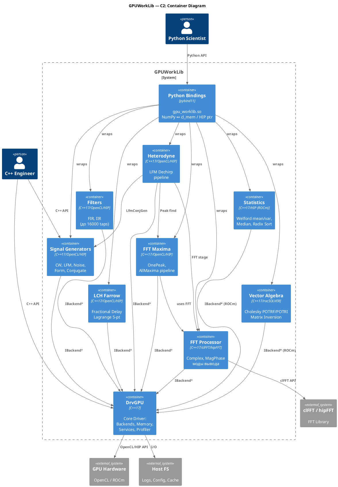

# C2 — Container Diagram

> **Project**: GPUWorkLib
> **Date**: 2026-03-03
> **Reference**: [c4model.com](https://c4model.com)
> **Level**: 2 (Container) — основные "контейнеры" внутри системы

---

## 1. Описание

Container-уровень показывает основные развёртываемые/компилируемые единицы GPUWorkLib:
библиотеки, модули, биндинги и инфраструктурные компоненты.

---

## 2. Container Diagram (ASCII)

```
  ┌─────────────┐     ┌──────────────────┐     ┌─────────────────┐
  │  C++ App    │     │  Python App      │     │  CI/CD          │
  │  (Engineer) │     │  (Scientist)     │     │  (cmake+ctest)  │
  └──────┬──────┘     └────────┬─────────┘     └────────┬────────┘
         │                     │                        │
         │ C++ API             │ Python API              │ Build
         ▼                     ▼                        ▼
  ═══════════════════════════════════════════════════════════════════
  ║                       GPUWorkLib System                        ║
  ║                                                                 ║
  ║  ┌──────────────────────────────────────────────────────────┐  ║
  ║  │              Python Bindings (pybind11)                  │  ║
  ║  │  gpu_worklib.pyd / .so                                   │  ║
  ║  │  GPUContext, PySignalGenerator, PyFFTProcessor,          │  ║
  ║  │  PyHeterodyneDechirp, PyFilters, PyLchFarrow             │  ║
  ║  └──────────────────────────┬───────────────────────────────┘  ║
  ║                              │                                  ║
  ║  ┌───────────────────────────┴───────────────────────────────┐ ║
  ║  │                    Module Layer                            │ ║
  ║  │                                                            │ ║
  ║  │ ┌──────────────┐ ┌──────────────┐ ┌────────────────────┐ │ ║
  ║  │ │ Signal       │ │ FFT          │ │ FFT Maxima         │ │ ║
  ║  │ │ Generators   │ │ Processor    │ │ (SpectrumMaxima-   │ │ ║
  ║  │ │              │ │              │ │  Finder)           │ │ ║
  ║  │ │ CW,LFM,Noise│ │ Complex,     │ │ OnePeak,AllMaxima  │ │ ║
  ║  │ │ Form,Conj    │ │ MagPhase     │ │                    │ │ ║
  ║  │ └──────┬───────┘ └──────┬───────┘ └─────────┬──────────┘ │ ║
  ║  │        │                │                    │             │ ║
  ║  │ ┌──────┴───────┐ ┌─────┴────────┐ ┌────────┴───────────┐│ ║
  ║  │ │ Filters      │ │ Heterodyne   │ │ LCH Farrow         ││ ║
  ║  │ │              │ │ (Dechirp)    │ │ (Fractional Delay)  ││ ║
  ║  │ │ FIR, IIR     │ │ LFM Dechirp  │ │ Lagrange 5-point   ││ ║
  ║  │ │ OpenCL+ROCm  │ │ Pipeline     │ │ OpenCL+ROCm        ││ ║
  ║  │ └──────┬───────┘ └──────┬───────┘ └─────────┬──────────┘│ ║
  ║  │        │                │                    │            │ ║
  ║  │ ┌──────┴───────┐ ┌─────┴────────┐                        │ ║
  ║  │ │ Statistics   │ │ Vector       │                         │ ║
  ║  │ │ (ROCm only)  │ │ Algebra      │                         │ ║
  ║  │ │ Welford,     │ │ (ROCm only)  │                         │ ║
  ║  │ │ Median,RadixS│ │ Cholesky     │                         │ ║
  ║  │ └──────┬───────┘ └──────┬───────┘                        │ ║
  ║  │        │                │                                  │ ║
  ║  └────────┼────────────────┼──────────────────────────────────┘ ║
  ║           │                │                    │               ║
  ║  ┌────────┴────────────────┴────────────────────┴────────────┐ ║
  ║  │                     DrvGPU (Core Driver)                  │ ║
  ║  │                                                            │ ║
  ║  │  ┌────────────┐  ┌──────────────┐  ┌──────────────────┐  │ ║
  ║  │  │ Backends   │  │ Memory       │  │ Services          │  │ ║
  ║  │  │            │  │ Manager      │  │                   │  │ ║
  ║  │  │ OpenCL     │  │ GPUBuffer<T> │  │ GPUProfiler       │  │ ║
  ║  │  │ ROCm/HIP   │  │ SVM Buffer   │  │ ConsoleOutput     │  │ ║
  ║  │  │ Hybrid     │  │              │  │ BatchManager      │  │ ║
  ║  │  │            │  │              │  │ KernelCache       │  │ ║
  ║  │  └────────────┘  └──────────────┘  └──────────────────┘  │ ║
  ║  │                                                            │ ║
  ║  │  ┌────────────┐  ┌──────────────┐  ┌──────────────────┐  │ ║
  ║  │  │ Logger     │  │ Config       │  │ Module Registry   │  │ ║
  ║  │  │ (plog)     │  │ (JSON)       │  │ (DI container)    │  │ ║
  ║  │  └────────────┘  └──────────────┘  └──────────────────┘  │ ║
  ║  └────────────────────────────┬───────────────────────────────┘ ║
  ║                               │                                  ║
  ═════════════════════════════════╪══════════════════════════════════
                                  │
                    ┌─────────────┼─────────────┐
                    ▼             ▼             ▼
          ┌──────────────┐ ┌──────────┐ ┌──────────────┐
          │ GPU Hardware │ │ clFFT /  │ │ Host FS      │
          │ (OpenCL/HIP) │ │ hipFFT   │ │ (Logs,Config)│
          └──────────────┘ └──────────┘ └──────────────┘
```

---

## 3. Таблица контейнеров

| # | Контейнер | Технология | Каталог | Назначение |
|---|-----------|-----------|---------|------------|
| 1 | **DrvGPU** | C++17 / OpenCL / HIP | `DrvGPU/` | Ядро: абстракция GPU, память, сервисы, профилирование |
| 2 | **Signal Generators** | C++17 / OpenCL / HIP kernels | `modules/signal_generators/` | Генерация CW, LFM, Noise, Script, Conjugate |
| 3 | **FFT Processor** | C++17 / clFFT / hipFFT | `modules/fft_processor/` | БПФ с режимами Complex / MagPhase |
| 4 | **FFT Maxima** | C++17 / OpenCL / HIP kernels | `modules/fft_maxima/` | Поиск спектральных максимумов (OnePeak, AllMaxima) |
| 5 | **Filters** | C++17 / OpenCL / HIP kernels | `modules/filters/` | FIR/IIR фильтрация (до 16000 taps) |
| 6 | **Heterodyne** | C++17 / OpenCL / HIP kernels | `modules/heterodyne/` | LFM Dechirp pipeline (дальнометрия) |
| 7 | **LCH Farrow** | C++17 / OpenCL / HIP kernels | `modules/lch_farrow/` | Дробная задержка (Lagrange 5-point, 48x5 matrix) |
| 8 | **Statistics** | C++17 / HIP kernels (ROCm only) | `modules/statistics/` | Welford mean/variance, медиана, radix sort |
| 9 | **Vector Algebra** | C++17 / rocSOLVER (ROCm only) | `modules/vector_algebra/` | Cholesky POTRF/POTRI инверсия матриц |
| 10 | **Python Bindings** | pybind11 / NumPy | `python/` | Python API: `gpu_worklib.so` |
| 11 | **Test Suite** | C++17 / pytest | `*/tests/`, `Python_test/` | C++ тесты (hpp) + Python тесты |

---

## 4. Зависимости между контейнерами

```
  Python Bindings ──────────────────────────────────┐
       │                                             │
       │ wraps all modules                           │
       ▼                                             ▼
  ┌────────────┐   ┌────────────┐   ┌────────────────────┐
  │ Signal     │   │ FFT        │   │ FFT Maxima         │
  │ Generators │   │ Processor  │   │                    │
  └─────┬──────┘   └─────┬──────┘   └──┬──────────┬─────┘
        │                │              │          │
        │                │              │ uses FFT │ uses SigGen
        │                │              ▼          ▼
  ┌─────┴──────┐   ┌─────┴──────┐   ┌────────────────────┐
  │ Filters    │   │ LCH Farrow │   │ Heterodyne         │
  │            │   │            │   │ (uses SigGen+FFT+  │
  │            │   │            │   │  Maxima)            │
  └─────┬──────┘   └─────┬──────┘   └──────────┬─────────┘
        │                │                      │
        └────────────────┼──────────────────────┘
                         │
                         ▼
               ┌──────────────────┐
               │     DrvGPU       │
               │  (IBackend*,     │
               │   MemoryManager, │
               │   Services)      │
               └────────┬─────────┘
                        │
              ┌─────────┼──────────┐
              ▼         ▼          ▼
         OpenCL      ROCm      Hybrid
         Backend     Backend   Backend
```

### Матрица зависимостей

| Модуль ↓ \ Зависит от → | DrvGPU | SigGen | FFT | Maxima | Filters | Heterodyne | Farrow | Statistics | VecAlgebra |
|--------------------------|:------:|:------:|:---:|:------:|:-------:|:----------:|:------:|:----------:|:----------:|
| **Signal Generators**    |   ✅   |   —    |  —  |   —    |   —     |     —      |   —    |     —      |     —      |
| **FFT Processor**        |   ✅   |   —    |  —  |   —    |   —     |     —      |   —    |     —      |     —      |
| **FFT Maxima**           |   ✅   |   —    | ✅  |   —    |   —     |     —      |   —    |     —      |     —      |
| **Filters**              |   ✅   |   —    |  —  |   —    |   —     |     —      |   —    |     —      |     —      |
| **Heterodyne**           |   ✅   |  ✅    | ✅  |  ✅    |   —     |     —      |   —    |     —      |     —      |
| **LCH Farrow**           |   ✅   |   —    |  —  |   —    |   —     |     —      |   —    |     —      |     —      |
| **Statistics**           |   ✅   |   —    |  —  |   —    |   —     |     —      |   —    |     —      |     —      |
| **Vector Algebra**       |   ✅   |   —    |  —  |   —    |   —     |     —      |   —    |     —      |     —      |
| **Python Bindings**      |   ✅   |  ✅    | ✅  |  ✅    |  ✅     |    ✅      |  ✅    |    ✅      |    ✅      |

---

## 5. Коммуникация между контейнерами

| Источник | Назначение | Протокол | Данные |
|----------|-----------|----------|--------|
| User C++ App | DrvGPU | Direct C++ call | `DrvGPU::Initialize()` |
| User Python App | Python Bindings | pybind11 | `GPUContext(0)` |
| Python Bindings | Все модули | Direct C++ call | NumPy → `cl_mem` |
| Signal Generators | DrvGPU | `IBackend*` | `cl_mem` (GPU буфер) |
| FFT Processor | DrvGPU | `IBackend*` | `cl_mem` input → `cl_mem` output |
| FFT Processor | clFFT | C API | `clfftEnqueueTransform()` |
| Heterodyne | Signal Generators | Factory | `LfmConjugateGenerator` |
| Heterodyne | FFT Processor | Direct | `ProcessComplex()` |
| Heterodyne | FFT Maxima | Direct | `FindAllMaxima()` |
| Все модули | GPUProfiler | Async queue | `profiler.Record()` |
| Все модули | ConsoleOutput | Async queue | `con.Print()` |
| DrvGPU | GPU Hardware | OpenCL / HIP API | Kernel launch, memcpy |

---

## 6. PlantUML



---

*Предыдущий уровень: [C1 — System Context](Architecture_C1_SystemContext.md)*
*Следующий уровень: [C3 — Component Diagram](Architecture_C3_Component.md)*
