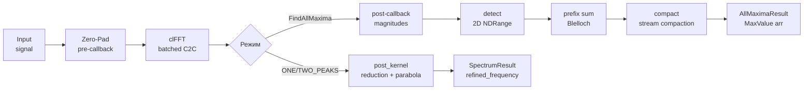

# FFT Maxima (SpectrumMaximaFinder) — Полная документация

> GPU-поиск максимумов FFT-спектра: один пик, два пика или все локальные максимумы

**Namespace**: `antenna_fft`
**Каталог**: `modules/fft_maxima/`
**Зависимости**: DrvGPU (`IBackend*`), OpenCL, clFFT; ROCm: hipFFT, hiprtc (`ENABLE_ROCM`)

---

## Содержание

1. [Обзор и назначение](#1-обзор-и-назначение)
2. [Зачем нужен и алгоритм](#2-зачем-нужен-и-алгоритм)
3. [Математика](#3-математика)
4. [Пошаговый pipeline](#4-пошаговый-pipeline)
5. [Kernels](#5-kernels)
6. [API (C++ и Python)](#6-api)
7. [Тесты](#7-тесты)
8. [Ссылки и файловое дерево](#8-ссылки-и-файловое-дерево)
9. [Важные нюансы](#9-важные-нюансы)

---

## 1. Обзор и назначение

`SpectrumMaximaFinder` — GPU-модуль поиска пиков в FFT-спектре для массива антенн/лучей.
В отличие от `FFTProcessor`, который возвращает полный спектр, этот модуль находит конкретные максимумы.

| Класс | Назначение |
|-------|------------|
| **FFTProcessor** | FFT → полный спектр (complex / mag+phase) |
| **SpectrumMaximaFinder** | FFT → поиск пиков (1, 2 или все максимумы) |

**Три режима:**

| Метод | Вход | Pipeline |
|-------|------|---------|
| `Process()` | Сырой сигнал | Upload → Zero-Pad → clFFT → Post-Kernel (1/2 пика) |
| `FindAllMaxima()` | Сырой сигнал | Upload → Zero-Pad → clFFT → Detect → Scan → Compact |
| `AllMaxima()` | FFT-спектр | ComputeMag → Detect → Scan → Compact (без FFT!) |

**Реализовано:**
- ONE_PEAK, TWO_PEAKS с параболической интерполяцией
- FindAllMaxima — все локальные максимумы через stream compaction
- InputData\<T\>: CPU (`vector<complex<float>>`), GPU (`cl_mem`)
- Batch processing через BatchManager (по лимиту памяти)
- ROCm backend: `SpectrumProcessorROCm` (hipFFT + hiprtc)
- Профилирование через GPUProfiler

---

## 2. Зачем нужен и алгоритм

### Проблема: нужно найти частоту сигнала

После FFT в спектре есть пики, соответствующие частотам в сигнале. Задача — найти их позиции точнее, чем позволяет разрешение FFT (один бин = fs/nFFT Гц).

### Решение: параболическая интерполяция

Для уточнения позиции пика используются три соседних значения спектра:

$$\delta = \frac{1}{2} \cdot \frac{y_L - y_R}{y_L - 2y_C + y_R}$$

$$f_{refined} = (k + \delta) \cdot \frac{f_s}{N_{FFT}}$$

Это позволяет определить частоту с точностью до долей бина.

### Задача FindAllMaxima: stream compaction

Нужно найти все локальные максимумы в большом массиве (beams × nFFT) эффективно на GPU.
Прямой подход (каждый поток пишет в выходной буфер) приводит к race conditions.
Решение — Blelloch exclusive scan (prefix sum) для подсчёта позиций без конфликтов.

### Зачем нужен нулевой padding

nFFT = nextPow2(n_point) × repeat_count — дополнительный padding увеличивает разрешение по частоте:

$$\Delta f = \frac{f_s}{N_{FFT}} = \frac{f_s}{N_{pow2} \cdot r}$$

Например, при n_point=100000, repeat_count=4: nFFT=524288, Δf≈0.0019 Гц (при fs=1000 Гц).

---

## 3. Математика

### Параболическая интерполяция

Для пика на бине k:

$$y_L = |FFT[k-1]|, \quad y_C = |FFT[k]|, \quad y_R = |FFT[k+1]|$$

$$\delta = \frac{1}{2} \cdot \frac{y_L - y_R}{y_L - 2y_C + y_R}, \quad \delta \in [-0.5,\; +0.5]$$

$$f_{refined} = \left(k + \delta\right) \cdot \frac{f_s}{N_{FFT}}$$

**Ограничение**: применяется только к пику №0 (наибольшему). Остальные пики используют $f = k \cdot f_s / N_{FFT}$.

### Zero-padding и nFFT

$$N_{FFT} = \text{nextPow2}(n_{point}) \cdot r$$

где $r$ = repeat_count (по умолчанию 2).

### Условие локального максимума

$$\text{isMax}(i) = \begin{cases} 1 & \text{если } m_i > m_{i-1} \text{ и } m_i > m_{i+1} \\ 0 & \text{иначе} \end{cases}$$

где $m_i = |FFT[i]|$ — предвычисленная амплитуда.

### Blelloch Exclusive Scan (prefix sum)

Scan превращает массив флагов $[0, 1, 1, 0, 1, ...]$ в массив позиций $[0, 0, 1, 2, 2, ...]$, позволяя каждому максимуму записать результат в уникальную позицию:

- Up-sweep (reduce): $O(\log N)$ шагов, суммирование снизу вверх
- Down-sweep: $O(\log N)$ шагов, распространение префикса сверху вниз
- Итог: без race conditions, параллельно для всех лучей (beam-aware)

### Амплитуда, фаза, результат

$$\text{magnitude} = \sqrt{Re^2 + Im^2}, \quad \text{phase} = \text{atan2}(Im, Re) \cdot \frac{180°}{\pi}$$

---

## 4. Пошаговый pipeline

### Process (ONE_PEAK / TWO_PEAKS)

```
Input (CPU flat complex<float>[antennas × n_point])
    │
    ▼
┌──────────────────────────────────────────────────┐
│ 1. PrepareParams                                 │  nFFT = nextPow2(n_point) × repeat_count
│    CalculateFFTSize()                            │  search_range = nFFT/4 если 0
└──────────────────────────────────────────────────┘
    │
    ▼
┌──────────────────────────────────────────────────┐
│ 2. Upload / Copy                                 │  CPU: clEnqueueWriteBuffer
│    UploadData() / CopyGpuData()                  │  GPU cl_mem: clEnqueueCopyBuffer (zero-copy)
└──────────────────────────────────────────────────┘
    │
    ▼
┌──────────────────────────────────────────────────┐
│ 3. Pre-callback (встроен в clFFT)                │  padding_kernel (fft_kernels.cl):
│    clFFT с pre-callback                          │  input[n_point] → fft_input[nFFT] + zeros
└──────────────────────────────────────────────────┘
    │
    ▼
┌──────────────────────────────────────────────────┐
│ 4. clFFT batched C2C                             │  fft_input → fft_output
│    ExecuteFFT()                                  │  размер: batch × nFFT
└──────────────────────────────────────────────────┘
    │
    ▼
┌──────────────────────────────────────────────────┐
│ 5. Post-kernel (256 WI/луч)                      │  post_kernel (fft_kernels.cl):
│    ExecutePostKernel()                           │  1-stage reduction → top-N peaks
│    ONE_PEAK: 1 peak, TWO_PEAKS: 2 peaks          │  параболическая интерполяция для peak[0]
└──────────────────────────────────────────────────┘
    │
    ▼
┌──────────────────────────────────────────────────┐
│ 6. ReadResults()                                 │  Download → vector<SpectrumResult>
│    clEnqueueReadBuffer                           │  SpectrumResult: interpolated + center+left+right
└──────────────────────────────────────────────────┘
    │
    ▼
vector<SpectrumResult>[antennas]
```

**Batch processing**: при нехватке памяти (memory_limit) BatchManager разбивает на пакеты, результаты объединяются.

---

### FindAllMaxima (полный pipeline: сырой сигнал → все пики)

```
Input (CPU/GPU flat complex<float>[antennas × n_point])
    │
    ▼
┌──────────────────────────────────────────────────┐
│ 1. PrepareParams + CompileAllMaximaKernels       │  однократная компиляция 4 kernel'ов
└──────────────────────────────────────────────────┘
    │
    ▼
┌──────────────────────────────────────────────────┐
│ 2. Upload / CopyGpuData                          │  input → input_buffer_
└──────────────────────────────────────────────────┘
    │
    ▼
┌──────────────────────────────────────────────────┐
│ 3. clFFT с pre+post callbacks                    │  pre: pad n_point → nFFT
│    ExecuteAllMaximaFFT()                         │  post: |FFT[i]| → magnitudes_buffer_
│    (post-callback вычисляет |FFT[i]| во время FFT│  fft_output + magnitudes параллельно
└──────────────────────────────────────────────────┘
    │
    ▼
┌──────────────────────────────────────────────────┐
│ 4. detect_all_maxima (TASK-6: 2D NDRange)        │  global=(nFFT, beam_count), local=(256,1)
│    AllMaximaPipeline → DetectStep()              │  flags[i]=mag[i]>mag[i-1] && mag[i]>mag[i+1]
│                                                  │  диапазон [search_start, search_end)
└──────────────────────────────────────────────────┘
    │
    ▼
┌──────────────────────────────────────────────────┐
│ 5. Blelloch Exclusive Scan (TASK-9: LDS +1)      │  block_scan: суммирование блоков
│    ExecutePrefixSum()                            │  block_add: добавление sum предыдущих блоков
│    beam-aware: каждый луч независимо             │  BLOCK_SIZE=512 (2 × LOCAL_SIZE=256)
└──────────────────────────────────────────────────┘
    │
    ▼
┌──────────────────────────────────────────────────┐
│ 6. compact_maxima                                │  каждый поток по флагу пишет MaxValue
│    AllMaximaPipeline → CompactStep()             │  в позицию scan_output[i] (без конфликтов)
│                                                  │  MaxValue: index, real, imag, mag, phase, freq
└──────────────────────────────────────────────────┘
    │
    ▼
AllMaximaResult (dest=CPU: beams[].maxima / dest=GPU: gpu_maxima, gpu_counts)
```

---

### AllMaxima (только detect+scan+compact, без FFT)

```
Input (FFT-спектр complex<float>[beams × nFFT])   ← input.n_point = nFFT (не n_point сигнала!)
    │
    ▼
┌──────────────────────────────────────────────────┐
│ 1. compute_magnitudes (TASK-2: native_sqrt)      │  fft_output → magnitudes_buffer_
│    отдельный kernel (не post-callback)           │  применяется когда FFT уже готов
└──────────────────────────────────────────────────┘
    │
    ▼  (далее те же шаги 4-6 как в FindAllMaxima)
detect → scan → compact
    │
    ▼
AllMaximaResult
```

---

### Диаграмма (mermaid)



---

### Архитектура C4

**C1 — System Context**
```
[Приложение / Тест] → [SpectrumMaximaFinder] → [GPU Hardware]
    ↑ flat complex<float> input                    ↑ OpenCL / ROCm
    ← vector<SpectrumResult> / AllMaximaResult
```

**C2 — Container**
```
[SpectrumMaximaFinder]
    → [DrvGPU IBackend]          ← cl_context, cl_command_queue, hipStream
    → [clFFT / hipFFT]           ← FFT план (batched C2C)
    → [GPU Memory]               ← input_buffer_, fft_output_, magnitudes_, maxima_output_
    → [AllMaximaPipeline]        ← detect + scan + compact kernel'ы
```

**C3 — Component**
```
[SpectrumMaximaFinder] (facade, spectrum_maxima_finder.h)
    → [ISpectrumProcessor] (interface)
        → [SpectrumProcessorOpenCL]  ← fft_kernels.cl, all_maxima_kernel_sources.hpp
        → [SpectrumProcessorROCm]    ← fft_kernel_sources_rocm.hpp, all_maxima_kernel_sources_rocm.hpp
    → [AllMaximaPipelineOpenCL]      ← detect + scan + compact (OpenCL)
    → [AllMaximaPipelineROCm]        ← detect + scan + compact (ROCm, hiprtc)
    → [SpectrumProcessorFactory]     ← Create(BackendType, IBackend*)
    → [BatchManager]                 ← разбивка по memory_limit
```

**C4 — Code**
```
SpectrumMaximaFinder
  + SpectrumMaximaFinder(IBackend*)         // актуальный конструктор
  + [[deprecated]] SpectrumMaximaFinder(SpectrumParams, IBackend*)
  + Process<T>(InputData<T>, PeakSearchMode, DriverType) → vector<SpectrumResult>
  + FindAllMaxima<T>(InputData<T>, dest, driver, search_start, search_end) → AllMaximaResult
  + FindAllMaxima(cl_mem, beam_count, nFFT, fs, dest, ...) → AllMaximaResult
  + AllMaxima<T>(InputData<T>, dest, driver, ...) → AllMaximaResult
  + GetProfilingData() → ProfilingData
  + GetParams() → SpectrumParams
  + IsInitialized() → bool
  - params_, backend_, plan_handle_
  - input_buffer_, fft_output_, maxima_output_, magnitudes_buffer_
  - detect_kernel_, block_scan_kernel_, block_add_kernel_, compact_kernel_
```

---

## 5. Kernels

### fft_kernels.cl — padding_kernel и post_kernel

**Файл**: `modules/fft_maxima/kernels/fft_kernels.cl`

#### padding_kernel (pre-callback для clFFT)

| Параметр | Тип | Описание |
|----------|-----|----------|
| input | `__global const float2*` | Входной буфер: все лучи × n_point |
| output | `__global float2*` | Выходной: batch × nFFT |
| batch_beam_count | `uint` | Лучей в текущем batch |
| count_points | `uint` | Точек на луч (n_point) |
| nFFT | `uint` | Размер FFT |
| beam_offset | `uint` | Смещение для batch |

Логика:
```c
if (pos_in_fft < count_points)
    output[gid] = input[global_beam_idx * count_points + pos_in_fft];
else
    output[gid] = (float2)(0.0f, 0.0f);  // zero-padding
```

#### post_kernel (поиск пиков + интерполяция)

| Параметр | Тип | Описание |
|----------|-----|----------|
| fft_output | `__global const float2*` | FFT результат: beam_count × nFFT |
| maxima_output | `__global MaxValue*` | Выход: beam_count × max_peaks_count |
| beam_count | `uint` | Количество лучей |
| nFFT | `uint` | Размер FFT |
| search_range | `uint` | Диапазон поиска (обычно nFFT/4) |
| max_peaks_count | `uint` | 1 (ONE_PEAK) или 2 (TWO_PEAKS) |
| sample_rate | `float` | Гц |

Архитектура: один work-group на луч, 256 work-items, local memory reduction:
```
Stage 1: 256 WI → каждый находит локальный максимум в диапазоне [0, search_range)
Stage 2: Thread 0 → top-N пиков последовательно (удаляет найденные)
Stage 3: Thread 0 → записывает MaxValue[] с параболической интерполяцией для peak[0]
```

---

### all_maxima_kernel_sources.hpp — pipeline kernels

**Файл**: `modules/fft_maxima/include/kernels/all_maxima_kernel_sources.hpp`

Четыре inline-строки с OpenCL-кодом:

#### 0. computeMagnitudePost (post-callback для clFFT)

Вызывается clFFT для каждого выходного элемента. Записывает `|FFT[i]|` в magnitudes buffer
(через `length(fftoutput)` — оптимизированная builtin функция).

#### 0b. compute_magnitudes (отдельный kernel)

Для случая когда FFT уже на GPU (`AllMaxima<cl_mem>`). TASK-2: `native_sqrt` вместо `sqrt` — 2-4x ускорение.

```c
magnitudes[gid] = native_sqrt(val.x * val.x + val.y * val.y);
```

#### 1. detect_all_maxima (TASK-6: 2D NDRange)

| Параметр | Описание |
|----------|----------|
| magnitudes | Pre-computed \|FFT[i]\| |
| flags | Out: 0 или 1 |
| beam_count, nFFT | Размеры |
| search_start, search_end | Диапазон поиска |

Dispatch после TASK-6: `global=(nFFT, beam_count)`, `local=(256, 1)` — устраняет дорогие `div/mod`.

Условие: `flags[gid] = (mag_c > mag_l && mag_c > mag_r) ? 1 : 0`

#### 2. block_scan + block_add (Blelloch Work-Efficient Exclusive Scan)

TASK-9: LDS с `+1` padding для устранения bank conflicts — аллоцировать `(BLOCK_SIZE+1)*sizeof(uint32_t)`.

- `block_scan`: up-sweep (reduce) + down-sweep, размер блока = 2 × local_size = 512
- `block_add`: добавляет суммы предыдущих блоков (in-place)

#### 3. compact_maxima (stream compaction)

Каждый поток по флагу пишет MaxValue в позицию `scan_output[i]` — гарантированно уникальную.

Заполняет MaxValue: index, real, imag, magnitude, phase (degrees), refined_frequency
(без параболической интерполяции — просто `pos × fs/nFFT`).

---

## 6. API

### Структура InputData

```cpp
template<typename T>
struct InputData {
    uint32_t antenna_count = 0;       // Количество лучей/антенн
    uint32_t n_point = 0;             // Точек на луч (для AllMaxima: n_point = nFFT!)
    T data{};                         // Данные (CPU vector или GPU cl_mem)
    size_t gpu_memory_bytes = 0;      // Размер GPU буфера (для cl_mem)

    uint32_t repeat_count = 2;        // nFFT = nextPow2(n_point) × repeat_count
    float sample_rate = 1000.0f;      // Гц
    uint32_t search_range = 0;        // 0 = auto = nFFT/4
    float memory_limit = 0.80f;       // Доля GPU памяти для batch (0.0-1.0)
    size_t max_maxima_per_beam = 1000; // Лимит максимумов на луч
};
```

### MaxValue (формат результата)

```cpp
struct MaxValue {
    uint32_t index;           // Бин в спектре
    float real, imag;         // Re/Im FFT
    float magnitude, phase;   // |FFT|, arg(FFT) в градусах
    float refined_frequency;  // Частота в Hz
};
```

Подробнее: [FindAllMaxima_MaxValue_Guide.md](FindAllMaxima_MaxValue_Guide.md)

---

### C++ — Process (один или два пика)

```cpp
#include "spectrum_maxima_finder.h"
#include "interface/spectrum_input_data.hpp"

// 1. Создать
antenna_fft::SpectrumMaximaFinder finder(backend);
// Initialize() вызывается автоматически при первом Process

// 2. Подготовить данные
antenna_fft::InputData<std::vector<std::complex<float>>> input{
    .antenna_count = 5,
    .n_point = 100000,
    .data = my_signal,           // flat: antennas × n_point
    .repeat_count = 4,           // nFFT = nextPow2(100000) × 4 = 524288
    .sample_rate = 1000.0f,
    .memory_limit = 0.80f
};

// 3. Обработать
auto results = finder.Process(input,
    antenna_fft::PeakSearchMode::ONE_PEAK,
    antenna_fft::DriverType::OPENCL);

// 4. Читать результаты
for (const auto& r : results) {
    std::cout << "Beam " << r.antenna_id
              << ": freq=" << r.interpolated.refined_frequency << " Hz"
              << ", mag=" << r.interpolated.magnitude << "\n";
}
```

### C++ — FindAllMaxima (все пики из сырого сигнала)

```cpp
antenna_fft::InputData<std::vector<std::complex<float>>> input{
    .antenna_count = 64,
    .n_point = 1024,
    .data = raw_signal,          // СЫРОЙ сигнал (не FFT!)
    .repeat_count = 1,
    .sample_rate = 1000.0f,
    .max_maxima_per_beam = 1000
};

auto result = finder.FindAllMaxima(input, antenna_fft::OutputDestination::CPU);

for (const auto& beam : result.beams) {
    std::cout << "Beam " << beam.antenna_id
              << ": " << beam.num_maxima << " peaks\n";
    for (uint32_t i = 0; i < beam.num_maxima; ++i) {
        const auto& mv = beam.maxima[i];
        std::cout << "  bin=" << mv.index
                  << " freq=" << mv.refined_frequency << " Hz"
                  << " mag=" << mv.magnitude << "\n";
    }
}
```

### C++ — FindAllMaxima (из готового cl_mem FFT, низкоуровневый API)

```cpp
// Данные уже на GPU после FFT
cl_mem gpu_fft_result = /* ... */;

auto result = finder.FindAllMaxima(
    gpu_fft_result,
    /*beam_count=*/5,
    /*nFFT=*/1024,
    /*sample_rate=*/1000.0f,
    antenna_fft::OutputDestination::CPU,
    /*search_start=*/1,          // пропуск DC
    /*search_end=*/0             // 0 = auto = nFFT/2
);
```

### C++ — AllMaxima (из готового FFT-спектра, без FFT)

```cpp
// FFT уже посчитан (FFTProcessor или другой источник)
antenna_fft::InputData<cl_mem> fft_input{
    .antenna_count = 5,
    .n_point = 1024,             // ВАЖНО: n_point = nFFT (размер FFT!)
    .data = gpu_fft_result,
    .sample_rate = 1000.0f
};

auto result = finder.AllMaxima(fft_input, antenna_fft::OutputDestination::CPU);
// Pipeline: compute_magnitudes → detect → scan → compact (без FFT!)
```

### C++ — Process с GPU данными (zero-copy)

```cpp
// Данные уже на GPU (например, от CwGenerator)
antenna_fft::InputData<cl_mem> gpu_input{
    .antenna_count = 256,
    .n_point = 1300000,
    .data = my_cl_mem,
    .gpu_memory_bytes = 256ULL * 1300000 * sizeof(std::complex<float>),
    .repeat_count = 2,
    .sample_rate = 1000.0f
};

auto results = finder.Process(gpu_input,
    antenna_fft::PeakSearchMode::ONE_PEAK,
    antenna_fft::DriverType::OPENCL);
```

### C++ — результат OutputDestination::GPU

```cpp
auto result = finder.FindAllMaxima(gpu_fft, beam_count, nFFT, fs,
    antenna_fft::OutputDestination::GPU);

// Буферы остаются на GPU — caller ОБЯЗАН освободить!
if (result.gpu_maxima)
    clReleaseMemObject(static_cast<cl_mem>(result.gpu_maxima));
if (result.gpu_counts)
    clReleaseMemObject(static_cast<cl_mem>(result.gpu_counts));
```

---

### Python API

Python предоставляет только метод `find_all_maxima()`. `Process` и `AllMaxima` в Python не экспортированы.

**Важно**: Python принимает FFT-спектр (не сырой сигнал). FFT нужно сделать заранее через `FFTProcessor`.

```python
import gpuworklib
import numpy as np

# 1. Контекст и объекты
ctx = gpuworklib.GPUContext(0)         # OpenCL
fft = gpuworklib.FFTProcessor(ctx)
finder = gpuworklib.SpectrumMaximaFinder(ctx)

# 2. Сигнал (numpy complex64)
fs = 1000.0
nFFT = 1024
t = np.arange(nFFT, dtype=np.float32)
signal = (np.sin(2 * np.pi * 100 * t / fs) +
          np.sin(2 * np.pi * 200 * t / fs)).astype(np.complex64)

# 3. FFT (через FFTProcessor)
spectrum = fft.process_complex(signal, sample_rate=fs)

# 4. Поиск всех максимумов (принимает FFT-спектр!)
result = finder.find_all_maxima(spectrum, sample_rate=fs)

# 5. Результат (1 луч → dict)
print(result['num_maxima'])        # количество максимумов
print(result['positions'])         # np.array uint32: бины
print(result['magnitudes'])        # np.array float32: амплитуды
print(result['frequencies'])       # np.array float32: частоты [Hz]
```

### Python — несколько лучей

```python
# Multi-beam: signals shape = (beam_count, nFFT)
beam_count = 5
signals = np.zeros((beam_count, nFFT), dtype=np.complex64)
for i in range(beam_count):
    freq = 50.0 + i * 50.0
    signals[i] = np.sin(2 * np.pi * freq * t / fs).astype(np.complex64)

spectra = fft.process_complex(signals, sample_rate=fs)
result = finder.find_all_maxima(spectra, sample_rate=fs)

# Multi-beam → list[dict]
for i, beam in enumerate(result):
    print(f"Beam {i}: {beam['num_maxima']} peaks")
    print(f"  frequencies: {beam['frequencies'][:5]}")
```

### Python — ROCm контекст

```python
ctx = gpuworklib.ROCmGPUContext(0)    # AMD GPU
finder = gpuworklib.SpectrumMaximaFinder(ctx)
# API идентичен OpenCL варианту
```

### Python — параметры find_all_maxima

```python
result = finder.find_all_maxima(
    fft_data,           # np.array complex64 (1D или 2D)
    sample_rate=1000.0, # float, Гц
    beam_count=0,       # 0 = auto из формы массива
    nFFT=0,             # 0 = auto из формы массива
    search_start=0,     # 0 = auto = 1 (пропуск DC)
    search_end=0        # 0 = auto = nFFT/2
)
```

---

## 7. Тесты

**Вызов**: через `modules/fft_maxima/tests/all_test.hpp` из `main.cpp`

### C++ тесты

| # | Тест | Параметры | Что проверяет | Порог |
|---|------|-----------|---------------|-------|
| 1 | ONE_PEAK (5 антенн) | N=100000, r=4, fs=1000, freqs=2.5×(1+(ant+1)/10) | refined_frequency близка к ожидаемой; bin корректен | freq_err < 0.5 Hz, bin_err < 1.5 |
| 2 | TWO_PEAKS (5 антенн) | те же параметры | оба пика совпадают с CPU референсом | freq_err < 0.5 Hz, bin_err < 1.5 |
| 3 | ThreePeaks (FFT на GPU) | nFFT=1024, fs=1000, freqs=[50,120,200] | GPU находит те же максимумы, что CPU референс | bin ±1 |
| 4 | MultiBeam (5 лучей) | nFFT=512, fs=1000, beam_freqs=[30,60,100,150,200] | каждый луч: ожидаемый бин найден | bin ±1 |
| 5 | GpuOutput | nFFT=256, 1 луч, 100 Hz | Dest=GPU: ненулевые gpu_maxima, gpu_counts | total_maxima > 0 |
| 6 | FullPipelineCPU | n_point=1024, freqs=[80,160,300] | InputData\<vector\> полный pipeline работает | bin ±1 |
| 7 | FullPipelineGPU | beam_count=3, n_point=512, freqs=[50,100,200] | InputData\<cl_mem\> full pipeline работает | bin ±1 |
| 8 | AllMaximaCPU | nFFT=1024, FFT данные на CPU | AllMaxima\<vector\> без FFT шага | bin ±1 |
| 9 | AllMaximaGPU | beam_count=3, nFFT=512, FFT на GPU | AllMaxima\<cl_mem\> без FFT шага | bin ±1 |
| 10 | VectorInput_DestCPU | memory_limit=0.01f (форсирует batch) | batch из CPU данных, Dest=CPU | num_maxima совпадает с небatched |
| 11 | VectorInput_DestGPU | те же | batch из CPU данных, Dest=GPU | gpu буферы ненулевые |
| 12 | GPUInput_DestCPU | те же | batch из cl_mem, Dest=CPU | корректность |
| 13 | GPUInput_DestGPU | те же | batch из cl_mem, Dest=GPU | gpu буферы ненулевые |
| 14 | LargeBatch | 256×1300000 точек | автобатч работает; 10 лучей проверены | freq_err < 5 Hz |
| 15 | CwGenIntegration | 256 ant, 1.3M pts | CwGenerator→Process zero-copy | freq корректна |
| 16 | ROCm OnePeak | N=1000, fs=10000, 4 ant, 100 Hz | ROCm backend ONE_PEAK | error < 5 Hz |
| 17 | ROCm TwoPeaks | N=1000, fs=10000, 2 ant, [100,300] Hz | ROCm TWO_PEAKS, 2 result/beam | корректность |
| 18 | ROCm FindAllMaxima | N=1024, fs=1000, 2 ant, [50,120,200] Hz | ROCm FindAllMaxima ≥3 peaks | num_maxima ≥ 3 |
| 19 | ROCm AllMaximaFromCPU | nFFT=1024, синтетич. спектр peaks@[50,120,200] | ROCm AllMaxima ≥3 peaks | total_maxima ≥ 3 |
| 20 | ROCm BatchProcessing | 16 ant, N=1000, fs=10000, freq=100+b×10 | ROCm batch 16 лучей | error < 10 Hz |
| 21 | ROCm CompareWithOpenCL | 4 ant, N=1000, 100 Hz | ROCm vs OpenCL (если доступен) | diff < 5 Hz |

### Активные тесты (all_test.hpp, 2026-03-02)

```cpp
// АКТИВНО (ENABLE_ROCM):
test_spectrum_maxima_rocm::run();

// ЗАКОММЕНТИРОВАНО (clFFT не работает на gfx1201):
// test_spectrum_maxima::run()
// test_large_batch::run()
// test_gpu_generator_integration::run()
// test_find_all_maxima::run()
// test_batch_all_maxima::run()
// test_fft_maxima_benchmark::run()
```

### Python тесты

| # | Файл | Тест | Параметры | Порог |
|---|------|------|-----------|-------|
| 1 | test_spectrum_find_all_maxima.py | single_tone | fs=1000, nFFT=1024, freq=100 | freq_err < 1 Hz |
| 2 | test_spectrum_find_all_maxima.py | three_tones | fs=1000, nFFT=1024, [50,120,200] Hz | bin ±1, SciPy совпадение |
| 3 | test_spectrum_find_all_maxima.py | multi_beam | fs=1000, n=512, 5 лучей [50,100,...,250] Hz | каждый луч: bin ±1 |
| 4 | test_spectrum_find_all_maxima.py | gpu_vs_scipy | те же | точные позиции совпадают с SciPy |
| 5 | test_spectrum_find_all_maxima.py | performance | 256 лучей, 1024 pts | avg time < 500 мс |
| 6 | test_find_all_maxima_maxvalue.py | cpu_vs_gpu_data | fs=1000, nFFT=1024, [50,120,200] Hz | оба пути дают одинаковые бины |
| 7 | test_find_all_maxima_maxvalue.py | multi_beam_beautiful | 5 лучей, визуализация | все бины найдены |
| 8 | test_spectrum_find_all_maxima_rocm.py | rocm_context_available | ROCm | ctx создаётся, AMD device |
| 9 | test_spectrum_find_all_maxima_rocm.py | spectrum_via_heterodyne_rocm | fs=12e6, N=8000, delay=100мкс | f_beat_err < 5000 Hz |

### Производительность (RTX 2080 Ti, OpenCL)

| Конфигурация | Время |
|-------------|-------|
| 1 луч × 1024 FFT | ~0.03 мс |
| 5 лучей × 512 FFT | ~0.09 мс |
| 256 лучей × 4096 FFT | ~56 мс |
| 256 лучей FindAllMaxima (10 GPU) | ~50–75 мс |

---

## 8. Ссылки и файловое дерево

### Документация модуля

| Файл | Описание |
|------|----------|
| [API.md](API.md) | Детальный API: FFTPlanCache, FFTBatchAdapter, FFTResultWriter |
| [FindAllMaxima_MaxValue_Guide.md](FindAllMaxima_MaxValue_Guide.md) | Формат MaxValue, CPU/GPU пути данных |
| [spectrum_maxima_api_guide.md](spectrum_maxima_api_guide.md) | Руководство для начинающих |
| [Doc/Python/spectrum_maxima_api.md](../../Python/spectrum_maxima_api.md) | Python API |
| [Doc/Modules/fft_processor/Full.md](../fft_processor/Full.md) | FFTProcessor — смежный модуль |

### Внешние

| Источник | Описание |
|----------|----------|
| [clFFT GitHub](https://github.com/clMathLibraries/clFFT) | OpenCL FFT (устарел для RDNA4+) |
| [Blelloch scan (GPU Gems 3)](https://developer.nvidia.com/gpugems/gpugems3/part-vi-gpu-computing/chapter-39-parallel-prefix-sum-scan-cuda) | Алгоритм prefix sum |

### Файловое дерево модуля

```
modules/fft_maxima/
├── include/
│   ├── spectrum_maxima_finder.h           # Facade (шаблоны Process/FindAllMaxima/AllMaxima)
│   ├── fft_logger.h                       # Логирование
│   ├── interface/
│   │   ├── spectrum_maxima_types.h        # Устаревшие типы (совместимость)
│   │   ├── i_spectrum_processor.hpp       # Strategy interface
│   │   ├── i_all_maxima_pipeline.hpp      # Pipeline interface
│   │   └── spectrum_input_data.hpp        # InputData<T> + ProcessingParams + DriverType
│   ├── types/
│   │   ├── spectrum_params.hpp            # SpectrumParams (antenna_count, n_point, ...)
│   │   ├── spectrum_result_types.hpp      # MaxValue, SpectrumResult, AllMaximaResult
│   │   ├── spectrum_modes.hpp             # PeakSearchMode: ONE_PEAK, TWO_PEAKS, ALL_MAXIMA
│   │   ├── spectrum_profiling.hpp         # ProfilingData
│   │   └── spectrum_types.hpp            # Вспомогательные типы
│   ├── processors/
│   │   ├── spectrum_processor_opencl.hpp  # OpenCL impl
│   │   └── spectrum_processor_rocm.hpp    # ROCm impl (hipFFT + hiprtc)
│   ├── pipelines/
│   │   ├── all_maxima_pipeline_opencl.hpp # Detect+Scan+Compact (OpenCL)
│   │   └── all_maxima_pipeline_rocm.hpp   # Detect+Scan+Compact (ROCm)
│   ├── kernels/
│   │   ├── fft_kernel_sources.hpp         # padding_kernel source (string)
│   │   ├── all_maxima_kernel_sources.hpp  # Detect+Scan+Compact (OpenCL inline)
│   │   ├── fft_kernel_sources_rocm.hpp    # ROCm pad kernel (HIP)
│   │   └── all_maxima_kernel_sources_rocm.hpp # ROCm pipeline kernels (HIP)
│   └── factory/
│       └── spectrum_processor_factory.hpp # Create(BackendType, IBackend*)
├── src/
│   ├── spectrum_maxima_finder.cpp          # Facade: init, buffers, helpers
│   ├── spectrum_maxima_finder_process.cpp  # Process<T>: batch, GPU pipeline
│   ├── spectrum_maxima_finder_all_maxima.cpp # FindAllMaxima/AllMaxima pipeline
│   ├── spectrum_processor_opencl.cpp       # OpenCL impl
│   ├── spectrum_processor_rocm.cpp         # ROCm impl
│   ├── all_maxima_pipeline_opencl.cpp      # OpenCL pipeline
│   ├── all_maxima_pipeline_rocm.cpp        # ROCm pipeline
│   └── spectrum_processor_factory.cpp      # Factory impl
├── kernels/
│   └── fft_kernels.cl                      # padding_kernel + post_kernel
└── tests/
    ├── all_test.hpp                         # Перечень тестов (вызывает main.cpp)
    ├── test_spectrum_maxima.hpp             # ONE_PEAK + TWO_PEAKS (OpenCL)
    ├── test_find_all_maxima.hpp             # 7 тестов FindAllMaxima + AllMaxima
    ├── test_batch_all_maxima.hpp            # 4 batch теста
    ├── test_large_batch.hpp                 # 256×1.3M large batch
    ├── test_gpu_generator_integration.hpp   # CwGenerator → Process
    ├── test_spectrum_maxima_rocm.hpp        # 6 ROCm тестов
    ├── test_fft_maxima_benchmark.hpp        # OpenCL benchmark
    ├── test_fft_maxima_benchmark_rocm.hpp   # ROCm benchmark
    ├── cpu_fft_reference.hpp               # CPU DFT + find_peaks (эталон)
    └── README.md                           # Описание тестов

Python_test/fft_maxima/
├── test_spectrum_find_all_maxima.py         # 5 pytest тестов + matplotlib
├── test_find_all_maxima_maxvalue.py         # CPU vs GPU paths + визуализация
└── test_spectrum_find_all_maxima_rocm.py    # 2 ROCm pytest теста
```

---

## 9. Важные нюансы

1. **AllMaxima требует `n_point = nFFT`** — если передать сырой сигнал вместо FFT-спектра, `compute_magnitudes` посчитает sqrt от Re/Im исходного сигнала, результат будет неверным. Всегда: `input.n_point = nFFT` для AllMaxima.

2. **Python принимает FFT, не сырой сигнал** — `find_all_maxima(fft_data, sample_rate)` ждёт комплексный FFT-спектр. Сначала вызови `fft.process_complex(signal, sample_rate)`.

3. **Dest=GPU — caller освобождает** — при `OutputDestination::GPU` буферы `result.gpu_maxima` и `result.gpu_counts` принадлежат caller'у. Вызов `clReleaseMemObject()` обязателен, иначе утечка памяти.

4. **clFFT мёртв на AMD RDNA4+ (gfx1201)** — все OpenCL тесты закомментированы. На AMD Radeon 9070 использовать только ROCm тесты. OpenCL тесты работают на NVIDIA.

5. **Параболическая интерполяция только для peak[0]** — в post_kernel интерполяция применяется только к первому (наибольшему) пику. Остальные возвращают `refined_frequency = index × fs/nFFT` без уточнения.

6. **Deprecated конструктор** — `SpectrumMaximaFinder(SpectrumParams, IBackend*)` помечен `[[deprecated]]`. Использовать `SpectrumMaximaFinder(IBackend*)` + `Process(InputData<T>, ...)`.

7. **DriverType = BackendType** — `DriverType` в `spectrum_input_data.hpp` это алиас `drv_gpu_lib::BackendType`. Значения: `OPENCL`, `ROCm`.

8. **TASK-9: LDS +1 padding** — в `block_scan` аллоцировать `(BLOCK_SIZE+1)*sizeof(uint32_t)` для устранения bank conflicts. Сделано внутри `ExecutePrefixSum`.

9. **search_start=0 → auto=1** — ноль-бин (DC) пропускается автоматически. При `search_end=0` конец поиска = `nFFT/2` (только положительные частоты).

10. **pre-callback vs отдельный kernel** — `FindAllMaxima` использует clFFT с post-callback для вычисления `|FFT[i]|` во время FFT (эффективно). `AllMaxima` использует отдельный `compute_magnitudes` kernel, потому что FFT уже посчитан.

---

*Обновлено: 2026-03-02*
