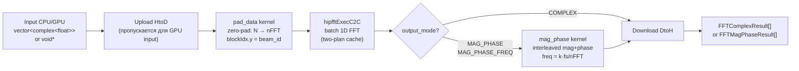

# FFT Processor — Полная документация

> GPU FFT с вариантами вывода (Complex / MagPhase / MagPhaseFreq)
> OpenCL backend: `FFTProcessor` (clFFT)
> ROCm backend: `FFTProcessorROCm` (hipFFT) + `ComplexToMagPhaseROCm`

**Namespace**: `fft_processor`
**Каталог**: `modules/fft_processor/`
**Зависимости**: DrvGPU (`IBackend*`), OpenCL + clFFT **или** ROCm + hipFFT

---

## Содержание

1. [Обзор и назначение](#1-обзор-и-назначение)
2. [Pipeline и zero-padding](#2-pipeline-и-zero-padding)
3. [Режимы вывода](#3-режимы-вывода)
4. [API (C++ и Python)](#4-api)
5. [Тесты](#5-тесты)
6. [Важные замечания](#6-важные-замечания)
7. [Файлы модуля](#7-файлы-модуля)
8. [Ссылки](#8-ссылки)
9. [Математика алгоритма](#9-математика-алгоритма)
10. [Архитектура C4](#10-архитектура-c4)

---

## 1. Обзор и назначение

`FFTProcessor` возвращает **полный спектр** в нужном формате. Отдельно: `SpectrumMaximaFinder` (модуль fft_maxima) ищет максимумы.

| Класс | Backend | Назначение |
|-------|---------|------------|
| **FFTProcessor** | OpenCL/clFFT | FFT → полный спектр (complex / mag+phase / mag+phase+freq) |
| **FFTProcessorROCm** | ROCm/hipFFT | То же самое, но на hipFFT (AMD GPU, gfx1201 совместим) |
| **ComplexToMagPhaseROCm** | ROCm | Прямое вычисление `|z|` и `arg(z)` **без FFT** |
| **SpectrumMaximaFinder** | OpenCL | FFT → поиск пиков (1, 2 или все максимумы) |

> ⚠️ На AMD GPU (RDNA4+, gfx1201) используй **FFTProcessorROCm** — clFFT не поддерживает новые архитектуры.

### Реализовано

- [x] FFT для размеров 2^n (n = 4..17+)
- [x] IFFT (через clFFT/hipFFT)
- [x] Zero-padding: OpenCL — pre-callback; ROCm — отдельный pad kernel
- [x] Режимы: COMPLEX, MAGNITUDE_PHASE, MAGNITUDE_PHASE_FREQ
- [x] Batch (несколько лучей за вызов)
- [x] GPU-input overload (`void*` / `cl_mem`)
- [x] Профилирование через GPUProfiler (стадии Upload/Pad/FFT/Download)
- [x] **ROCm/hipFFT**: `FFTProcessorROCm` (2026-02-23)
- [x] **ComplexToMagPhaseROCm**: прямой complex→mag+phase без FFT (2026-03-01)
- [x] hiprtc JIT-компиляция kernels + HSACO disk cache (KernelCacheService)

### Планируется

- [ ] Оконные функции (Hann, Hamming, Blackman, Kaiser)
- [ ] Real-to-Complex FFT (R2C)

---

## 2. Pipeline и zero-padding

### 2.1 OpenCL Pipeline (clFFT)

```
Input → [32B header][data] → Pre-Callback (zero-pad) → clFFT → [Post-Kernel: mag+phase] → Output
```

Pre-callback выполняется автоматически внутри clFFT — ядро zero-pad встроено как callback. Заголовок 32 байта содержит: `beam_count`, `count_points`, `nFFT`.

```
Input (host или cl_mem)
      │
      ▼
┌─────────────────────┐
│  Upload / Copy GPU  │
└──────────┬──────────┘
           │
           ▼
┌─────────────────────┐
│ Pre-Callback        │  ← zero-pad, 32B header
│ (clFFT user data)   │
└──────────┬──────────┘
           │
           ▼
┌─────────────────────┐
│   clFFT (1D C2C)    │
└──────────┬──────────┘
           │
           ▼
┌─────────────────────┐
│ MagPhase Kernel     │  ← если output_mode ≠ COMPLEX
│ (|FFT|, phase, freq)│
└──────────┬──────────┘
           │
           ▼
    Results (host)
```

### 2.2 ROCm Pipeline (hipFFT, FFTProcessorROCm)

```
Input (host или void*) → Upload → Pad Kernel → hipfftExecC2C → [MagPhase Kernel] → Download → Output
```

Принципиальное отличие: zero-padding — **отдельный HIP-kernel** (не callback). hipFFT не поддерживает pre-callbacks.

```
Input (CPU или GPU ptr)
      │
      ▼
┌─────────────────────┐
│ Upload (HtoD)        │  ← hipMemcpyHtoD, пропускается при GPU-input
└──────────┬──────────┘
           │
           ▼
┌─────────────────────┐
│ Pad Kernel (hiprtc)  │  ← zero-pad: copies n_point samples, zeroes rest
│ fft_processor_kernels_rocm.hpp │
└──────────┬──────────┘
           │
           ▼
┌──────────────────────────────┐
│ hipfftExecC2C (batch 1D FFT) │  ← plan кешируется (two-plan cache)
└──────────┬───────────────────┘
           │
           ▼
┌──────────────────────────────┐
│ MagPhase Kernel (optional)   │  ← только если режим ≠ COMPLEX
└──────────┬───────────────────┘
           │
           ▼
┌─────────────────────┐
│ Download (DtoH)      │  ← hipMemcpyDtoH
└──────────┬──────────┘
           │
           ▼
    ROCmFFTResult[]
```

**Two-plan cache**: `FFTProcessorROCm` кеширует **два** hipFFT-плана (`plan_` и `plan_last_`). Это позволяет быстро переключаться между двумя разными размерами `nFFT` без пересоздания плана. При каждом вызове новый размер вытесняет более старый.

### 2.3 ComplexToMagPhaseROCm Pipeline

Не выполняет FFT — напрямую вычисляет `|z|` и `arg(z)` по комплексному входу.

```
Complex input [N × beam_count]
      │
      ▼
┌─────────────────────────────────┐
│ (Upload, если CPU input)         │
└──────────┬──────────────────────┘
           │
           ▼
┌──────────────────────────────────────┐
│ c2mp_kernel (hiprtc)                  │
│ for each sample: mag = |z|, ph = arg  │
└──────────┬───────────────────────────┘
           │
           ▼
┌──────────────────────────────────────┐
│ (Download + repack, если CPU output)  │
└──────────┬───────────────────────────┘
           │
           ▼
  MagPhaseResult[] (CPU) или void* (GPU)
```

**GPU-output режим**: `ProcessToGPU()` возвращает `void*` — интерливованные `[mag, phase]` float-пары на GPU. **Caller owner!** — необходимо вызвать `backend.Free(ptr)` после использования. Используется для GPU-пайплайна без копирования на CPU.

### Zero-padding формула

$$
nFFT = \text{nextPowerOf2}(n\_point) \times repeat\_count
$$

Пример: `n_point=1000`, `repeat_count=2` → `nFFT = 1024 × 2 = 2048`

---

## 3. Режимы вывода

### FFTProcessor / FFTProcessorROCm

| Режим | Поля результата | Использование |
|-------|-----------------|---------------|
| **COMPLEX** | `spectrum[]` (complex\<float\>) | Сырой спектр, дальнейшая обработка |
| **MAGNITUDE_PHASE** | `magnitude[]`, `phase[]` | Амплитуда и фаза |
| **MAGNITUDE_PHASE_FREQ** | `magnitude[]`, `phase[]`, `frequency[]` | + частоты в Hz: `freq[k] = k * fs / nFFT` |

### ComplexToMagPhaseROCm

| Режим | Метод | Описание |
|-------|-------|----------|
| CPU → CPU | `Process(vector<complex>, params)` | Upload → kernel → download → MagPhaseResult[] |
| GPU → CPU | `Process(void*, params, size)` | Kernel → download → MagPhaseResult[] |
| CPU → GPU | `ProcessToGPU(vector<complex>, params)` | Upload → kernel → возвращает `void*` на GPU |
| GPU → GPU | `ProcessToGPU(void*, params, size)` | Kernel → возвращает `void*` на GPU (zero-copy) |

---

## 4. API

### 4.1 FFTProcessor (OpenCL/clFFT)

```cpp
#include "fft_processor.hpp"

fft_processor::FFTProcessor fft(backend);
fft_processor::FFTProcessorParams params;
params.beam_count = 256;
params.n_point    = 1024;
params.sample_rate = 1000.0f;
params.output_mode = fft_processor::FFTOutputMode::MAGNITUDE_PHASE_FREQ;

// CPU данные
auto results  = fft.ProcessComplex(data, params);   // → vector<FFTResult>
auto results2 = fft.ProcessMagPhase(data, params);  // → vector<FFTResult>

// GPU данные (cl_mem)
auto results3 = fft.ProcessComplex(gpu_buf, params, gpu_bytes);

// Профилирование
auto prof = fft.GetProfilingData();
// prof.upload_time_ms, .fft_time_ms, .download_time_ms, .total_time_ms
```

### 4.2 FFTProcessorROCm (ROCm/hipFFT)

```cpp
#include "fft_processor_rocm.hpp"

fft_processor::FFTProcessorROCm fft(backend);  // IBackend* или ROCmBackend*
fft_processor::FFTProcessorParams params;
params.beam_count  = 64;
params.n_point     = 4096;
params.sample_rate = 1e6f;
params.output_mode = fft_processor::FFTOutputMode::COMPLEX;

// CPU данные
auto results = fft.ProcessComplex(data, params);

// GPU данные (void* / hipPtr)
auto results2 = fft.ProcessComplex(gpu_ptr, params, byte_size);

// С детальным профилированием по стадиям
fft_processor::ROCmProfEvents events;
auto results3 = fft.ProcessComplex(data, params, &events);
// events["Upload"].start_ns / .end_ns
// events["Pad"].start_ns / .end_ns
// events["FFT"].start_ns / .end_ns
// events["Download"].start_ns / .end_ns
```

### 4.3 ComplexToMagPhaseROCm (ROCm)

```cpp
#include "complex_to_mag_phase_rocm.hpp"

fft_processor::ComplexToMagPhaseROCm converter(backend);
fft_processor::MagPhaseParams params;
params.beam_count = 4;
params.n_point    = 2048;

// CPU → CPU
std::vector<std::complex<float>> data = ...;
auto results = converter.Process(data, params);
// results[i].magnitude[], results[i].phase[], results[i].n_point, results[i].beam_id

// GPU → CPU (external GPU buffer)
void* gpu_data = ...;
auto results2 = converter.Process(gpu_data, params, data_size_bytes);

// CPU → GPU (для дальнейшей обработки без копирования)
void* gpu_output = converter.ProcessToGPU(data, params);
// gpu_output: интерлив [mag0, phase0, mag1, phase1, ...] float
// ВАЖНО: caller должен освободить! backend.Free(gpu_output)

// GPU → GPU (zero-copy пайплайн)
void* gpu_out = converter.ProcessToGPU(gpu_data, params, data_size_bytes);
backend.Free(gpu_out);  // не забыть!
```

### 4.4 FFTProcessorParams

| Параметр | Тип | Default | Описание |
|----------|-----|---------|----------|
| `beam_count` | uint32_t | 1 | Количество лучей (каналов) |
| `n_point` | uint32_t | 0 | Входных точек на луч |
| `sample_rate` | float | 1000.0f | Частота дискретизации (Hz) |
| `output_mode` | FFTOutputMode | COMPLEX | Режим вывода |
| `repeat_count` | uint32_t | 1 | Множитель nFFT: `nFFT = nextPow2(n_point) * repeat_count` |
| `memory_limit` | float | 0.80f | Лимит GPU памяти для batch (0.0–1.0) |

### 4.5 Python API

> Python-биндинг файл: `python/py_fft_processor.hpp` (планируется на платформе OpenCL)

```python
import gpuworklib

ctx = gpuworklib.GPUContext(0)
fft = gpuworklib.FFTProcessor(ctx)

# process_complex(data, beam_count, n_point, sample_rate)
results = fft.process_complex(signal, beam_count=8, n_point=1024, sample_rate=50000.0)
# results[i].spectrum (list of complex), results[i].nFFT

# process_mag_phase(data, beam_count, n_point, sample_rate, include_freq=True)
results = fft.process_mag_phase(signal, 8, 1024, 50000.0, include_freq=True)
# results[i].magnitude, .phase, .frequency (если include_freq)
```

---

## 5. Тесты

**Вызов**: `main.cpp` → `all_test.hpp` → `fft_processor_all_test::run()`

> Статус: OpenCL-тесты закомментированы (clFFT не компилируется на gfx1201). ROCm-тесты активны.

### 5.1 test_fft_processor.hpp — OpenCL базовые тесты (4 теста)

> *Статус: закомментированы в `all_test.hpp` (clFFT на gfx1201)*

| # | Тест | Входные данные | Что проверяет | Почему именно это |
|---|------|----------------|---------------|-------------------|
| 1 | **SingleBeamComplex** | Синусоида 100 Hz, fs=1000, N=1024, 1 луч | Пик FFT на бине 100 ±1 бин | Синусоида с известной частотой → FFT должен дать пик ровно на `f/fs·N`. Ошибка > 1 бина = ошибка в pad/header/clFFT-плане |
| 2 | **MultiBeamMagPhaseFreq** | 8 лучей, freq 500..1200 Hz (шаг 100), N=2048, fs=10kHz | Пик каждого луча совпадает с ожидаемой частотой ±1 бин; freq-массив заполнен правильно | Проверяет batch-обработку и `frequency[]` = `k * fs / nFFT` — типичная ошибка: неверный масштаб оси частот |
| 3 | **MagPhaseVsComplex** | Синусоида 250 Hz, N=512 | Magnitude и phase из режима MAGNITUDE_PHASE совпадают с `abs()` и `arg()` из COMPLEX | Ловит баг в post-kernel: неверная формула mag/phase или неверный порядок бинов между двумя режимами. Порог 1e-3 — предел float32 при N=512 |
| 4 | **TestProfiling** | Синусоида 100 Hz, N=1024 | `GetProfilingData()` возвращает ненулевые времена | Гарантирует что профилирование CL_QUEUE_PROFILING_ENABLE работает и данные передаются |

### 5.2 test_fft_vs_cpu.hpp — GPU vs CPU reference (5 тестов)

> *Статус: закомментированы в `all_test.hpp` (clFFT на gfx1201)*

| # | Тест | Входные данные | CPU reference | Порог | Что ловит |
|---|------|----------------|---------------|-------|-----------|
| 1 | **SingleToneVsCpu** | Синусоида f=100 Hz, N=1024, 1 луч | pocketfft | max_error < 1e-4 | Численный drift clFFT vs CPU: если >1e-4 — рендеринг плана плохой или неверная нормализация |
| 2 | **MultiToneVsCpu** | 3 синусоиды (f1=100, f2=200, f3=300 Hz), N=1024 | pocketfft (сумма) | max_error < 1e-4 | Линейность FFT (суперпозиция): ошибка в буфере или batch-offset — три тона разъедутся по бинам |
| 3 | **MultiBeamVsCpu** | 4 луча, разные частоты, N=1024 | pocketfft (каждый луч отдельно) | max_error < 1e-4 | batch-mode: неверный stride между лучами → перекрёстное загрязнение между каналами |
| 4 | **LargeFFTVsCpu** | N=65536, 1 луч | pocketfft | max_error < 1e-3 | Накопление ошибок округления при большом N — порог 1e-3 (не 1e-4) обоснован: float32 FFT при N=64K даёт ~5·10⁻⁴ накопленную ошибку |
| 5 | **MagPhaseVsCpuReference** | Синусоида, N=1024 | `std::abs()`/`std::arg()` каждого бина | max_error < 1e-4 | Корректность GPU post-kernel mag/phase vs CPU-расчёт |

### 5.3 test_fft_processor_rocm.hpp — ROCm/hipFFT тесты (5 тестов)

> *Статус: активен*

| # | Тест | Входные данные | Что проверяет | Нюансы |
|---|------|----------------|---------------|--------|
| 1 | **SingleBeamComplex** | Синусоида, f=100 Hz, N=1024, 1 луч | Пик на бине 100 ±1 бин | Базовый smoke-тест hipFFT pipeline: upload → pad → fft → download |
| 2 | **MultiBeamBatch** | 8 лучей, разные частоты | Каждый луч: пик ±1 бин | Проверяет hipFFT batch-plan: неверный `dist` в плане → перекрёстное загрязнение лучей |
| 3 | **MagPhaseConsistency** | Синусоида, N=4096 | GPU MagPhase vs GPU Complex: `abs(spectrum[k])` vs `magnitude[k]` | Ловит баг в mag_phase_kernel: если два режима дают разные значения — ошибка в ядре или в адресации буферов |
| 4 | **MagPhaseFreq** | Синусоида, N=2048, fs=10 kHz | `frequency[peak_bin]` ≈ expected_freq | Проверяет `freq = k * fs / nFFT` при ROCm — типичная ошибка: неверный масштаб или off-by-one |
| 5 | **GpuInput** | Синусоида, данные уже загружены в GPU (`void*`) | Результат совпадает с CPU-input вариантом | Проверяет overload с `void*`: пропуск upload-стадии, прямой pad от чужого буфера |

### 5.4 test_complex_to_mag_phase_rocm.hpp — ComplexToMagPhaseROCm (6 тестов)

> *Статус: активен*

| # | Тест | Входные данные | Что проверяет | Порог | Нюансы |
|---|------|----------------|---------------|-------|--------|
| 1 | **SingleBeam CPU→CPU** | Синусоида, A=2.5, f=100 Hz, N=4096 | `magnitude[k]` = `std::abs(data[k])`, `phase[k]` = `std::arg(data[k])` | 1e-3 | Синусоида с известной амплитудой: `|z| = 2.5` для всех точек. Ловит баг в формуле гипотенузы GPU (`sqrtf(re²+im²)`) |
| 2 | **MultiBeam CPU→CPU** | 8 лучей, амплитуды 0.5..4.0 (шаг 0.5), f=500 Hz, N=4096 | Каждый луч: max_mag_err < 1e-3 | 1e-3 | Разные амплитуды гарантируют что GPU правильно адресует stride между лучами. Неверный `beam_id` или смещение → ошибка только в части лучей |
| 3 | **GPU Input → CPU** | Синусоида, данные вручную загружены на GPU | Совпадает с CPU-input вариантом | 1e-3 | Проверяет overload с `void*`: ядро работает с чужим GPU-буфером без extra upload |
| 4 | **CPU → GPU (ProcessToGPU)** | Синусоида, A=3.0, N=1024 | Interleaved `[mag, phase]` в GPU-памяти корректны | 1e-3 | Уникальный режим: нет download, данные остаются на GPU. Результат читается вручную D2H для проверки. Ловит ошибку в interleave layout |
| 5 | **GPU → GPU (ProcessToGPU)** | 4 луча, данные на GPU | Interleaved output верен для всех лучей | 1e-3 | Полный zero-copy pipeline: ни одного D2H/H2D. Ловит баг когда GPU→GPU path использует неверный stride/offset по сравнению с CPU→GPU |
| 6 | **Accuracy (edge cases)** | 16 точек: нуль, чистое вещественное, чистое мнимое, ±45°, 3-4-5 треугольник, большие/малые значения | `magnitude[(3,4)] = 5.0`, `phase[(3,4)] = atan2(4,3)` | 1e-2 | Граничные случаи: ноль (нет деления на нуль), чистые оси (angle 0/π/±π/2), 3-4-5 — проверяет гипотенузу известного прямоугольного треугольника |

### 5.5 test_fft_matrix_rocm.hpp — FFT Matrix Benchmark (не unit-тест)

Запускает матрицу замеров: 20 значений `beam_count` (20..400, шаг 20) × 13 значений `nFFT` (2⁴..2¹⁶).

**Зачем**: показывает где hipFFT становится memory-bound vs compute-bound, оптимальные рабочие точки для конкретного GPU.

**Контрольная точка** 320×1024: замеряется в начале и конце для детекта drift (перегрев, throttling).

**Экспорт**: `Results/Profiler/FFT_Matrix/fft_matrix_YYYY-MM-DD_HH-MM-SS.md` (3 таблицы: FFT-only, Pad+FFT, Upload+Pad+FFT+Download) и `.txt`.

### 5.6 test_fft_benchmark.hpp / test_fft_benchmark_rocm.hpp

Бенчмарки через `GpuBenchmarkBase` — хронометраж hipFFT с warmup и усреднением. Закомментированы в `all_test.hpp` (запускать отдельно при необходимости).

---

## 6. Важные замечания

### FFT Plan Caching

**OpenCL (FFTProcessor)**: кеширует один clFFT plan. При изменении `n_point` — создать новый экземпляр.

**ROCm (FFTProcessorROCm)**: two-plan cache — хранит два hipFFT-плана для двух последних размеров `nFFT`. Позволяет быстро переключаться между двумя размерами (напр. 1024 и 4096) без пересоздания плана.

```cpp
// ПРАВИЛЬНО — два экземпляра для разных размеров (OpenCL)
fft_processor::FFTProcessor fft_4096(backend);
fft_processor::FFTProcessor fft_8192(backend);

// ПРАВИЛЬНО — FFTProcessorROCm автоматически кеширует два размера
fft_processor::FFTProcessorROCm fft(backend);
fft.ProcessComplex(data_4096, params_4096);  // создаёт план для 4096
fft.ProcessComplex(data_8192, params_8192);  // создаёт план для 8192
fft.ProcessComplex(data_4096, params_4096);  // переиспользует существующий план
```

### GPU Memory

- CPU данные копируются на GPU внутри `ProcessXxx`
- GPU данные (`cl_mem` / `void*`) используются напрямую, ownership не передаётся
- `ComplexToMagPhaseROCm::ProcessToGPU()` — **исключение**: caller владеет возвращённым указателем, нужно освободить через `backend.Free(ptr)`
- Результаты (не ProcessToGPU) всегда возвращаются на CPU

### hiprtc JIT + HSACO Disk Cache

`FFTProcessorROCm` и `ComplexToMagPhaseROCm` компилируют ядра через hiprtc (JIT). Скомпилированные бинарники (.hsaco) кешируются на диске через `KernelCacheService`:

- **При первом запуске**: JIT-компиляция (~100-500 ms), результат сохраняется в `kernels/bin/`
- **При повторных запусках**: загрузка из кеша (~1 ms)
- **Предкомпилированные файлы**: `kernels/bin/fft_processor_kernels_rocm.hsaco`, `kernels/bin/c2mp_kernels_rocm.hsaco`

### OpenCL vs ROCm — выбор backend

| Платформа | FFT-класс | Ядро |
|-----------|-----------|------|
| **AMD GPU (RDNA4+, gfx1201)** | `FFTProcessorROCm` | hipFFT |
| **AMD GPU (старые)** | `FFTProcessorROCm` или `FFTProcessor` | hipFFT / clFFT |
| **NVIDIA GPU** | `FFTProcessor` | clFFT |
| **Intel GPU** | `FFTProcessor` | clFFT |

### Нормализация

clFFT и hipFFT возвращают **ненормализованный** FFT — без деления на N. `FFTProcessor` и `FFTProcessorROCm` также не нормализуют.

```cpp
// GPU magnitude[k] — ненормализованный
// Для совместимости с NumPy np.fft.fft(): совпадает (тоже ненормализованный)
// Для физических единиц: делить самостоятельно
float normalized_mag = results[i].magnitude[k] / params.n_point;
```

```python
# NumPy сравнение (оба ненормализованные)
np_fft = np.abs(np.fft.fft(signal, n=nFFT))  # совместимо с GPU magnitude[]
```

### Pad Kernel 2D Grid (ROCm)

`pad_data` kernel использует `blockIdx.y = beam_id` — без `div/mod` для вычисления индекса луча. Это оптимизация occupancy (`__launch_bounds__(256)`). При отладке: если видишь что данные разных лучей перемешались — проверить stride в `gridDim.y` (должен равняться `beam_count`).

### Matrix Benchmark: 3+ размера на одном экземпляре

Two-plan cache рассчитан на 2 размера. При 3+ разных `nFFT` план пересоздаётся при каждом переключении. В `test_fft_matrix_rocm.hpp` для каждой ячейки матрицы создаётся отдельный `FFTProcessorROCm` экземпляр — это правильный паттерн:

```cpp
// ПРАВИЛЬНО для matrix benchmark — новый экземпляр на каждый nFFT
for (auto nfft : nfft_values) {
    fft_processor::FFTProcessorROCm proc(backend);  // ← внутри цикла
    proc.ProcessComplex(data, params);
}
```

### Метрики (ориентир, AMD RX 7900 XTX)

| Операция | Лучи | nFFT | Время FFT | Полный цикл |
|----------|------|------|-----------|-------------|
| hipFFT | 320 | 1024 | ~1 ms | ~3 ms |
| hipFFT | 100 | 4096 | ~1.5 ms | ~5 ms |
| hipFFT | 20 | 65536 | ~4 ms | ~8 ms |

> Точные данные: `Results/Profiler/FFT_Matrix/`

---

## 7. Файлы модуля

```
modules/fft_processor/
├── include/
│   ├── fft_processor.hpp              ← FFTProcessor (OpenCL/clFFT)
│   ├── fft_processor_types.hpp        ← общие типы
│   ├── fft_processor_rocm.hpp         ← FFTProcessorROCm (hipFFT) [ROCM]
│   ├── complex_to_mag_phase_rocm.hpp  ← ComplexToMagPhaseROCm [ROCM]
│   ├── kernels/
│   │   ├── fft_processor_kernels.hpp       ← OpenCL kernel sources
│   │   ├── fft_processor_kernels_rocm.hpp  ← ROCm pad/mag-phase kernel sources
│   │   └── complex_to_mag_phase_kernels_rocm.hpp ← ROCm c2mp kernel sources
│   └── types/
│       ├── fft_modes.hpp              ← FFTOutputMode enum
│       ├── fft_params.hpp             ← FFTProcessorParams
│       ├── fft_results.hpp            ← FFTResult, ROCmFFTResult
│       ├── fft_types.hpp
│       └── mag_phase_types.hpp        ← MagPhaseParams, MagPhaseResult [ROCM]
├── src/
│   ├── fft_processor.cpp              ← OpenCL реализация
│   ├── fft_processor_rocm.cpp         ← ROCm/hipFFT реализация [ROCM]
│   └── complex_to_mag_phase_rocm.cpp  ← ComplexToMagPhaseROCm реализация [ROCM]
├── kernels/
│   ├── fft_processor_kernels.cl       ← OpenCL: mag+phase post-kernel
│   ├── c2mp_kernels.cl                ← ROCm: complex→mag+phase kernel source
│   └── bin/
│       ├── fft_processor_kernels_rocm.hsaco ← предкомпилированный HSACO [ROCM]
│       └── c2mp_kernels_rocm.hsaco          ← предкомпилированный HSACO [ROCM]
├── tests/
│   ├── all_test.hpp                   ← точка входа из main.cpp
│   ├── test_fft_processor.hpp         ← 4 теста OpenCL (закомментированы)
│   ├── test_fft_vs_cpu.hpp            ← 5 тестов GPU vs pocketfft (закомментированы)
│   ├── test_fft_benchmark.hpp         ← OpenCL benchmark (закомментирован)
│   ├── fft_processor_benchmark.hpp    ← benchmark base (OpenCL)
│   ├── test_fft_processor_rocm.hpp    ← 5 тестов ROCm (активен)
│   ├── test_complex_to_mag_phase_rocm.hpp ← 6 тестов ROCm (активен)
│   ├── test_fft_benchmark_rocm.hpp    ← ROCm benchmark (закомментирован)
│   ├── fft_processor_benchmark_rocm.hpp  ← benchmark base ROCm
│   └── test_fft_matrix_rocm.hpp       ← matrix benchmark 20×13 (активен)
└── CMakeLists.txt
```

---

## 8. Ссылки

| Источник | Описание |
|----------|----------|
| [clFFT GitHub](https://github.com/clMathLibraries/clFFT) | OpenCL FFT библиотека |
| [hipFFT Docs](https://rocm.docs.amd.com/projects/hipFFT/) | ROCm FFT (активно используется) |
| [Doc/Modules/fft_maxima/Full.md](../fft_maxima/Full.md) | SpectrumMaximaFinder — поиск максимумов |
| [Doc_Addition/Info_ROCm_HIP_Optimization_Guide.md](../../Doc_Addition/Info_ROCm_HIP_Optimization_Guide.md) | Оптимизация HIP/ROCm ядер |

---

## 9. Математика алгоритма

### DFT (Дискретное Преобразование Фурье)

Для входного сигнала $x[n]$, $n = 0, 1, \ldots, N-1$:

$$
X[k] = \sum_{n=0}^{N-1} x[n] \cdot e^{-j 2\pi k n / N}, \quad k = 0, 1, \ldots, N-1
$$

clFFT и hipFFT реализуют 1D C2C FFT по алгоритму Cooley–Tukey (radix-2/4/8).

### Zero-padding

$$
N_{FFT} = \text{nextPowerOf2}(n\_point) \times repeat\_count
$$

Дополнение нулями увеличивает частотное разрешение интерполяции, но **не добавляет новой информации**. `repeat_count > 1` реализует суперразрешение (плавнее огибающая спектра).

### Частота бина

$$
f_k = k \cdot \frac{f_s}{N_{FFT}}, \quad k = 0, 1, \ldots, N_{FFT}-1
$$

Поле `frequency[]` в режиме `MAGNITUDE_PHASE_FREQ` вычисляется именно по этой формуле.

### Амплитуда и фаза

$$
\text{magnitude}[k] = \sqrt{\text{Re}^2 + \text{Im}^2}
$$

$$
\text{phase}[k] = \text{atan2}(\text{Im},\ \text{Re})
$$

**GPU-реализация** (hiprtc): `__fsqrt_rn(z.x*z.x + z.y*z.y)` — fast sqrt intrinsic, `atan2f(z.y, z.x)`.

### Нормализация

clFFT и hipFFT возвращают **ненормализованный** FFT (нет деления на $N_{FFT}$). Для физических единиц:

$$
|X_{norm}[k]| = \frac{|X[k]|}{N_{FFT}}
$$

`FFTProcessor` и `FFTProcessorROCm` намеренно не нормализуют — caller делает это при необходимости.

---

## 10. Архитектура C4

### C1 — System Context

```
[Входной сигнал CPU/GPU]  →→  [GPUWorkLib fft_processor]  →→  [GPU Hardware]
 vector<complex<float>>         FFTProcessor                    AMD: hipFFT (gfx1201+)
 cl_mem / void*                 FFTProcessorROCm                NVIDIA/Intel: clFFT
                                ComplexToMagPhaseROCm
        ↓↑                                                           ↑
 [FFTComplexResult[]]                                       hiprtc JIT + HSACO cache
 [FFTMagPhaseResult[]]
 [MagPhaseResult[]]
```

### C2 — Container

```
[fft_processor модуль]
  ├── OpenCL path
  │     ├── IBackend (cl_context, cl_command_queue)
  │     ├── clFFT (clfftPlanHandle, pre-callback)
  │     └── cl_mem: pre_callback_userdata, fft_input, fft_output, mag_output, phase_output
  └── ROCm path
        ├── IBackend → ROCmBackend (hipStream_t)
        ├── hipFFT (hipfftHandle, two-plan cache: plan_ + plan_last_)
        ├── hiprtc → KernelCacheService (HSACO disk cache в kernels/bin/)
        └── void*: input_buffer, fft_input, fft_output, mag_phase_interleaved
```

### C3 — Component

```
namespace fft_processor
  ├── FFTProcessor          ← OpenCL: clFFT plan + pre-callback (32B header) + BatchManager
  ├── FFTProcessorROCm      ← ROCm: hipFFT + hiprtc pad_data kernel + mag_phase + two-plan cache
  └── ComplexToMagPhaseROCm ← ROCm: hiprtc c2mp_kernel, ProcessToGPU() (caller-owned ptr)
```

### C4 — Code (FFTProcessorROCm)

```
FFTProcessorROCm
  + FFTProcessorROCm(IBackend*)
  + ProcessComplex(data, params, prof_events=nullptr)  → vector<FFTComplexResult>
  + ProcessComplex(void* gpu_data, params, size)        → vector<FFTComplexResult>
  + ProcessMagPhase(data, params, prof_events=nullptr)  → vector<FFTMagPhaseResult>
  + ProcessMagPhase(void* gpu_data, params, size)       → vector<FFTMagPhaseResult>
  + GetProfilingData()  → FFTProfilingData
  + GetNFFT()           → uint32_t
  ─────────────────────────────────────────
  - CreateFFTPlan(batch)           ← two-plan cache (plan_ + plan_last_)
  - CompileKernels()               ← hiprtc + KernelCacheService (HSACO)
  - ExecutePadKernel(beams)        ← pad_data: grid dim (blocks, beam_count), __launch_bounds__(256)
  - ExecuteFFT()                   ← hipfftExecC2C batch
  - ExecuteMagPhaseKernel(beams)   ← interleaved {mag, phase} output
  ─────────────────────────────────────────
  - stream_: hipStream_t
  - plan_, plan_last_: hipfftHandle   ← two-plan cache
  - kernel_cache_: KernelCacheService
```

### Mermaid Pipeline (ROCm)



---

*Обновлено: 2026-03-02*
*Изменения: добавлены FFTProcessorROCm (hipFFT), ComplexToMagPhaseROCm, all 9 тестов с описаниями, two-plan cache, HSACO disk cache, актуальное файловое дерево*
