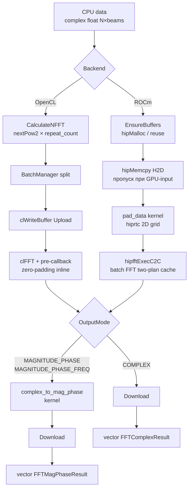

# FFT Processor — Полная документация

> Пакетное GPU-FFT с тремя режимами вывода: Complex, MagPhase, MagPhaseFreq

**Namespace**: `fft_processor`
**Каталог**: `modules/fft_processor/`
**Зависимости**: DrvGPU (`IBackend*`), clFFT (OpenCL) / hipFFT (ROCm), hiprtc (ROCm kernels)

---

## Содержание

1. [Обзор и назначение](#1-обзор-и-назначение)
2. [Зачем нужен / Алгоритм](#2-зачем-нужен--алгоритм)
3. [Математика алгоритма](#3-математика-алгоритма)
4. [Пошаговый pipeline](#4-пошаговый-pipeline)
5. [Kernels](#5-kernels)
6. [C4 Диаграммы](#6-c4-диаграммы)
7. [API (C++ и Python)](#7-api)
8. [Тесты](#8-тесты)
9. [Бенчмарки](#9-бенчмарки)
10. [Ссылки и файловое дерево](#10-ссылки-и-файловое-дерево)

---

## 1. Обзор и назначение

`fft_processor` — модуль пакетного FFT на GPU. Принимает вектор комплексных выборок для N лучей, выполняет FFT на GPU для всех лучей одновременно, возвращает спектр в одном из трёх форматов.

**Три класса**:

| Класс | Backend | Назначение |
|-------|---------|------------|
| `FFTProcessor` | OpenCL / clFFT | FFT на любом GPU через OpenCL |
| `FFTProcessorROCm` | ROCm / hipFFT | FFT на AMD GPU (gfx1201+), hiprtc kernels |
| `ComplexToMagPhaseROCm` | ROCm | Только `|z|` + `arg(z)` без FFT |

**Вход**: плоский вектор `complex<float>[beam_count × n_point]`.
**Выход**: `vector<FFTComplexResult>` или `vector<FFTMagPhaseResult>` — по одному на луч.

**Режимы вывода**:

| `FFTOutputMode` | Поля результата |
|-----------------|-----------------|
| `COMPLEX` | `spectrum[]` — `complex<float>[nFFT]` |
| `MAGNITUDE_PHASE` | `magnitude[]` + `phase[]` — `float[nFFT]` каждый |
| `MAGNITUDE_PHASE_FREQ` | то же + `frequency[]` — Hz для каждого бина |

---

## 2. Зачем нужен / Алгоритм

### Проблема: частотный анализ требует GPU

Одиночный FFT из 4096 точек занимает ~10 мкс на CPU. При обработке 64 лучей с периодом 1 мс — CPU не успевает. GPU выполняет батч из 64 независимых FFT параллельно за ~0.5 мс.

### Алгоритм пакетного FFT

```
Для каждого луча b из beam_count:
    1. Взять срез data[b*n_point .. (b+1)*n_point]
    2. Дополнить нулями до nFFT = nextPow2(n_point) × repeat_count
    3. Выполнить 1D комплексный FFT (Cooley-Tukey radix-2/4/8)
    4. Опционально: вычислить |X[k]| + arg(X[k])
    5. Опционально: вычислить freq[k] = k × fs / nFFT
```

**Zero-padding**: если `n_point` не степень двойки, данные дополняются нулями до `nextPow2(n_point)`. Это увеличивает спектральное разрешение (интерполяция в частотной области) без добавления новой информации.

### Нормализация

FFT не нормируется — результат идентичен `np.fft.fft()` из NumPy. Для получения амплитуды физического сигнала нужно делить на `n_point`.

### Два backend

- **OpenCL (clFFT)**: pre-callback механизм — zero-padding выполняется прямо во время загрузки данных в clFFT план. Не требует отдельного pass.
- **ROCm (hipFFT)**: отдельный hiprtc-кернел `pad_data` дополняет нули перед hipFFT. После — кернел `complex_to_mag_phase` если нужен режим MagPhase.

---

## 3. Математика алгоритма

### DFT (дискретное преобразование Фурье)

$$
X[k] = \sum_{n=0}^{N-1} x[n] \cdot e^{-j 2\pi k n / N}, \quad k = 0, 1, \ldots, N-1
$$

где $N = \text{nFFT}$, $x[n]$ — zero-padded вход комплексный.

clFFT и hipFFT реализуют 1D C2C FFT по алгоритму Cooley–Tukey (radix-2/4/8).

### Zero-padding

$$
\text{nFFT} = \text{nextPow2}(n\_point) \times \text{repeat\_count}
$$

$$
\tilde{x}[n] = \begin{cases} x[n], & 0 \le n < n\_point \\ 0, & n\_point \le n < \text{nFFT} \end{cases}
$$

Пример: `n_point=1000`, `repeat_count=2` → `nFFT = 1024 × 2 = 2048`.

### Частота бина

$$
f_k = k \cdot \frac{f_s}{\text{nFFT}}, \quad k = 0, 1, \ldots, \text{nFFT}-1
$$

Поле `frequency[]` в режиме `MAGNITUDE_PHASE_FREQ` вычисляется по этой формуле.

### Амплитуда и фаза

$$
|X[k]| = \sqrt{\operatorname{Re}(X[k])^2 + \operatorname{Im}(X[k])^2}
$$

$$
\angle X[k] = \operatorname{atan2}\!\big(\operatorname{Im}(X[k]),\; \operatorname{Re}(X[k])\big)
$$

GPU-реализация (hiprtc): `__fsqrt_rn(re*re + im*im)` — fast sqrt intrinsic, `atan2f(im, re)`.

### Нормализация

clFFT и hipFFT возвращают **ненормализованный** FFT — без деления на $N$. Для физических единиц:

$$
|X_{\text{norm}}[k]| = \frac{|X[k]|}{N}
$$

### Точность float32

Ошибка FFT в float32 растёт как $\varepsilon_N \approx \varepsilon \cdot \sqrt{\log_2 N}$, где $\varepsilon \approx 10^{-7}$.

| nFFT | log₂(N) стадий | Ожидаемая max ошибка | Порог в тестах |
|------|----------------|---------------------|----------------|
| 1024 | 10 | < 1e-4 (relative) | 1e-4 |
| 4096 | 12 | < 1e-4 (relative) | 1e-4 |
| 65536 | 16 | < 1e-3 (relative) | 1e-3 |
| MagPhase (fast intrinsics) | — | < 1e-2 | 1e-2 |

---

## 4. Пошаговый pipeline

### OpenCL (FFTProcessor)

```
INPUT: CPU vector<complex<float>>[beam_count × n_point]
    │
    ▼
┌────────────────────────────────────────────┐
│ 1. CalculateNFFT                           │  nFFT = nextPow2(n_point) × repeat_count
│    CalculateBytesPerBeam                   │  для BatchManager
└────────────────────────────────────────────┘
    │
    ▼
┌────────────────────────────────────────────┐
│ 2. BatchManager::Split                     │  разбить лучи на батчи по memory_limit
└────────────────────────────────────────────┘
    │
    ├── для каждого батча:
    ▼
┌────────────────────────────────────────────┐
│ 3. clEnqueueWriteBuffer (Upload)           │  CPU → GPU: данные лучей батча
└────────────────────────────────────────────┘
    │
    ▼
┌────────────────────────────────────────────┐
│ 4. clFFT Execute (с pre-callback)          │  FFT + zero-padding внутри callback
│   prepareDataPre kernel (pre-callback)     │  читает x[n], при n≥n_point → {0,0}
└────────────────────────────────────────────┘
    │
    ▼
┌────────────────────────────────────────────┐
│ 5. (если MagPhase) complex_to_mag_phase    │  |X[k]|, arg(X[k]), frequency[k]
│    GPU kernel                              │
└────────────────────────────────────────────┘
    │
    ▼
┌────────────────────────────────────────────┐
│ 6. clEnqueueReadBuffer (Download)          │  GPU → CPU
└────────────────────────────────────────────┘
    │
    ▼
OUTPUT: vector<FFTComplexResult> или vector<FFTMagPhaseResult>
```

### ROCm (FFTProcessorROCm)

```
INPUT: CPU vector<complex<float>>[beam_count × n_point]
    │
    ▼
┌────────────────────────────────────────────┐
│ 1. EnsureBuffers / reuse                   │  hipMalloc или переиспользование
└────────────────────────────────────────────┘
    │
    ▼
┌────────────────────────────────────────────┐
│ 2. hipMemcpy H2D (Upload)                  │  CPU → GPU: raw data
│   (пропускается при GPU-input overload)    │
└────────────────────────────────────────────┘
    │
    ▼
┌────────────────────────────────────────────┐
│ 3. pad_data kernel (hiprtc)                │  zero-padding: n_point → nFFT
│    grid: (ceil(nFFT/256), beam_count)      │  blockIdx.y = beam_id (без div/mod)
└────────────────────────────────────────────┘
    │
    ▼
┌────────────────────────────────────────────┐
│ 4. hipfftExecC2C (HIPFFT_FORWARD)          │  batch FFT: beam_count планов
│    two-plan cache (slot 0 / slot 1)        │
└────────────────────────────────────────────┘
    │
    ├── если MAGNITUDE_PHASE / MAGNITUDE_PHASE_FREQ:
    ▼
┌────────────────────────────────────────────┐
│ 5. complex_to_mag_phase kernel (hiprtc)    │  interleaved out: float2[nFFT × beams]
│    __fsqrt_rn, atan2f, __launch_bounds__   │  out[i].x=mag, out[i].y=phase
└────────────────────────────────────────────┘
    │
    ▼
┌────────────────────────────────────────────┐
│ 6. hipMemcpy D2H (Download)                │  GPU → CPU, repack → результаты
└────────────────────────────────────────────┘
    │
    ▼
OUTPUT: vector<FFTComplexResult> или vector<FFTMagPhaseResult>
```

### ComplexToMagPhaseROCm (без FFT)

```
INPUT: CPU/GPU complex<float>[beam_count × n_point]
    │
    ▼
┌─────────────────────────────────────┐
│ 1. Upload (если CPU input)          │  hipMemcpy H2D
└─────────────────────────────────────┘
    │
    ▼
┌─────────────────────────────────────┐
│ 2. complex_to_mag_phase kernel      │  for each z: |z|=sqrt(re²+im²),
│   (c2mp_kernels HSACO)              │              φ=atan2(im, re)
└─────────────────────────────────────┘
    │
    ├── Process()      → Download → CPU vector<MagPhaseResult>
    └── ProcessToGPU() → возвращает void* GPU (CALLER OWNS!)
```

### Mermaid



---

## 5. Kernels

### 5.1 OpenCL — pre-callback `prepareDataPre`

**Файл**: `include/kernels/fft_processor_kernels.hpp` (inline source, загружается clFFT как pre-callback)
**Назначение**: вызывается clFFT для каждого элемента входа перед FFT-вычислением. Реализует zero-padding без отдельного GPU pass.

**Буфер userdata** (`pre_callback_userdata_`, 32 байта):

| Offset | Тип | Поле | Описание |
|--------|-----|------|----------|
| 0 | `uint` | `n_point` | Реальный размер входа на луч |
| 4 | `uint` | `nFFT` | Размер FFT (с padding) |
| 8 | `uint` | `beam_count` | Количество лучей |
| 12 | `uint` | `_pad` | Выравнивание до 16 байт |

**Логика**: `local_idx = offset % nFFT`. Если `local_idx < n_point` — читаем реальный сэмпл, иначе возвращаем `{0, 0}`.

```opencl
float2 prepareDataPre(
    __global void* input, uint offset, uint n_point,
    __global void* userdata, uint* outOffset)
{
    __global const uint* hdr = (__global const uint*)userdata;
    uint real_n = hdr[0];  // n_point
    uint nFFT   = hdr[1];
    uint local_idx = offset % nFFT;  // позиция внутри луча
    if (local_idx < real_n)
        return ((__global const float2*)input)[offset];
    else
        return (float2)(0.0f, 0.0f);
}
```

При пересоздании плана (смена `n_point` или `nFFT`) буфер `pre_callback_userdata_` обновляется автоматически внутри `EnsurePlan`.

### 5.2 OpenCL — `complex_to_mag_phase`

**Файл**: `kernels/fft_processor_kernels.cl`
**Inline source**: `include/kernels/fft_processor_kernels.hpp` (`GetMagPhaseKernelSource_opencl()`)
**Назначение**: после clFFT, преобразует комплексный спектр в амплитуду и фазу.

| Arg | Тип | Описание |
|-----|-----|----------|
| 0 | `__global const float2*` | Вход: spectrum (re, im) |
| 1 | `__global float*` | Выход: magnitude |
| 2 | `__global float*` | Выход: phase (рад) |
| 3 | `uint` | Общее число точек: `nFFT × beam_count` |

**Grid**: `(total_points + 255) / 256` блоков, 256 потоков.

```opencl
__kernel void complex_to_mag_phase(
    __global const float2* spectrum,
    __global float* magnitude,
    __global float* phase,
    uint total_points)
{
    uint idx = get_global_id(0);
    if (idx >= total_points) return;
    float2 c = spectrum[idx];
    magnitude[idx] = sqrt(c.x * c.x + c.y * c.y);
    phase[idx]     = atan2(c.y, c.x);
}
```

### 5.3 ROCm — `pad_data` (hiprtc)

**Файл**: `include/kernels/fft_processor_kernels_rocm.hpp` (функция `GetHIPKernelSource()`)
**HSACO cache key**: `"fft_processor_kernels"`
**Назначение**: zero-padding входных данных перед hipFFT. Оптимизация: `blockIdx.y = beam_id` — без операций div/mod для вычисления индекса луча.

| Arg | Тип | Описание |
|-----|-----|----------|
| 0 | `const float2* __restrict__` | Вход: исходные данные |
| 1 | `float2* __restrict__` | Выход: padded буфер `[beam_count × nFFT]` |
| 2 | `int` | `n_point` — реальный размер входа |
| 3 | `int` | `nFFT` — целевой размер (степень двойки) |

**Grid**: `dim3(ceil(nFFT/256), beam_count)`. `blockDim.x = 256`.

```hip
__launch_bounds__(256)
__global__ void pad_data(
    const float2* __restrict__ in,
    float2* __restrict__ out,
    int n_point, int nFFT)
{
    int beam    = blockIdx.y;                           // beam_id из 2D grid
    int k       = blockIdx.x * blockDim.x + threadIdx.x;
    if (k >= nFFT) return;
    int out_idx = beam * nFFT + k;
    int in_idx  = beam * n_point + k;
    out[out_idx] = (k < n_point) ? in[in_idx] : make_float2(0.0f, 0.0f);
}
```

### 5.4 ROCm — `complex_to_mag_phase` (встроен в FFTProcessorROCm)

**Файл**: `include/kernels/fft_processor_kernels_rocm.hpp` (та же функция `GetHIPKernelSource()`)
**Назначение**: вычислить `|X|` и `arg(X)` после hipFFT. Оптимизации: interleaved output, `__fsqrt_rn`, `__launch_bounds__(256)`.

| Arg | Тип | Описание |
|-----|-----|----------|
| 0 | `const float2* __restrict__` | Вход: FFT spectrum `[beam_count × nFFT]` |
| 1 | `float2* __restrict__` | Выход: interleaved `(mag, phase)` пары |
| 2 | `int` | Общее число точек: `nFFT × beam_count` |

**Interleaved layout**: `out[i].x = magnitude[i]`, `out[i].y = phase[i]`.
**Grid**: `(ceil(total/256), 1)`. `blockDim.x = 256`.

```hip
__launch_bounds__(256)
__global__ void complex_to_mag_phase(
    const float2* __restrict__ in,
    float2* __restrict__ out,
    int total)
{
    int i = blockIdx.x * blockDim.x + threadIdx.x;
    if (i >= total) return;
    float re = in[i].x, im = in[i].y;
    out[i].x = __fsqrt_rn(re * re + im * im);   // fast sqrt intrinsic
    out[i].y = atan2f(im, re);
}
```

### 5.5 ROCm — standalone `complex_to_mag_phase` (ComplexToMagPhaseROCm)

**Файл**: `include/kernels/complex_to_mag_phase_kernels_rocm.hpp`
**HSACO cache key**: `"c2mp_kernels"` — отдельный от `"fft_processor_kernels"`
**Manifest**: `kernels/manifest.json`

Тот же алгоритм что в 5.4, но скомпилирован и кеширован отдельно. Используется только классом `ComplexToMagPhaseROCm` — позволяет использовать его независимо от `FFTProcessorROCm` без пересборки общего HSACO.

Параметры кернела аналогичны 5.4 (3 аргумента: in, out, total).

---

## 6. C4 Диаграммы

### C1 — System Context

```
┌─────────────────────────────────────────────────────────────────┐
│                          GPUWorkLib                              │
│                                                                  │
│  [Приложение / тест]                                            │
│        │ vector<complex<float>>                                  │
│        │ или cl_mem / void*                                      │
│        ▼                                                         │
│  [fft_processor module] ──────────────────►  [GPU Hardware]     │
│                              OpenCL / ROCm        AMD: hipFFT   │
│        │                     kernels         NVIDIA: clFFT      │
│        │                                                         │
│        │ vector<FFTComplexResult>                                │
│        │ vector<FFTMagPhaseResult>                               │
│        │ vector<MagPhaseResult>                                  │
│        ▼                                                         │
│  [heterodyne / fft_maxima / statistics / ...]                   │
└─────────────────────────────────────────────────────────────────┘
```

### C2 — Container

```
┌─────────────────────────────────────────────────────────────────┐
│                       fft_processor                              │
│                                                                  │
│  [FFTProcessor]          ──►  [DrvGPU IBackend (OpenCL)]        │
│       │ clfftPlanHandle         cl_context, cl_command_queue     │
│       │ pre_callback_userdata_  cl_mem × 4                       │
│       └─────────────────────────►  [GPU Memory cl_mem]          │
│                                                                  │
│  [FFTProcessorROCm]      ──►  [DrvGPU IBackend (ROCm)]          │
│       │ hipfftHandle × 2        hipStream_t                      │
│       │ hiprtc: pad_data        hipDevicePtr × 3                 │
│       └── hiprtc: c2mp ─────────►  [GPU Memory void*]           │
│           KernelCacheService                                     │
│                                                                  │
│  [ComplexToMagPhaseROCm] ──►  [DrvGPU IBackend (ROCm)]          │
│       └── hiprtc: c2mp (c2mp_kernels HSACO, отдельный)          │
└─────────────────────────────────────────────────────────────────┘
```

### C3 — Component

```
┌─────────────────────────────────────────────────────────────────┐
│  FFTProcessor (OpenCL)                                           │
│    ├── EnsurePlan(nFFT)      — создаёт / кеширует clFFT план     │
│    │                           обновляет pre_callback_userdata_  │
│    ├── EnsureBuffers(bytes)  — GPU буферы через IBackend         │
│    ├── UploadAndExecute()    — write → clFFT с pre-callback      │
│    └── DownloadResults()     — read → COMPLEX или MAG_PHASE      │
│                                                                  │
│  FFTProcessorROCm (ROCm)                                         │
│    ├── EnsurePlan(nFFT)      — two-plan cache (slot 0 / slot 1)  │
│    ├── EnsureBuffers()       — hipMalloc через backend           │
│    ├── CompileKernels()      — lazy hiprtc + KernelCacheService  │
│    ├── LaunchPadKernel()     — pad_data, grid (ceil/256, beams)  │
│    ├── ExecuteFFT()          — hipfftExecC2C                     │
│    └── LaunchMagPhaseKernel()— c2mp, interleaved output          │
│                                                                  │
│  ComplexToMagPhaseROCm                                           │
│    ├── EnsureKernel()        — lazy hiprtc + HSACO cache         │
│    │                           cache key: "c2mp_kernels"         │
│    └── LaunchKernel()        — c2mp, interleaved output          │
└─────────────────────────────────────────────────────────────────┘
```

### C4 — Code

```
FFTProcessor
  + FFTProcessor(IBackend*)
  + ProcessComplex(vector<complex<float>>, FFTProcessorParams)        → vector<FFTComplexResult>
  + ProcessComplex(cl_mem, FFTProcessorParams, size_t bytes)          → vector<FFTComplexResult>
  + ProcessMagPhase(vector<complex<float>>, FFTProcessorParams)       → vector<FFTMagPhaseResult>
  + ProcessMagPhase(cl_mem, FFTProcessorParams, size_t bytes)         → vector<FFTMagPhaseResult>
  + GetProfilingData()   → FFTProfilingData
  + GetNFFT()            → uint32_t
  ─────────────────────────────────────────────────────────────
  - plan_                     : clfftPlanHandle
  - input_buf_, output_buf_   : cl_mem
  - mag_buf_, phase_buf_      : cl_mem
  - pre_callback_userdata_    : cl_mem  (32-byte header)
  - nFFT_                     : uint32_t

FFTProcessorROCm
  + FFTProcessorROCm(IBackend*)
  + ProcessComplex(vector<complex<float>>, FFTProcessorParams, ROCmProfEvents*) → vector<FFTComplexResult>
  + ProcessComplex(void*, FFTProcessorParams, size_t, ROCmProfEvents*)          → vector<FFTComplexResult>
  + ProcessMagPhase(vector<complex<float>>, FFTProcessorParams, ROCmProfEvents*)→ vector<FFTMagPhaseResult>
  + ProcessMagPhase(void*, FFTProcessorParams, size_t, ROCmProfEvents*)         → vector<FFTMagPhaseResult>
  + GetNFFT()            → uint32_t
  ─────────────────────────────────────────────────────────────
  - plans_[2]            : hipfftHandle   (two-plan cache)
  - plan_nfft_[2]        : uint32_t
  - pad_kernel_          : hipFunction_t
  - mag_phase_kernel_    : hipFunction_t
  - kernels_compiled_    : bool  (lazy init guard)
  - input_buf_           : void*
  - padded_buf_          : void*
  - output_buf_          : void*

ComplexToMagPhaseROCm
  + ComplexToMagPhaseROCm(IBackend*)
  + Process(vector<complex<float>>, MagPhaseParams)           → vector<MagPhaseResult>
  + Process(void*, MagPhaseParams, size_t)                    → vector<MagPhaseResult>
  + ProcessToGPU(vector<complex<float>>, MagPhaseParams)      → void*  [CALLER OWNS]
  + ProcessToGPU(void*, MagPhaseParams, size_t)               → void*  [CALLER OWNS]
  ─────────────────────────────────────────────────────────────
  - kernel_              : hipFunction_t
  - kernels_compiled_    : bool
```

---

## 7. API

### 7.1 Типы данных

```cpp
// Параметры запуска
struct FFTProcessorParams {
    uint32_t beam_count   = 1;
    uint32_t n_point      = 0;
    float    sample_rate  = 1000.0f;
    FFTOutputMode output_mode = FFTOutputMode::COMPLEX;
    uint32_t repeat_count = 1;       // nFFT = nextPow2(n_point) × repeat_count
    float    memory_limit = 0.80f;   // ограничение GPU памяти (0..1)
};

enum class FFTOutputMode { COMPLEX, MAGNITUDE_PHASE, MAGNITUDE_PHASE_FREQ };

struct FFTBeamResult {
    uint32_t beam_id;
    uint32_t nFFT;
    float    sample_rate;
};
struct FFTComplexResult : FFTBeamResult {
    std::vector<std::complex<float>> spectrum;   // [nFFT]
};
struct FFTMagPhaseResult : FFTBeamResult {
    std::vector<float> magnitude;    // [nFFT]
    std::vector<float> phase;        // [nFFT], рад, [-π, π]
    std::vector<float> frequency;    // [nFFT], Hz (только MAGNITUDE_PHASE_FREQ)
};
struct FFTProfilingData {
    double upload_time_ms, fft_time_ms, post_processing_time_ms,
           download_time_ms, total_time_ms;
};

// Для ComplexToMagPhaseROCm
struct MagPhaseParams { uint32_t beam_count=1, n_point=0; float memory_limit=0.80f; };
struct MagPhaseResult  { uint32_t beam_id, n_point; std::vector<float> magnitude, phase; };

// ROCm профилирование
using ROCmProfEvents = std::vector<std::pair<const char*, drv_gpu_lib::ROCmProfilingData>>;
// stages: "Upload", "PadData", "FFT", "MagPhase", "Download"
```

### 7.2 FFTProcessor — OpenCL C++

```cpp
#include "fft_processor.hpp"

// 1. Создать
fft_processor::FFTProcessor fft(backend);

// 2. Параметры
fft_processor::FFTProcessorParams params;
params.beam_count  = 16;
params.n_point     = 4096;
params.sample_rate = 1e6f;
params.output_mode = fft_processor::FFTOutputMode::COMPLEX;
params.repeat_count = 1;   // nFFT = nextPow2(4096) × 1 = 4096

// 3. Комплексный спектр (CPU вход)
std::vector<std::complex<float>> data(16 * 4096);
// ... заполнить data ...
auto results = fft.ProcessComplex(data, params);

// 4. Результат
for (const auto& r : results) {
    // r.beam_id, r.nFFT, r.sample_rate
    float peak_mag = 0;
    size_t peak_bin = 0;
    for (size_t k = 0; k < r.nFFT / 2; ++k) {
        float mag = std::abs(r.spectrum[k]);
        if (mag > peak_mag) { peak_mag = mag; peak_bin = k; }
    }
    float freq_hz = static_cast<float>(peak_bin) * params.sample_rate / r.nFFT;
}

// 5. MagPhase режим
params.output_mode = fft_processor::FFTOutputMode::MAGNITUDE_PHASE_FREQ;
auto mp = fft.ProcessMagPhase(data, params);
// mp[i].magnitude[k], .phase[k], .frequency[k]

// 6. GPU input (cl_mem — без upload)
cl_mem gpu_buf = /* ... */;
size_t byte_size = 16 * 4096 * sizeof(std::complex<float>);
auto results2 = fft.ProcessComplex(gpu_buf, params, byte_size);

// 7. Профилирование
auto prof = fft.GetProfilingData();
// prof.upload_time_ms, .fft_time_ms, .post_processing_time_ms
// prof.download_time_ms, .total_time_ms

// 8. nFFT (после первого вызова)
uint32_t nfft = fft.GetNFFT();
```

### 7.3 FFTProcessorROCm — ROCm C++

```cpp
#include "fft_processor_rocm.hpp"

// backend — IBackend* указывающий на ROCmBackend
fft_processor::FFTProcessorROCm fft(backend);

fft_processor::FFTProcessorParams params;
params.beam_count  = 64;
params.n_point     = 1024;
params.sample_rate = 1e6f;

// Базовый вызов
auto results = fft.ProcessComplex(data, params);

// С детальным ROCm профилированием
fft_processor::ROCmProfEvents events;
fft.ProcessComplex(data, params, &events);
for (const auto& [stage, ev] : events) {
    double ms = (ev.end_ns - ev.start_ns) / 1e6;
    // stage: "Upload", "PadData", "FFT", "MagPhase", "Download"
}

// GPU input (void* — без upload)
void* gpu_ptr = backend->Allocate(byte_size);
backend->MemcpyHostToDevice(gpu_ptr, data.data(), byte_size);
auto results2 = fft.ProcessComplex(gpu_ptr, params, byte_size);
backend->Free(gpu_ptr);

// Two-plan cache: два разных размера — планы не пересоздаются
fft.ProcessComplex(data_1024, params_1024);   // создаёт план для 1024
fft.ProcessComplex(data_4096, params_4096);   // создаёт план для 4096
fft.ProcessComplex(data_1024, params_1024);   // переиспользует план 1024
```

### 7.4 ComplexToMagPhaseROCm — ROCm C++

```cpp
#include "complex_to_mag_phase_rocm.hpp"

fft_processor::ComplexToMagPhaseROCm converter(backend);
fft_processor::MagPhaseParams params;
params.beam_count = 4;
params.n_point    = 2048;

// CPU → CPU
auto results = converter.Process(data, params);
// results[b].magnitude[k], .phase[k], .n_point, .beam_id

// GPU → CPU
void* gpu_data = /* ... */;
size_t byte_size = 4 * 2048 * sizeof(std::complex<float>);
auto results2 = converter.Process(gpu_data, params, byte_size);

// CPU → GPU (остаётся в GPU памяти — CALLER OWNS!)
void* gpu_out = converter.ProcessToGPU(data, params);
// gpu_out: interleaved float2[beam_count × n_point]
//          gpu_out[i].x = magnitude[i],  gpu_out[i].y = phase[i]
backend->Free(gpu_out);  // ОБЯЗАТЕЛЬНО

// GPU → GPU (zero-copy path)
void* gpu_out2 = converter.ProcessToGPU(gpu_data, params, byte_size);
backend->Free(gpu_out2);
```

### 7.5 Python API

Через Python доступен только `FFTProcessor` (OpenCL). `FFTProcessorROCm` и `ComplexToMagPhaseROCm` — только C++. Биндинг реализован напрямую в `python/gpu_worklib_bindings.cpp` (строки 487–635), отдельного файла `py_fft_processor.hpp` нет.

```python
import gpuworklib
import numpy as np

# 1. Контекст
ctx = gpuworklib.GPUContext(0)

# 2. Создать
fft = gpuworklib.FFTProcessor(ctx)

# 3. Данные: flat complex64 [beam_count × n_point]
beam_count, n_point = 8, 1024
fs = 1000.0
signal = np.zeros(beam_count * n_point, dtype=np.complex64)
for b in range(beam_count):
    freq = 100.0 + b * 50.0
    t = np.arange(n_point) / fs
    signal[b*n_point:(b+1)*n_point] = np.exp(2j * np.pi * freq * t).astype(np.complex64)

# 4. Комплексный спектр
# ВАЖНО: sample_rate — второй ПОЗИЦИОННЫЙ аргумент, НЕ beam_count!
spectrum = fft.process_complex(signal, 1000.0)
spectrum = fft.process_complex(signal, 1000.0, beam_count=8, n_point=1024)

# beam_count=0 и n_point=0 → автоопределение из формы массива
signal_2d = signal.reshape(beam_count, n_point)   # shape [8, 1024]
spectrum  = fft.process_complex(signal_2d, 1000.0) # B=8, N=1024 — авто

# 5. Амплитуда + фаза + частота
result = fft.process_mag_phase(signal, 1000.0, beam_count=8, n_point=1024,
                                include_freq=True)
# result — dict:
#   'magnitude'   : ndarray float32
#   'phase'       : ndarray float32
#   'frequency'   : ndarray float32  (только если include_freq=True)
#   'nFFT'        : int
#   'sample_rate' : float

# 6. Профилирование
prof = fft.get_profiling()
# {'upload_ms': ..., 'fft_ms': ..., 'post_processing_ms': ...,
#  'download_ms': ..., 'total_ms': ...}

# 7. nFFT (property, read-only)
nfft = fft.nfft
```

**Сигнатуры методов** (из `python/gpu_worklib_bindings.cpp`):

```python
FFTProcessor(ctx: GPUContext)

process_complex(
    data: ndarray,           # flat или 2D, dtype=complex64
    sample_rate: float,      # позиционный! (не keyword-only)
    beam_count: int = 0,     # 0 → автоопределение
    n_point: int = 0         # 0 → автоопределение
) -> ndarray[complex64]

process_mag_phase(
    data: ndarray,
    sample_rate: float,
    beam_count: int = 0,
    n_point: int = 0,
    include_freq: bool = True
) -> dict

get_profiling() -> dict

nfft: int   # property (read-only)
```

---

## 8. Тесты

### 8.1 `test_fft_processor.hpp` — базовые OpenCL тесты

**Статус**: **закомментированы** в `all_test.hpp` — clFFT не работает на AMD gfx1201.

| # | Название | Что проверяет | Параметры | Порог |
|---|----------|---------------|-----------|-------|
| 1 | `TestSingleBeamComplex` | Пик FFT на ожидаемой частоте | f=100 Hz, N=1024, fs=1000, 1 beam | error < 1 bin (= fs/nFFT) |
| 2 | `TestMultiBeamMagPhaseFreq` | Пики 8 лучей + корректный freq массив | 8 beams, N=2048, fs=10000, freqs=500..1200 шаг 100 | error < freq_res; freq_step верный |
| 3 | `TestMagPhaseVsComplex` | Совпадение COMPLEX и MAGNITUDE_PHASE режимов | f=250 Hz, N=512, fs=4000, 1 beam | max_err < 1e-3 |
| 4 | `TestProfiling` | `GetProfilingData()` возвращает ненулевые времена | f=100, N=1024, 1 beam | total_ms > 0 |

**Обоснование порогов**:
- Тест 1: порог `< 1 bin = fs/nFFT` — bin-aligned синусоид обязан давать пик точно в своём бине. Ошибка > 1 бина означает дефект в pad/header/clFFT-плане.
- Тест 3: порог 1e-3 — оба режима используют одно FFT, разница только в последнем шаге (sqrt/atan2 vs возврат комплексного числа). float32 для N=512 даёт < 1e-4 накопленную ошибку, порог 1e-3 с запасом.

### 8.2 `test_fft_vs_cpu.hpp` — GPU vs pocketfft

**Статус**: **закомментированы** в `all_test.hpp`.
**CPU reference**: pocketfft с нулевым padding до того же nFFT.
**Метрика**: `max_rel_error = max(|gpu[k] - cpu[k]|) / max(|cpu[k]|)` по всем бинам.

| # | Название | Что проверяет | Параметры | Порог |
|---|----------|---------------|-----------|-------|
| 1 | `TestSingleToneVsCpu` | Поэлементное GPU vs CPU | f=137.5 Hz (non-aligned!), N=1024, fs=1000 | max_rel_err < 1e-4 |
| 2 | `TestMultiToneVsCpu` | 3 тона разной амплитуды | f={100,500,1200}, amp={1,.5,.25}, N=2048, fs=4000 | max_rel_err < 1e-4 |
| 3 | `TestMultiBeamVsCpu` | 4 луча, per-beam vs CPU | N=512, fs=2000, freqs=200..650 шаг 150 | max_rel_err < 1e-4 |
| 4 | `TestLargeFFTVsCpu` | Стресс-тест: большой FFT | f={440,1000,5000,12000}, N=65536, fs=48000 | max_rel_err < 1e-3 |
| 5 | `TestMagPhaseVsCpuReference` | mag/phase GPU vs std::abs/arg | f={250,750}, N=1024, fs=2000 | mag_err < 1e-3, phase_err < 1e-3 rad |

**Обоснование порогов**:
- Тест 1: f=137.5 Hz — намеренно non-bin-aligned, чтобы проверить что zero-padding не вносит артефактов. Без корректного padding пик исказится.
- Тест 4: порог 1e-3 (в 10 раз мягче, чем у N=1024) — N=65536 требует log₂(65536)=16 стадий butterfly против 10 для N=1024; float32 накопление ошибок пропорционально числу стадий.
- Тест 5: фаза и магнитуда проверяются раздельно — важно что GPU `atan2f` даёт тот же результат, что CPU `std::arg` (включая знак в третьем квадранте).

### 8.3 `test_fft_processor_rocm.hpp` — ROCm тесты

**Статус**: **активны**. Требуют `ENABLE_ROCM=1` и AMD GPU.

| # | Название | Что проверяет | Параметры | Порог |
|---|----------|---------------|-----------|-------|
| 1 | `test_single_beam_complex` | hipFFT пик на ожидаемом бине | f=100 Hz, N=1024, fs=1000 | peak_bin == expected_bin |
| 2 | `test_multi_beam_batch` | 8 лучей, каждый пик в правильном бине | 8 beams, base_f=50, step=25, fs=1000, N=1024 | \|peak_bin − expected\| ≤ 1 |
| 3 | `test_mag_phase_consistency` | mag/phase ROCm vs complex ROCm | f=200, N=512, fs=1000 | max_err < 1e-2 |
| 4 | `test_mag_phase_freq` | freq[k] = k × fs / nFFT | f=150, N=1024, fs=1000 | \|freq[k] − expected\| < 1e-4 |
| 5 | `test_gpu_input` | void* вход — без upload | f=100, N=1024, fs=1000 | peak_bin == expected_bin |

**Обоснование порогов**:
- Тест 2: tolerance ±1 bin — частоты 50+25×b Hz при N=1024 и fs=1000 часть не bin-aligned (например, beam 3: 125 Hz → bin 128, не целый). DFT пик смещается на ближайший бин.
- Тест 3: порог 1e-2 мягче, чем OpenCL 1e-3 — ROCm использует `__fsqrt_rn` и `atan2f` (быстрые GPU intrinsics), которые имеют ULP-погрешность по сравнению с `std::abs/arg` на CPU. Порог 1e-2 соответствует реальной точности fast intrinsics.
- Тест 5: проверяет overload `ProcessComplex(void*, params, size)` — пропуск upload-стадии, pad kernel читает данные из чужого буфера.

### 8.4 `test_complex_to_mag_phase_rocm.hpp` — ComplexToMagPhaseROCm

**Статус**: **активны**. Требуют `ENABLE_ROCM=1`.

| # | Название | Что проверяет | Параметры | Порог |
|---|----------|---------------|-----------|-------|
| 1 | `test_single_beam_cpu` | CPU→CPU: mag/phase vs std::abs/arg | amp=2.5, f=100, N=4096, fs=1000 | mag < 1e-3, phase < 1e-3 rad |
| 2 | `test_multi_beam_cpu` | 8 лучей, амплитуды 0.5..4.0 | 8 beams, N=4096, f=500, fs=12000 | max_mag_err < 1e-3 |
| 3 | `test_gpu_input` | void* вход → CPU | f=200, N=2048, fs=1000 | max_mag_err < 1e-3 |
| 4 | `test_process_to_gpu_cpu` | CPU→GPU, interleaved layout | amp=3.0, f=300, N=1024, fs=2000 | mag < 1e-3, phase < 1e-3 |
| 5 | `test_process_to_gpu_gpu` | GPU→GPU zero-copy | 4 beams, N=2048, f=150, fs=1000 | max_mag_err < 1e-3 |
| 6 | `test_accuracy` | Граничные случаи | 16 edge cases: 0, ±re, ±im, 45°, 3-4-5, large, small | mag < 1e-2, phase < 1e-2 |

**Обоснование порогов**:
- Тесты 1–5: порог 1e-3 — float32 GPU `__fsqrt_rn` vs CPU `std::sqrt` для типичных значений амплитуды (0.5..4.0). ULP-разница укладывается в < 1e-4, порог 1e-3 с запасом.
- Тест 2: разные амплитуды (0.5..4.0 шаг 0.5) гарантируют что GPU правильно адресует stride между лучами. При неверном `beam_id` или смещении — ошибка только в части лучей.
- Тест 4: читает raw float32 из GPU напрямую (`MemcpyDeviceToHost`) и проверяет interleaved layout: `raw[i*2] = mag`, `raw[i*2+1] = phase`. Ловит ошибку в layout при `ProcessToGPU`.
- Тест 6: порог 1e-2 — граничные случаи: `{0,0}` (ноль → mag=0, нет деления на нуль), `{1000, 2000}` (большие значения → относительная ошибка float32 выше), `{1e-6, 1e-6}` (малые). Проверяется конкретный известный случай `{3,4}→5.0` (теорема Пифагора — точный эталон для `mag_3_4_err`).

### 8.5 `test_fft_matrix_rocm.hpp` — матричный бенчмарк

Не тест корректности — тест производительности.

**Конфигурация**: 20 значений `beam_count` (20, 40, ..., 400) × 13 значений `nFFT` (2⁴=16 ... 2¹⁶=65536) = **260 ячеек**.
**Контрольная точка**: 320 beams × 1024 nFFT — запускается в начале и конце для оценки thermal drift.
**Warmup**: 5 итераций. **Замер**: 10 итераций, среднее.

**Вывод**: `Results/Profiler/FFT_Matrix/fft_matrix_YYYY-MM-DD_HH-MM-SS.md` + `.txt`

| Таблица | Что измеряет |
|---------|-------------|
| 1. FFT-only | только `hipfftExecC2C` (мс) |
| 2. Pad+FFT | `pad_data` kernel + `hipfftExecC2C` (GPU processing) |
| 3. Full cycle | Upload + Pad + FFT + Download |

**Зачем**: показывает где hipFFT memory-bound vs compute-bound, оптимальные рабочие точки для конкретного GPU. При 3+ разных `nFFT` в матрице для каждой ячейки создаётся отдельный `FFTProcessorROCm` — корректный паттерн для обхода two-plan cache.

---

## 9. Бенчмарки

| Стадия | OpenCL | ROCm |
|--------|--------|------|
| Upload | `clEnqueueWriteBuffer` | `hipMemcpy H2D` |
| Pad | встроен в clFFT pre-callback | `pad_data` hiprtc kernel |
| FFT | `clfftEnqueueTransform` | `hipfftExecC2C` |
| MagPhase | `complex_to_mag_phase` OpenCL kernel | `complex_to_mag_phase` hiprtc kernel |
| Download | `clEnqueueReadBuffer` | `hipMemcpy D2H` |

Подробные результаты матрицы: `Results/Profiler/FFT_Matrix/`.

Бенчмарк-файлы:
- `tests/fft_processor_benchmark.hpp` + `tests/test_fft_benchmark.hpp` — OpenCL
- `tests/fft_processor_benchmark_rocm.hpp` + `tests/test_fft_benchmark_rocm.hpp` — ROCm

---

## 10. Ссылки и файловое дерево

### Файловое дерево

```
modules/fft_processor/
├── CMakeLists.txt
├── include/
│   ├── fft_processor.hpp                        # FFTProcessor (OpenCL/clFFT)
│   ├── fft_processor_rocm.hpp                   # FFTProcessorROCm (ROCm/hipFFT)
│   ├── complex_to_mag_phase_rocm.hpp            # ComplexToMagPhaseROCm
│   ├── fft_processor_types.hpp                  # агрегатор: include types/
│   ├── types/
│   │   ├── fft_params.hpp                       # FFTProcessorParams
│   │   ├── fft_modes.hpp                        # FFTOutputMode enum
│   │   ├── fft_results.hpp                      # FFTBeamResult, FFTComplexResult,
│   │   │                                        # FFTMagPhaseResult, FFTProfilingData
│   │   ├── fft_types.hpp                        # агрегатор types/
│   │   └── mag_phase_types.hpp                  # MagPhaseParams, MagPhaseResult
│   └── kernels/
│       ├── fft_processor_kernels.hpp            # OpenCL kernel sources (inline)
│       ├── fft_processor_kernels_rocm.hpp       # ROCm: GetHIPKernelSource()
│       │                                        # содержит pad_data + c2mp hiprtc
│       └── complex_to_mag_phase_kernels_rocm.hpp # C2MP standalone kernel source
├── src/
│   ├── fft_processor.cpp                        # OpenCL реализация
│   ├── fft_processor_rocm.cpp                   # ROCm реализация
│   └── complex_to_mag_phase_rocm.cpp            # ComplexToMagPhaseROCm реализация
├── kernels/
│   ├── fft_processor_kernels.cl                 # OpenCL kernel файл
│   ├── c2mp_kernels.cl                          # C2MP kernel (OpenCL вариант)
│   └── manifest.json                            # HSACO cache manifest:
│                                                # "fft_processor_kernels" + "c2mp_kernels"
└── tests/
    ├── all_test.hpp                             # Точка входа из main.cpp
    ├── test_fft_processor.hpp                   # 4 OpenCL теста (закомментированы)
    ├── test_fft_vs_cpu.hpp                      # 5 GPU vs pocketfft (закомментированы)
    ├── test_fft_processor_rocm.hpp              # 5 ROCm тестов (активны)
    ├── test_complex_to_mag_phase_rocm.hpp       # 6 C2MP тестов (активны)
    ├── test_fft_matrix_rocm.hpp                 # Матричный бенчмарк (активен)
    ├── fft_processor_benchmark.hpp              # OpenCL benchmark base
    ├── test_fft_benchmark.hpp                   # OpenCL benchmark runner
    ├── fft_processor_benchmark_rocm.hpp         # ROCm benchmark base
    ├── test_fft_benchmark_rocm.hpp              # ROCm benchmark runner
    └── README.md

python/
└── gpu_worklib_bindings.cpp   # PyFFTProcessor (строки 487–635)
                               # (нет отдельного py_fft_processor.hpp — биндинг inline)
```

### Смежные модули

- `modules/fft_maxima/` — поиск максимумов спектра (использует выход FFTProcessor)
- `modules/heterodyne/` — LFM дечирп (FFTProcessor через fft_maxima)
- `modules/signal_generators/` — генерация тестовых сигналов для тестов

### Внешние зависимости

| Зависимость | Платформа | Назначение |
|-------------|-----------|------------|
| [clFFT](https://github.com/clMathLibraries/clFFT) | OpenCL | 1D C2C FFT |
| [hipFFT](https://rocm.docs.amd.com/projects/hipFFT/) | ROCm | 1D C2C FFT |
| hiprtc | ROCm | JIT компиляция pad_data и c2mp kernels |
| pocketfft | CPU (тесты) | CPU-reference FFT в test_fft_vs_cpu.hpp |

### Документация

- [Quick.md](Quick.md) — краткий справочник
- [Full.md](Full.md) — этот документ
- [Doc_Addition/Info_ROCm_HIP_Optimization_Guide.md](../../Doc_Addition/Info_ROCm_HIP_Optimization_Guide.md) — оптимизации HIP/ROCm ядер

---

## Важные нюансы

1. **clFFT не работает на AMD RDNA4+** (gfx1201, RX 9070 и новее). Для AMD используй `FFTProcessorROCm`. OpenCL тесты закомментированы именно по этой причине — они никогда не запустятся на текущем стенде.

2. **Нормализация**: FFT не нормируется — результат совместим с `np.fft.fft()`. Для физической амплитуды сигнала делить на `n_point`: `amplitude = magnitude[peak_bin] / n_point`.

3. **ProcessToGPU — caller owner**: метод возвращает `void*` с интерливованными `(mag, phase)` парами. Caller обязан вызвать `backend->Free(ptr)`. Утечка не будет поймана RAII — нет обёртки.

4. **HSACO disk cache**: первый запуск hiprtc JIT ~100–500 мс (зависит от GPU и сложности kernel). Последующие запуски загружают `.hsaco` из `kernels/bin/` за ~1 мс. Файлы кеша не нужно коммитить в git (генерируются на целевой машине).

5. **Two-plan cache в FFTProcessorROCm**: хранит два hipFFT плана (`plans_[0]` и `plans_[1]`) с разными `nFFT`. При переключении между двумя размерами план не пересоздаётся. При трёх и более разных `n_point` — вытесняется более старый (LRU-2). Для matrix benchmark с 13 разными nFFT — создавать отдельный экземпляр на каждый размер.

6. **n_point=0 в Python**: автоопределение из формы массива. 2D array shape `[B, N]` → `beam_count=B`, `n_point=N`. 1D array с явным `beam_count` → `n_point = len(data) / beam_count`. 1D без beam_count → 1 луч, весь массив.

7. **pad_data 2D grid**: `blockIdx.y = beam_id` — без деления и остатка. При отладке: если данные лучей перемешались — проверить `gridDim.y == beam_count` при вызове кернела.

8. **Pre-callback userdata (OpenCL)**: буфер `pre_callback_userdata_` содержит 32-byte header `{n_point, nFFT, beam_count, 0}`. При изменении параметров (вызов с другим `n_point` или `nFFT`) буфер пересоздаётся автоматически внутри `EnsurePlan`. Прямое обращение не нужно.

---

*Обновлено: 2026-03-05*
