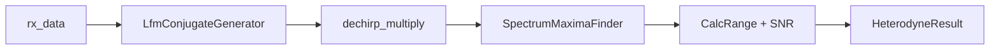

# Heterodyne — Полная документация

> Stretch-processing (дечирп) ЛЧМ-радара на GPU

**Namespace**: `drv_gpu_lib`
**Каталог**: `modules/heterodyne/`
**Зависимости**: DrvGPU (`IBackend*`), signal_generators (LfmConjugateGenerator), fft_maxima (SpectrumMaximaFinder), OpenCL

---

## Содержание

1. [Обзор и назначение](#1-обзор-и-назначение)
2. [Зачем нужен дечирп в ЛЧМ-радаре](#2-зачем-нужен-дечирп)
3. [Математика алгоритма](#3-математика-алгоритма)
4. [Пошаговый pipeline](#4-пошаговый-pipeline)
5. [Kernels (dechirp_multiply, dechirp_correct)](#5-kernels)
6. [API (C++ и Python)](#6-api)
7. [Тесты — что читать и где смотреть](#7-тесты)
8. [Ссылки и материалы](#8-ссылки)

---

## 1. Обзор и назначение

HeterodyneDechirp — процессор **stretch-processing** для ЛЧМ-радара. Принимает комплексный сигнал с антенн, умножает на сопряжённый опорный ЛЧМ, находит частоту биений и вычисляет дальность.

**Метод**: умножение s_rx × conj(s_tx) превращает квадратичную фазу чирпа в линейную (чистый тон). Частота тона пропорциональна дальности.

**Вход**: плоский вектор `complex<float>[num_antennas × num_samples]` — принятый сигнал с антенн.  
**Выход**: `HeterodyneResult` — f_beat, дальность R, SNR по каждой антенне.

---

## 2. Зачем нужен дечирп

### Проблема: дальность закодирована в задержке

Принятый сигнал — задержанная копия передающего ЛЧМ:

$$
s_{rx}(t) = A \cdot \exp\!\Big(j\big[\pi \mu (t-\tau)^2 + 2\pi f_0(t-\tau)\big]\Big) + n(t)
$$

где τ = 2R/c — задержка, μ = B/T — скорость перестройки частоты.

**Прямое измерение τ** требует очень высокой частоты дискретизации (разрешение по времени). Для дальности 1 км τ ≈ 6.7 мкс; при fs = 12 МГц один сэмпл ≈ 83 нс → грубое разрешение.

### Решение: stretch-processing

Умножение на сопряжённый опорный ЛЧМ **сокращает квадратичную фазу**:

$$
s_{dc}(t) = s_{rx}(t) \cdot s_{tx}^*(t) = A \cdot \exp\!\Big(j\big[-2\pi \mu \tau \cdot t + \text{const}\big]\Big)
$$

Остаётся **чистый тон** с частотой:

$$
f_{beat} = \mu \cdot \tau = \frac{B}{T} \cdot \frac{2R}{c}
$$

Дальность:

$$
R = \frac{c \cdot T \cdot f_{beat}}{2 \cdot B}
$$

FFT даёт f_beat с разрешением fs/N — при N=8000 и fs=12 МГц это ~1.5 кГц на бин. Для B=2 МГц и T=666 мкс разрешение по дальности ≈ 0.1 м.

---

## 3. Математика алгоритма

### Опорный сигнал (conj(s_tx))

Передающий ЛЧМ:

$$
s_{tx}(t) = \exp\!\Big(j\big[\pi \mu t^2 + 2\pi f_0 t\big]\Big)
$$

Сопряжённый (ref):

$$
\text{ref}(t) = s_{tx}^*(t) = \exp\!\Big(-j\big[\pi \mu t^2 + 2\pi f_0 t\big]\Big)
$$

Генерируется `LfmConjugateGenerator` — один вектор на N точек, общий для всех антенн.

### Дечирп: conj(rx × ref)

В реализации используется **conj от произведения** (не просто rx × ref):

$$
\text{dc} = \text{conj}(s_{rx} \cdot s_{tx}^*) = \text{conj}(s_{rx}) \cdot s_{tx}
$$

**Зачем conj?** Прямое s_rx × conj(s_tx) даёт тон на **отрицательной** частоте −μτ. Conj от результата даёт **положительную** f_beat = +μτ. Это нужно, чтобы:
- пик FFT был в нижней половине спектра [0, N/2);
- коррекция exp(−j·2π·f·t) в `dechirp_correct` корректно сдвигала к DC.

### Формула дальности

$$
R = \frac{c \cdot T \cdot f_{beat}}{2 \cdot B}
$$

где c = 3×10⁸ м/с, T = N/fs, B = f_end − f_start.

### SNR

$$
\text{SNR}_{dB} = 20 \cdot \log_{10}\frac{\text{peak}}{\text{noise\_est}}
$$

noise_est — среднее амплитуд соседних бинов (left + right) / 2.

---

## 4. Пошаговый pipeline

```
rx_data (CPU, flat complex<float>[antennas × N])
    │
    ▼
┌─────────────────────────────────────┐
│ 1. LfmConjugateGenerator (OPT-4)   │  → ref = conj(s_tx), размер N
│    lfm_conjugate.cl                 │     кешируется при SetParams
└─────────────────────────────────────┘
    │
    ▼
┌─────────────────────────────────────┐
│ 2. dechirp_multiply.cl (GPU)       │  dc = conj(rx[gid] × ref[n])
│    1D kernel: global = ant×N       │  ref broadcast на все антенны
└─────────────────────────────────────┘
    │
    ▼
┌─────────────────────────────────────┐
│ 3. SpectrumMaximaFinder (GPU)      │  FFT (clFFT) + OnePeak
│    fft_maxima модуль                │  параболическая интерполяция
│                                     │  → f_beat [Hz], bin, magnitude
└─────────────────────────────────────┘
    │
    ▼
┌─────────────────────────────────────┐
│ 4. CalcRange + SNR (CPU)            │  R = c·T·f_beat / (2·B)
│                                     │  SNR = 20·log10(peak/noise)
└─────────────────────────────────────┘
    │
    ▼
HeterodyneResult {f_beat_hz, range_m, peak_amplitude, peak_snr_db, ...}
```

### Опциональный этап: dechirp_correct

Для верификации: умножение на exp(−j·2π·f_beat·t) сдвигает пик к DC. После FFT corrected-сигнала пик должен быть на bin 0. Используется в Test 3.

---

## 5. Kernels

### dechirp_multiply.cl

**Назначение**: dc_out = conj(rx × ref)

| Параметр | Описание |
|----------|----------|
| rx | [num_antennas × num_samples], принятый сигнал |
| ref | [num_samples], conj(s_tx), broadcast |
| dc_out | [num_antennas × num_samples], результат |

**1D kernel** (OPT-5): `gid = get_global_id(0)`, `n = gid % num_samples`, `ant = gid / num_samples`.

```c
dc_out[gid].x =  rx_v.x * re_v.x - rx_v.y * re_v.y;   // Re: a*c - b*d
dc_out[gid].y = -rx_v.x * re_v.y - rx_v.y * re_v.x;   // Im: -(a*d + b*c)
```

### dechirp_correct.cl

**Назначение**: сдвиг спектра к DC для верификации.

| Параметр | Описание |
|----------|----------|
| dc_in | дечирпнутый сигнал |
| phase_step | [num_antennas], предвычислено: −2π·f_beat/fs (OPT-6) |
| corrected | output |

```c
float phase = phase_step[ant] * (float)n;
corrected = dc_in * (cos(phase), sin(phase));
```

---

## 6. API

### C++

```cpp
#include "heterodyne_dechirp.hpp"

drv_gpu_lib::HeterodyneDechirp het(backend);
het.SetParams({
    .f_start = 0.0f,
    .f_end = 2e6f,
    .sample_rate = 12e6f,
    .num_samples = 8000,
    .num_antennas = 5
});

// Из CPU данных
auto result = het.Process(rx_data);

// Из внешнего cl_mem (OPT-3: ref на GPU, без PCIe)
auto result = het.ProcessExternal(rx_cl_mem, params);

// Результат
for (const auto& a : result.antennas) {
    // a.f_beat_hz, a.range_m, a.peak_snr_db
}
```

### Python

```python
het = gpuworklib.HeterodyneDechirp(ctx)
het.set_params(f_start=0, f_end=2e6, sample_rate=12e6,
               num_samples=8000, num_antennas=5)
result = het.process(rx_signal)
# result.antennas[i].f_beat_hz, .range_m, .peak_snr_db
```

**Python API**: см. `Python_test/heterodyne/` — `test_heterodyne.py`, `test_heterodyne_step_by_step.py`, `test_heterodyne_comparison.py`.

---

## 7. Тесты — что читать и где смотреть

### C++ тесты

**Файлы**: `test_heterodyne_basic.hpp`, `test_heterodyne_pipeline.hpp`  
**Вызов**: через `all_test.hpp` из `main.cpp`

| # | Тест | Что проверяет | Порог |
|---|------|---------------|-------|
| 1 | Single antenna | delay=100 мкс → f_beat=300 кГц | error < 5 кГц |
| 2 | 5 antennas, linear | delays [100,200,300,400,500] мкс | error < 5 кГц |
| 3 | Dechirp correction | peak → DC после dechirp_correct | peak_bin ≤ 3 |
| 4 | Full pipeline | Process() — все антенны | error < 5 кГц |
| 5 | ProcessExternal | внешний cl_mem буфер | error < 10 кГц |
| 6 | Random delays | seed=42, delays [10..500] мкс | error < 5 кГц |
| 7 | AllMaxima | OnePeak vs FindAllMaxima | diff < 5 кГц |

**Параметры**: fs=12 МГц, B=2 МГц, N=8000, μ=3·10⁹ Гц/с, 5 антенн.

**Сигнал**: `LfmGeneratorAnalyticalDelay` — идеальная задержка без интерполяции.

### Python тесты

| Файл | Описание |
|------|----------|
| `test_heterodyne.py` | Базовые pytest, GPU vs NumPy |
| `test_heterodyne_step_by_step.py` | Пошаговый pipeline с графиками в `Results/Plots/heterodyne/` |
| `test_heterodyne_comparison.py` | Отчёт GPU vs CPU в `Results/Reports/` |

### Что смотреть при отладке

| Вопрос | Где искать |
|--------|------------|
| Как устроен эталон? | `LfmGeneratorAnalyticalDelay` + NumPy FFT в Python |
| Откуда conj? | `dechirp_multiply.cl` — conj(rx×ref) |
| Какой search_range? | `BuildResult()` — search_range=5000 |
| Результаты C++? | Консоль (ConsoleOutput), `Results/Profiler/` |

---

## 8. Ссылки

### Алгоритм и stretch-processing

| Источник | Описание |
|----------|----------|
| [Алгоритм гетероди](Алгоритм%20гетероди.md) | Пошаговый разбор: IQ vs вещественный, f_beat, R |
| Этот документ (Full.md) | Полный цикл, OPT-1..6, pipeline, тесты |

### Оптимизации (OPT-1..OPT-6)

| OPT | Описание |
|-----|----------|
| OPT-1 | Кеширование cl_kernel |
| OPT-2 | Кеширование GPU буферов (EnsureBuffers) |
| OPT-3 | ProcessExternal: ref на GPU, без PCIe |
| OPT-4 | Кеширование LfmConjugateGenerator |
| OPT-5 | 1D kernel вместо 2D |
| OPT-6 | phase_step предвычислен на CPU |

### Диаграмма pipeline



---

## Файлы модуля

```
modules/heterodyne/
├── include/
│   ├── heterodyne_dechirp.hpp          # Facade: HeterodyneDechirp
│   ├── heterodyne_params.hpp           # HeterodyneParams, Result types
│   ├── i_heterodyne_processor.hpp      # Strategy interface
│   └── processors/
│       ├── heterodyne_processor_opencl.hpp
│       └── heterodyne_processor_rocm.hpp
├── src/
│   ├── heterodyne_dechirp.cpp          # Facade, BuildResult, OPT-3/4
│   ├── heterodyne_processor_opencl.cpp
│   └── heterodyne_processor_rocm.cpp
├── kernels/opencl/
│   ├── dechirp_multiply.cl             # conj(rx × ref)
│   └── dechirp_correct.cl              # frequency correction
└── tests/
    ├── all_test.hpp
    ├── test_heterodyne_basic.hpp       # Tests 1-3, 6
    └── test_heterodyne_pipeline.hpp    # Tests 4-5, 7
```

---

## Важные нюансы

1. **Задержки < T** — при delay > T (длительность чирпа) сигнал пустой.
2. **conj от произведения** — без него f_beat отрицательная, пик в верхней половине FFT.
3. **SpectrumMaximaFinder** — FFT pad до степени 2 (8000→8192), search_range=5000.
4. **OPT-3** — `DechirpWithGPURef()` только в `ProcessExternal()` (rx уже на GPU).

---

*Обновлено: 2026-02-23*
