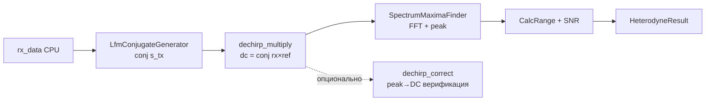

# Heterodyne — Полная документация

> Stretch-processing (дечирп) ЛЧМ-радара на GPU

**Namespace**: `drv_gpu_lib`
**Каталог**: `modules/heterodyne/`
**Зависимости**: DrvGPU (`IBackend*`), signal_generators (LfmConjugateGenerator), fft_maxima (SpectrumMaximaFinder), OpenCL / ROCm (HIP)

---

## Содержание

1. [Обзор и назначение](#1-обзор-и-назначение)
2. [Зачем нужен дечирп в ЛЧМ-радаре](#2-зачем-нужен-дечирп)
3. [Математика алгоритма](#3-математика-алгоритма)
4. [Пошаговый pipeline](#4-пошаговый-pipeline)
5. [Kernels (dechirp_multiply, dechirp_correct)](#5-kernels)
6. [C4 Диаграммы](#6-c4-диаграммы)
7. [API (C++ и Python)](#7-api)
8. [Тесты — что читать и где смотреть](#8-тесты)
9. [Бенчмарки](#9-бенчмарки)
10. [Ссылки и материалы](#10-ссылки)

---

## 1. Обзор и назначение

HeterodyneDechirp — процессор **stretch-processing** для ЛЧМ-радара. Принимает комплексный сигнал с антенн, умножает на сопряжённый опорный ЛЧМ, находит частоту биений и вычисляет дальность.

**Метод**: умножение s_rx × conj(s_tx) превращает квадратичную фазу чирпа в линейную (чистый тон). Частота тона пропорциональна дальности.

**Вход**: плоский вектор `complex<float>[num_antennas × num_samples]` — принятый сигнал с антенн.
**Выход**: `HeterodyneResult` — f_beat, дальность R, SNR по каждой антенне.

**Реализации**:
- `HeterodyneProcessorOpenCL` — OpenCL backend (Windows + Linux)
- `HeterodyneProcessorROCm` — ROCm/HIP backend (Linux + AMD GPU, `ENABLE_ROCM=1`)
- `HeterodyneDechirp` — фасад, автоматически выбирает backend по `BackendType`

---

## 2. Зачем нужен дечирп

### Проблема: дальность закодирована в задержке

Принятый сигнал — задержанная копия передающего ЛЧМ:

$$
s_{rx}(t) = A \cdot \exp\!\Big(j\big[\pi \mu (t-\tau)^2 + 2\pi f_0(t-\tau)\big]\Big) + n(t)
$$

где τ = 2R/c — задержка, μ = B/T — скорость перестройки частоты.

**Прямое измерение τ** требует очень высокой частоты дискретизации (разрешение по времени). Для дальности 1 км τ ≈ 6.7 мкс; при fs = 12 МГц один сэмпл ≈ 83 нс → грубое разрешение.

### Решение: stretch-processing

Умножение на сопряжённый опорный ЛЧМ **сокращает квадратичную фазу**:

$$
s_{dc}(t) = s_{rx}(t) \cdot s_{tx}^*(t) = A \cdot \exp\!\Big(j\big[-2\pi \mu \tau \cdot t + \text{const}\big]\Big)
$$

Остаётся **чистый тон** с частотой:

$$
f_{beat} = \mu \cdot \tau = \frac{B}{T} \cdot \frac{2R}{c}
$$

Дальность:

$$
R = \frac{c \cdot T \cdot f_{beat}}{2 \cdot B}
$$

FFT даёт f_beat с разрешением fs/N — при N=4000 и fs=12 МГц это 3 кГц на бин. Для B=1 МГц и T=333 мкс разрешение по дальности ≈ 50 м (1 бин = 50 м).

---

## 3. Математика алгоритма

### Опорный сигнал (conj(s_tx))

Передающий ЛЧМ:

$$
s_{tx}(t) = \exp\!\Big(j\big[\pi \mu t^2 + 2\pi f_0 t\big]\Big)
$$

Сопряжённый (ref):

$$
\text{ref}(t) = s_{tx}^*(t) = \exp\!\Big(-j\big[\pi \mu t^2 + 2\pi f_0 t\big]\Big)
$$

Генерируется `LfmConjugateGenerator` — один вектор на N точек, общий для всех антенн.

### Дечирп: conj(rx × ref)

В реализации используется **conj от произведения** (не просто rx × ref):

$$
\text{dc} = \text{conj}(s_{rx} \cdot s_{tx}^*) = \text{conj}(s_{rx}) \cdot s_{tx}
$$

**Зачем conj?** Прямое s_rx × conj(s_tx) даёт тон на **отрицательной** частоте −μτ. Conj от результата даёт **положительную** f_beat = +μτ. Это нужно, чтобы:
- пик FFT был в нижней половине спектра [0, N/2);
- коррекция exp(−j·2π·f·t) в `dechirp_correct` корректно сдвигала к DC.

### Формула дальности

$$
R = \frac{c \cdot T \cdot f_{beat}}{2 \cdot B}
$$

где c = 3×10⁸ м/с, T = N/fs, B = f_end − f_start.

Реализовано в `HeterodyneResult::CalcRange()`:
```cpp
float T = num_samples / sample_rate;
return (3e8f * T * f_beat) / (2.0f * bandwidth);
```

### SNR

$$
\text{SNR}_{dB} = 20 \cdot \log_{10}\frac{\text{peak}}{\text{noise\_est}}
$$

noise_est — среднее амплитуд соседних бинов (left + right) / 2.

### Производные параметры (HeterodyneParams)

```cpp
T         = num_samples / sample_rate      // длительность чирпа [с]
mu        = (f_end - f_start) / T         // chirp rate [Гц/с]
bin_width = sample_rate / num_samples     // [Гц/бин]
```

### Ожидаемые f_beat для типовых параметров

(fs=12 МГц, B=1 МГц, N=4000, μ=3·10⁹ Гц/с)

| Антенна | Delay мкс | f_beat = μ·τ | Бин (N=4096) | R [м] |
|---------|-----------|-------------|--------------|-------|
| 0 | 100 | 300 кГц | ~102 | 50 |
| 1 | 200 | 600 кГц | ~205 | 100 |
| 2 | 300 | 900 кГц | ~307 | 150 |
| 3 | 400 | 1200 кГц | ~410 | 200 |
| 4 | 500 | 1500 кГц | ~512 | 250 |

---

## 4. Пошаговый pipeline

```
rx_data (CPU, flat complex<float>[antennas × N])
    │
    ▼
┌─────────────────────────────────────┐
│ 1. LfmConjugateGenerator (OPT-4)   │  → ref = conj(s_tx), размер N
│    кешируется при SetParams         │    при изменении params пересчитывается
└─────────────────────────────────────┘
    │
    ▼
┌─────────────────────────────────────┐
│ 2. dechirp_multiply.cl (GPU)       │  dc = conj(rx[gid] × ref[n])
│    1D kernel: global = ant×N       │  ref broadcast на все антенны
└─────────────────────────────────────┘
    │
    ▼
┌─────────────────────────────────────┐
│ 3. SpectrumMaximaFinder (GPU)      │  FFT (clFFT/hipFFT) + OnePeak
│    fft_maxima модуль                │  параболическая интерполяция
│                                     │  → f_beat [Hz], bin, magnitude
└─────────────────────────────────────┘
    │
    ▼
┌─────────────────────────────────────┐
│ 4. CalcRange + SNR (CPU)           │  R = c·T·f_beat / (2·B)
│                                     │  SNR = 20·log10(peak/noise)
└─────────────────────────────────────┘
    │
    ▼
HeterodyneResult {
  antennas[i].f_beat_hz
  antennas[i].range_m
  antennas[i].peak_snr_db
  antennas[i].f_beat_bin
  antennas[i].peak_amplitude
}
```

### Опциональный этап: dechirp_correct

Для верификации: умножение на exp(−j·2π·f_beat·t) сдвигает пик к DC. После FFT corrected-сигнала пик должен быть на bin 0. Используется в Test 3.

### Диаграмма pipeline



---

## 5. Kernels

### dechirp_multiply.cl

**Назначение**: dc_out = conj(rx × ref)

| Параметр | Описание |
|----------|----------|
| rx | [num_antennas × num_samples], принятый сигнал |
| ref | [num_samples], conj(s_tx), broadcast |
| dc_out | [num_antennas × num_samples], результат |

**1D kernel** (OPT-5): `gid = get_global_id(0)`, `n = gid % num_samples`, `ant = gid / num_samples`.

```c
// conj(rx × ref)
dc_out[gid].x =  rx_v.x * re_v.x - rx_v.y * re_v.y;   // Re: a*c - b*d
dc_out[gid].y = -rx_v.x * re_v.y - rx_v.y * re_v.x;   // Im: -(a*d + b*c)
```

**ROCm эквивалент**: `include/kernels/heterodyne_kernels_rocm.hpp` — идентичный алгоритм, скомпилированный через hiprtc.

### dechirp_correct.cl

**Назначение**: сдвиг спектра к DC для верификации.

| Параметр | Описание |
|----------|----------|
| dc_in | дечирпнутый сигнал |
| phase_step | [num_antennas], предвычислено: −2π·f_beat/fs (OPT-6) |
| corrected | output |

```c
float phase = phase_step[ant] * (float)n;
corrected = dc_in * (cos(phase), sin(phase));
```

**Почему phase_step предвычислен на CPU (OPT-6)**: константа per-antenna, вычисляется один раз, передаётся в kernel — избегает дублирования вычислений на GPU.

---

## 6. C4 Диаграммы

### C1 — Контекст системы

```
┌──────────────────────────────────────────────────────────┐
│  ЛЧМ-радар / ФАР-система                                │
│                                                           │
│  ┌──────────────┐  flat complex[A×N]  ┌─────────────┐   │
│  │ Антенная     │ ──────────────────► │Heterodyne   │   │
│  │ решётка      │                     │Dechirp      │   │
│  └──────────────┘                     └──────┬──────┘   │
│                                              │           │
│                                    HeterodyneResult      │
│                                {f_beat, range, SNR}      │
└──────────────────────────────────────────────────────────┘
```

### C2 — Контейнеры

```
┌──────────────────────────────────────────────────────────────┐
│  modules/heterodyne/                                         │
│                                                               │
│  ┌─────────────────────┐                                     │
│  │  HeterodyneDechirp  │ ← Facade (выбирает backend)        │
│  │  heterodyne_dechirp │   BackendType::OPENCL / ::ROCM      │
│  │  .hpp/.cpp          │                                     │
│  └──────────┬──────────┘                                     │
│             │ owns (unique_ptr<IHeterodyneProcessor>)        │
│    ┌────────┴────────┐                                       │
│    │                 │                                       │
│  [OpenCL]         [ROCm]                                     │
│  HeterodyneProc-  HeterodyneProc-                           │
│  essorOpenCL      essorROCm                                  │
│  (.hpp/.cpp)      (.hpp/.cpp, ENABLE_ROCM=1)                │
│    │                 │                                       │
│  dechirp_multiply   heterodyne_kernels_rocm.hpp             │
│  dechirp_correct    (hiprtc compiled)                       │
│  (.cl files)                                                 │
│                                                               │
│  Зависимости:                                                │
│  ├── LfmConjugateGenerator (signal_generators)              │
│  └── SpectrumMaximaFinder  (fft_maxima)                     │
└──────────────────────────────────────────────────────────────┘
```

### C3 — Компоненты (Facade)

```
  HeterodyneDechirp
    ├── SetParams(HeterodyneParams)
    │     └── params_dirty_ = true
    │
    ├── Process(flat complex[A×N]) → HeterodyneResult
    │     ├── EnsureConjugateGenerator()   [OPT-4: lazy-init]
    │     ├── processor_->Dechirp()        [дечирп kernel]
    │     ├── SpectrumMaximaFinder::Find() [FFT + peak]
    │     └── BuildResult()               [R = c·T·f_beat/(2B), SNR]
    │
    ├── ProcessExternal(void* gpu_ptr, params) → HeterodyneResult
    │     └── processor_->DechirpWithGPURef()  [OPT-3]
    │
    └── GetLastResult() / GetParams()
```

### C4 — Kernel (dechirp_multiply)

```
  Thread: gid = [0 .. num_antennas * num_samples)
    ant = gid / num_samples
    n   = gid % num_samples
    │
    rx_v = rx[gid]      (принятый сигнал, антенна ant, сэмпл n)
    re_v = ref[n]       (conj(s_tx)[n], broadcast)
    │
    dc.x =  rx_v.x * re_v.x - rx_v.y * re_v.y    // Re
    dc.y = -(rx_v.x * re_v.y + rx_v.y * re_v.x)  // -Im = conj
    │
    dc_out[gid] = dc
```

---

## 7. API

### C++ — фасад HeterodyneDechirp

```cpp
#include "heterodyne_dechirp.hpp"

// OpenCL (по умолчанию)
drv_gpu_lib::HeterodyneDechirp het(backend);

// ROCm (ENABLE_ROCM=1, Linux + AMD GPU)
drv_gpu_lib::HeterodyneDechirp het_rocm(backend, BackendType::ROCM);

// Параметры
het.SetParams({
    .f_start     = 0.0f,
    .f_end       = 1e6f,      // B = 1 МГц
    .sample_rate = 12e6f,     // fs = 12 МГц
    .num_samples = 4000,      // N
    .num_antennas = 5
});

// Из CPU данных
auto result = het.Process(rx_data);   // rx_data: flat [antennas × N]

// Из внешнего GPU буфера (OPT-3: без PCIe, rx уже на GPU)
// rx_gpu_ptr: cl_mem* (OpenCL) или hipDeviceptr_t* (ROCm)
auto result = het.ProcessExternal(rx_gpu_ptr, params);
// NOT freed by HeterodyneDechirp

// Результат
for (const auto& a : result.antennas) {
    // a.antenna_idx, a.f_beat_hz, a.f_beat_bin
    // a.range_m, a.peak_amplitude, a.peak_snr_db
}
```

### Типы данных

```cpp
struct HeterodyneParams {
    float f_start      = 0.0f;    // Hz
    float f_end        = 1e6f;    // Hz  (B = f_end - f_start)
    float sample_rate  = 12e6f;   // Hz
    int   num_samples  = 4000;    // N
    int   num_antennas = 5;

    float GetBandwidth() const;   // f_end - f_start
    float GetDuration()  const;   // num_samples / sample_rate
    float GetChirpRate() const;   // B / T
    float GetBinWidth()  const;   // sample_rate / num_samples
};

struct AntennaDechirpResult {
    int   antenna_idx;
    float f_beat_hz;        // частота биений [Гц]
    float f_beat_bin;       // бин (дробный, параболическая интерп.)
    float range_m;          // дальность [м]
    float peak_amplitude;
    float peak_snr_db;
};

struct HeterodyneResult {
    bool success;
    std::vector<AntennaDechirpResult> antennas;
    std::vector<float> max_positions;  // все максимумы (контроль)
    std::string error_message;

    static float CalcRange(float f_beat, float fs, int N, float B);
};
```

### Python

```python
het = gpuworklib.HeterodyneDechirp(ctx)
het.set_params(f_start=0, f_end=1e6, sample_rate=12e6,
               num_samples=4000, num_antennas=5)
result = het.process(rx_signal)
# result.antennas[i].f_beat_hz, .range_m, .peak_snr_db
```

**Python тесты**: `Python_test/heterodyne/` — `test_heterodyne.py`, `test_heterodyne_step_by_step.py`, `test_heterodyne_comparison.py`.

---

## 8. Тесты — что читать и где смотреть

**Параметры всех тестов**:
```
fs        = 12 MHz
B         = 1 MHz (f_start=0, f_end=1e6)
N         = 4000 точек
T         = 333.33 мкс
mu        = 3e9 Гц/с
antennas  = 5
```

**Сигнал**: `LfmGeneratorAnalyticalDelay` — идеальная задержка без интерполяции, даёт точную f_beat = μ·τ.

---

### C++ тесты — OpenCL

**Файлы**: `tests/test_heterodyne_basic.hpp`, `tests/test_heterodyne_pipeline.hpp`

| # | Функция | Входные данные | Ожидаемый результат | Что ловит | Порог |
|---|---------|----------------|---------------------|-----------|-------|
| 1 | `run_test_single_antenna` | LFM 1 антенна, delay=100 мкс | f_beat = 300 кГц (μ·τ = 3e9·100e-6) | Базовую работу kernel на минимальном случае | ±10 кГц |
| 2 | `run_test_5_antennas_linear` | 5 антенн, delays=[100..500] мкс | f_beat=[300..1500] кГц | Broadcast ref на все антенны, изоляцию каналов | ±10 кГц |
| 3 | `run_test_correction` | dc-сигнал + f_beat → correct | Пик FFT на бинах 0..3 (≈DC) | Корректность phase_step=−2π·f_beat/fs, ошибку знака фазы | peak_bin ≤ 3 |
| 4 | `run_test_full_pipeline` | rx_data flat [5×4000] | f_beat + range для всех антенн | Интеграцию всех этапов (LfmConjGen + kernel + FFT + CalcRange) | ±10 кГц |
| 5 | `run_test_process_external` | rx как cl_mem (уже на GPU) | f_beat совпадает с Process() | OPT-3: передача GPU-буфера без PCIe round-trip, буфер не освобождён | ±10 кГц |

---

### C++ тесты — ROCm

**Файл**: `tests/test_heterodyne_rocm.hpp`
**Namespace**: `test_heterodyne_rocm`
**Платформа**: Linux + AMD GPU (`ENABLE_ROCM=1`). На Windows — compile-only.

| # | Тест | Входные данные | Ожидаемый результат | Что ловит | Порог |
|---|------|----------------|---------------------|-----------|-------|
| 1 | Single antenna | LFM, delay=100 мкс | f_beat = 300 кГц | HIP kernel компилируется и работает | ±5 кГц |
| 2 | 5 antennas, linear | delays [100..500] мкс | f_beat [300..1500] кГц | Параллельная обработка каналов на AMD GPU | ±5 кГц |
| 3 | Dechirp correction | dc-сигнал, f_beat → correct | Пик → DC | Корректность ROCm correct kernel | peak_bin ≤ 3 |
| 4 | Full pipeline (Facade) | `HeterodyneDechirp(backend, BackendType::ROCM)` | f_beat + range | Фасад с ROCm backend, полный пайплайн | ±5 кГц |
| 5 | DechirpFromGPU | rx как hipDeviceptr_t | f_beat корректен | ProcessExternal с HIP буфером | ±5 кГц |
| 6 | Random delays | seed=42, delays [10..500] мкс | f_beat = μ·τ для каждой антенны | Произвольные задержки, нет артефактов | ±5 кГц |

---

### Python тесты

| Файл | Описание |
|------|----------|
| `test_heterodyne.py` | Базовые pytest, GPU vs NumPy дечирп |
| `test_heterodyne_step_by_step.py` | Пошаговый pipeline с графиками в `Results/Plots/heterodyne/` |
| `test_heterodyne_comparison.py` | Отчёт GPU vs CPU в `Results/Reports/` |

---

### Что смотреть при отладке

| Вопрос | Где искать |
|--------|------------|
| Как устроен эталон? | `LfmGeneratorAnalyticalDelay` + NumPy FFT в Python |
| Откуда conj? | `kernels/opencl/dechirp_multiply.cl` |
| Какой search_range? | `BuildResult()` в `heterodyne_dechirp.cpp` — search_range=5000 |
| ROCm kernel source? | `include/kernels/heterodyne_kernels_rocm.hpp` |
| Результаты C++? | Консоль (ConsoleOutput), `Results/Profiler/` |

---

## 9. Бенчмарки

### OpenCL — 2 benchmark класса

**Файл**: `tests/heterodyne_benchmark.hpp`, namespace `test_heterodyne_opencl`
**Test runner**: `tests/test_heterodyne_benchmark.hpp`, namespace `test_heterodyne_benchmark`

```cpp
test_heterodyne_benchmark::run();
```

| Класс | Метод | Стейджи | output_dir |
|-------|-------|---------|-----------|
| `HeterodyneDechirpBenchmark` | `Dechirp()` | `Upload_Rx`, `Upload_Ref`, `Kernel_Multiply`, `Download` | `Results/Profiler/GPU_00_Heterodyne/` |
| `HeterodyneCorrectBenchmark` | `Correct()` | `Upload_DC`, `Upload_PhaseStep`, `Kernel_Correct`, `Download` | `Results/Profiler/GPU_00_Heterodyne/` |

**Параметры**:
```
num_antennas = 5
num_samples  = 4000
sample_rate  = 12 MHz
n_warmup = 5,  n_runs = 20
```

**Паттерн** (GpuBenchmarkBase):
- `ExecuteKernel()` — warmup без `HeterodyneOCLProfEvents`
- `ExecuteKernelTimed()` — с events → `RecordEvent()` → GPUProfiler

---

### ROCm — 2 benchmark класса

**Файл**: `tests/heterodyne_benchmark_rocm.hpp`
**Test runner**: `tests/test_heterodyne_benchmark_rocm.hpp`

```cpp
#if ENABLE_ROCM
test_heterodyne_benchmark_rocm::run();
#endif
```

| Класс | Метод | Стейджи | output_dir |
|-------|-------|---------|-----------|
| `HeterodyneDechirpBenchmarkROCm` | `Dechirp()` | `Upload_Rx`, `Upload_Ref`, `Kernel_Multiply`, `Download` | `Results/Profiler/GPU_00_Heterodyne_ROCm/` |
| `HeterodyneCorrectBenchmarkROCm` | `Correct()` | `Upload_DC`, `Upload_PhaseStep`, `Kernel_Correct`, `Download` | `Results/Profiler/GPU_00_Heterodyne_ROCm/` |

---

### Как запустить

1. В `configGPU.json` установить `"is_prof": true`
2. Раскомментировать в `tests/all_test.hpp`:

```cpp
test_heterodyne_benchmark::run();

#if ENABLE_ROCM
test_heterodyne_benchmark_rocm::run();
#endif
```

> ⚠️ OpenCL queue создаётся с `CL_QUEUE_PROFILING_ENABLE` — без этого `cl_event` timing не работает.

### Результаты

| Файл | Backend |
|------|---------|
| `Results/Profiler/GPU_00_Heterodyne/report.md` | OpenCL |
| `Results/Profiler/GPU_00_Heterodyne/report.json` | OpenCL |
| `Results/Profiler/GPU_00_Heterodyne_ROCm/report.md` | ROCm |
| `Results/Profiler/GPU_00_Heterodyne_ROCm/report.json` | ROCm |

---

## 10. Ссылки

### Алгоритм и stretch-processing

| Источник | Описание |
|----------|----------|
| [Алгоритм гетероди.md](Алгоритм%20гетероди.md) | Пошаговый разбор: IQ vs вещественный, f_beat, R |
| [Doc_Addition/Info_ROCm_HIP_Optimization_Guide.md](../../../Doc_Addition/Info_ROCm_HIP_Optimization_Guide.md) | Оптимизация HIP/ROCm ядер — теория и проверенные паттерны GPUWorkLib |

### Оптимизации (OPT-1..OPT-6)

| OPT | Описание |
|-----|----------|
| OPT-1 | Кеширование cl_kernel |
| OPT-2 | Кеширование GPU буферов (EnsureBuffers) |
| OPT-3 | ProcessExternal: rx уже на GPU, без PCIe round-trip |
| OPT-4 | Кеширование LfmConjugateGenerator (lazy-init, rebuild при SetParams) |
| OPT-5 | 1D kernel вместо 2D (gid = ant×N + n) |
| OPT-6 | phase_step предвычислен на CPU, передаётся как константа в kernel |

---

## Файлы модуля

```
modules/heterodyne/
├── CMakeLists.txt
├── include/
│   ├── heterodyne_dechirp.hpp          # Facade: SetParams/Process/ProcessExternal
│   ├── heterodyne_params.hpp           # HeterodyneParams, AntennaDechirpResult, HeterodyneResult
│   ├── i_heterodyne_processor.hpp      # Strategy interface (Dechirp/Correct/DechirpWithGPURef)
│   ├── processors/
│   │   ├── heterodyne_processor_opencl.hpp
│   │   └── heterodyne_processor_rocm.hpp
│   └── kernels/
│       ├── kernel_loader.hpp                # LoadKernelFile() утилита
│       └── heterodyne_kernels_rocm.hpp      # HIP kernel source (hiprtc string)
├── src/
│   ├── heterodyne_dechirp.cpp          # Facade + BuildResult + EnsureConjugateGenerator
│   ├── heterodyne_processor_opencl.cpp # Dechirp/Correct/DechirpWithGPURef
│   └── heterodyne_processor_rocm.cpp   # ROCm/HIP: Dechirp/Correct/DechirpFromGPU
├── kernels/opencl/
│   ├── dechirp_multiply.cl             # conj(rx × ref) → dc_out
│   └── dechirp_correct.cl              # частотная коррекция → DC
└── tests/
    ├── all_test.hpp                          # Точка входа (из main.cpp)
    ├── README.md                             # Параметры, ожидаемые результаты, бенчмарки
    ├── test_heterodyne_basic.hpp             # OpenCL: тесты 1-3
    ├── test_heterodyne_pipeline.hpp          # OpenCL: тесты 4-5
    ├── test_heterodyne_rocm.hpp              # ROCm: тесты 1-6 (Linux + AMD)
    ├── heterodyne_benchmark.hpp              # OpenCL: DechirpBenchmark + CorrectBenchmark
    ├── heterodyne_benchmark_rocm.hpp         # ROCm: аналоги для HIP
    ├── test_heterodyne_benchmark.hpp         # OpenCL: test runner
    └── test_heterodyne_benchmark_rocm.hpp    # ROCm: test runner
```

---

## Важные нюансы

1. **Задержки > T** — при delay > T (длительность чирпа) сигнал пустой, f_beat = 0.
2. **conj от произведения** — без него f_beat отрицательная, пик в верхней половине FFT → неверная дальность.
3. **SpectrumMaximaFinder** — FFT pad до степени 2 (4000→4096), search_range=5000.
4. **OPT-3** — `DechirpWithGPURef()` только в `ProcessExternal()` (rx уже на GPU).
5. **BackendType** — передаётся в конструктор `HeterodyneDechirp`. `OPENCL` по умолчанию; `ROCM` требует `ENABLE_ROCM=1` на Linux.
6. **Параметры тестов**: B=1 МГц, N=4000 (в ранних версиях документации встречалось B=2 МГц, N=8000 — устаревшие значения).

---

*Обновлено: 2026-03-02*
