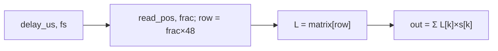

# LchFarrow — Полная документация

> Standalone GPU-процессор дробной задержки (Lagrange 48×5)

**Namespace**: `lch_farrow`
**Каталог**: `modules/lch_farrow/`
**Зависимости**: DrvGPU (`IBackend*`), OpenCL

---

## Содержание

1. [Обзор и назначение](#1-обзор-и-назначение)
2. [Зачем нужна дробная задержка в ЛЧМ-радаре с ФАР](#2-зачем-нужна-дробная-задержка)
3. [Математика алгоритма](#3-математика-алгоритма)
4. [Матрица 48×5](#4-матрица-485)
5. [Пошаговый алгоритм](#5-пошаговый-алгоритм)
6. [API (C++ и Python)](#6-api)
7. [Тесты — что читать и где смотреть](#7-тесты)
8. [Ссылки на статьи и метод](#8-ссылки)

---

## 1. Обзор и назначение

LchFarrow — **независимый** от генераторов сигналов процессор. Применяет дробную задержку к любому входному комплексному сигналу.

**Метод**: 5-точечная интерполяция Лагранжа с предвычисленной таблицей коэффициентов 48×5.

**Вход**: комплексный сигнал (float2), задержки в микросекундах per-antenna.  
**Выход**: задержанный сигнал той же размерности.

---

## 2. Зачем нужна дробная задержка

### Проблема: волна приходит «между сэмплами»

В фазированной антенной решётке (ФАР) задержка на элемент определяется геометрией:

$$
\tau_n = \frac{n \cdot d \cdot \sin\theta}{c}
$$

где `n` — номер элемента, `d` — шаг решётки (обычно λ/2), `θ` — угол прихода, `c` — скорость света.

**Проблема:** τ_n в общем случае **не кратна** периоду дискретизации. При `f_s = 100 МГц` и `τ = 23.7 нс` задержка = **2.37 сэмпла** — дробное число.

### Почему для ЛЧМ это критично

ЛЧМ: `s(t) = A·exp(j·2π·(f₀·t + μ·t²/2))`, мгновенная частота `f(t) = f₀ + μ·t`.

При **только целочисленной** задержке ошибка фазы:
$$
\Delta\phi \approx 2\pi \cdot f_{мгн} \cdot \Delta\tau
$$

На краях полосы ЛЧМ это даёт:
- разрушение когерентного сложения
- смещение луча ДН
- рост боковых лепестков

**Вывод:** для корректного фазирования ЛЧМ нужна **субсэмпловая точность** — её даёт Lagrange 48×5.

---

## 3. Математика алгоритма

### Разбиение задержки

$$
\tau = D + \mu, \quad D \in \mathbb{Z}, \quad \mu \in [0, 1)
$$

- **Целая часть D**: простой сдвиг `output[n] = input[n - D]`
- **Дробная часть μ**: интерполяция между сэмплами

### 5-точечная интерполяция Лагранжа

$$
\text{input}(n - \mu) \approx L_0 \cdot x[n-2] + L_1 \cdot x[n-1] + L_2 \cdot x[n] + L_3 \cdot x[n+1] + L_4 \cdot x[n+2]
$$

где `L₀…L₄` — коэффициенты Лагранжа, зависящие от μ.

### Формулы коэффициентов (5 точек, позиции -2..+2)

```
L₀(μ) = μ(μ-1)(μ-2)(μ-3) / 24 × (-1)
L₁(μ) = μ(μ+1)(μ-1)(μ-2) / (-6)
L₂(μ) = (μ+2)(μ+1)(μ-1)(μ-2) / 4
L₃(μ) = μ(μ+2)(μ+1)(μ-1) / (-6)
L₄(μ) = μ(μ+2)(μ+1)(μ-2) / 24
```

**В реализации** вместо вычисления полиномов на лету используется **таблица 48×5** — быстрее на GPU.

### Farrow vs Lagrange 48×5 — что реализовано

| По ТЗ (Farrow) | Текущая реализация |
|----------------|---------------------|
| Полином по μ, схема Горнера в ядре | **Выборка строки** матрицы: `row = (uint)(μ×48) % 48` |
| Базисные фильтры фиксированы, μ передаётся | 48 дискретных строк, 5 коэффициентов на строку |
| Пересчёт только μ при смене задержки | Lagrange 48×5 по строкам |

### Связь с классической структурой Farrow

Классический Farrow (1988): коэффициенты FIR как полиномы по μ:
$$
h_n(\mu) = \sum_m c_{n,m} \cdot \mu^m
$$

Вычисление по схеме Горнера. **Наша реализация** — выборка готовой строки матрицы по дискретному μ (row = μ×48). Это Lagrange-таблица, не «чистый» Farrow, но даёт тот же результат при 48 уровнях квантования μ.

---

## 4. Матрица 48×5

### Структура

| Размерность | Значение |
|-------------|----------|
| Строки (48) | Шаги μ = 0/48, 1/48, …, 47/48 |
| Столбцы (5) | Коэффициенты L₀, L₁, L₂, L₃, L₄ |

**Формат**: float32. **Источник**: `modules/lch_farrow/lagrange_matrix_48x5.json` (копия из LCH-Farrow01).

В C++ матрица встроена как `kBuiltinLagrangeMatrix`; опционально `LoadMatrix(json_path)` для тестов и смены коэффициентов. JSON и встроенная матрица совпадают.

### Примеры строк (из JSON)

| row | μ | L₀ | L₁ | L₂ | L₃ | L₄ |
|-----|---|-----|-----|-----|-----|-----|
| 0 | 0/48 | 0 | 1 | 0 | 0 | 0 |
| 1 | 1/48 | -0.0052 | 1.0417 | -0.0417 | 0.0052 | 0 |
| 24 | 24/48 | … | … | … | … | … |

При μ=0 (row=0) выход = centre-сэмпл без интерполяции.

### Выбор строки

$$
\text{row} = \lfloor \mu \cdot 48 \rfloor \bmod 48
$$

Шаг квантования `1/48 ≈ 0.0208` сэмпла. При `f_s = 100 МГц` ≈ 0.2 нс точности задержки.

### Почему 48 и 5?

- **48 строк** — компромисс: таблица мала (960 байт), умещается в L1 кэш GPU
- **5 точек** — 4-й порядок, достаточная точность для ЛЧМ при BW < 0.4·f_s

---

## 5. Пошаговый алгоритм

Для выходного сэмпла `n`:

```
read_pos = n - delay_samples
```

### Шаги

1. **delay_samples** = delay_us × 1e-6 × sample_rate
2. **read_pos** = n - delay_samples
3. Если read_pos < 0 → output[n] = 0
4. **center** = floor(read_pos), **frac** = read_pos - center
5. **row** = (uint)(frac × 48) % 48
6. **L[0..4]** = lagrange_matrix[row]

**Важно:** `row` определяется дробной частью **позиции чтения** (frac), а не дробной частью задержки (μ = delay_samples − floor(delay_samples)). Ошибка в ранних спецификациях: при `row = (uint)(μ×48)` получалось неверное окно интерполяции и искажение формы сигнала.
7. Чтение 5 сэмплов: input[center-1], …, input[center+3] (0 за границами)
8. **output[n]** = L₀·s₀ + L₁·s₁ + L₂·s₂ + L₃·s₃ + L₄·s₄

### Окно интерполяции

```
  ...  [center-1]  [center]  [center+1]  [center+2]  [center+3]  ...
         s₀           s₁          s₂          s₃          s₄
                                    ↑
                         read_pos = center + frac
```

### Семантика границ (когда output = 0)

| Случай | Поведение |
|--------|-----------|
| **Целая задержка 5** | output[0..4] = 0; с output[5] идёт задержанный сигнал |
| **Дробная задержка 5.23** | output[0..5] = 0; **первое ненулевое** — в output[6] (ceil(delay_samples)) |
| **Чтение за границами** | Индекс &lt; 0 или ≥ num_samples → подставляется 0 |

Условие в kernel: `if (sample_id < delay_samples) output[gid] = 0`.

---

## 6. API

### C++

```cpp
#include "lch_farrow.hpp"

lch_farrow::LchFarrow proc(backend);
proc.SetSampleRate(1e6f);
proc.SetDelays({0.0f, 2.7f, 5.0f});  // per-antenna, мкс
proc.SetNoise(0.1f, 0.707f, 0);     // опционально
proc.LoadMatrix("lagrange_matrix_48x5.json");  // опционально

// GPU
auto result = proc.Process(cl_mem input, antennas, points);

// CPU reference
auto cpu_ref = proc.ProcessCpu(input_2d, antennas, points);
```

### Python

```python
proc = gpuworklib.LchFarrow(ctx)
proc.set_sample_rate(1e6)
proc.set_delays([0.0, 2.7, 5.0])
delayed = proc.process(signal)
```

**Полный Python API**: [Doc/Python/lch_farrow_api.md](../../Python/lch_farrow_api.md)

---

## 7. Тесты — что читать и где смотреть

### C++ тесты

**Файл**: `modules/lch_farrow/tests/test_lch_farrow.hpp`  
**Вызов**: через `all_test.hpp` из `main.cpp`

| Тест | Что проверяет | Где смотреть | Порог |
|------|---------------|--------------|-------|
| **Test 1: Zero delay** | delay=0 → output ≈ input | Сравнение `output` с `cw_signal` по max \|diff\| | < 1e-4 |
| **Test 2: Integer delay (5)** | delay=5 сэмплов → output[n] = input[n-5] | GPU vs CPU reference (`ProcessCpu`) | < 1e-2 |
| **Test 3: Fractional delay (2.7)** | Дробная задержка 2.7 сэмпла | GPU vs CPU reference | < 1e-2 |

**Сигнал**: CW 50 kHz, fs=1 MHz, 4096 точек. Генерация в `generate_cw()`.

**Профилирование**: после тестов вызывается `GPUProfiler::PrintReport()`, отчёты в `Results/Profiler/lch_farrow_*.md` и `*.json`.

**Результаты (типичные)**: Zero delay max_err &lt; 1e-4 ✅ | Integer (5) max_err ≈ 1.35e-4 ✅ | Fractional (2.7) max_err ≈ 1.85e-3 ✅

---

### Python тесты

**Файл**: `Python_test/lch_farrow/test_lch_farrow.py`  
**Запуск**: `python Python_test/lch_farrow/test_lch_farrow.py`

| Тест | Что проверяет | Что читать | Порог |
|------|---------------|------------|-------|
| **Test 1: Zero delay** | delay=0 → output ≈ input | `apply_delay_numpy()` — NumPy эталон Lagrange 48×5 | < 1e-4 |
| **Test 2: Integer delay (5)** | delay=5 сэмплов, первые 5 нули, остальное = shift | `load_lagrange_matrix()` — матрица из JSON | < 1e-2 |
| **Test 3: Fractional delay (2.7)** | GPU vs NumPy Lagrange | `apply_delay_numpy(signal, delay_samples, matrix)` | < 1e-2 |
| **Test 4: Multi-antenna** | 4 канала с delays [0, 1.5, 3.0, 5.0] мкс | Per-channel сравнение с NumPy | < 1e-2 |
| **Test 5: LchFarrow vs Analytical** | LFM + LchFarrow vs LfmAnalyticalDelay (идеальная задержка) | Пропуск boundary (skip), сравнение Farrow vs analytical | < 0.1 |

**Матрица**: загружается из `modules/lch_farrow/lagrange_matrix_48x5.json` — тот же набор коэффициентов, что в C++ (kBuiltinLagrangeMatrix).

**Эталон**: `apply_delay_numpy()` — CPU реализация того же алгоритма (D, μ, row, 5-точечная сумма). Используется для верификации GPU.

---

### Что смотреть при отладке

| Вопрос | Где искать |
|-------|------------|
| Как устроен эталон? | `apply_delay_numpy()` в `test_lch_farrow.py` |
| Откуда матрица? | `modules/lch_farrow/lagrange_matrix_48x5.json` |
| Какой kernel? | `modules/lch_farrow/src/lch_farrow.cpp` — LCH_FARROW_KERNEL_SOURCE |
| Результаты C++ тестов? | Консоль (через `ConsoleOutput`), `Results/Profiler/` |

---

## 8. Ссылки

### Статьи и метод

| Источник | Описание |
|----------|----------|
| **Farrow C.W.** "A continuously variable digital delay element" (ISCAS, 1988) | Оригинальная статья |
| [CCRMA J.O. Smith — Farrow Structure](https://ccrma.stanford.edu/~jos/pasp/Farrow_Structure.html) | Структура Farrow, схема Горнера |
| [CCRMA — Farrow Structure for Variable Delay](https://ccrma.stanford.edu/~jos/pasp05/Farrow_Structure_Variable_Delay.html) | Lagrange через Farrow, finite difference filters |
| [CCRMA — Lagrange Interpolation](https://ccrma.stanford.edu/~jos/Interpolation/Lagrange_Interpolation.html) | Интерполяция Лагранжа |
| [CCRMA — Lagrange Coefficients Orders 1–3](https://ccrma.stanford.edu/~jos/Interpolation/Lagrange_Interpolation_Coefficients_Orders.html) | Коэффициенты |
| [MathWorks — Design of Fractional Delay FIR Filters](https://www.mathworks.com/help/dsp/ug/design-of-fractional-delay-fir-filters.html) | FIR-фильтры дробной задержки |
| [Sciencedirect — Fractional Delay](https://www.sciencedirect.com/topics/computer-science/fractional-delay) | Обзор |
| [DSP Related — Fractional Delay Filtering](https://www.dsprelated.com/freebooks/pasp/Fractional_Delay_Filtering_Linear.html) | Линейная интерполяция |
| [liquid-dsp firfarrow](https://github.com/jgaeddert/liquid-dsp) | Референсная реализация |
| [Lagrange Fractional Delay (PDF, Michigan)](https://quod.lib.umich.edu/cgi/p/pod/dod-idx/fractional-delay-lines-using-lagrange-interpolators.pdf) | Lagrange interpolators |
| [Tom Roelandts — Fractional Delay Filter](https://tomroelandts.com/articles/how-to-create-a-fractional-delay-filter) | Практика |

### Референсная реализация

**LCH-Farrow01** (внешний проект): `fractional_delay_processor.hpp/.cpp` — процессор Lagrange 48×5, форматы буферов, DelayParams, загрузка матрицы из JSON, IN-PLACE через temp-буфер. Матрица `lagrange_matrix_48x5.json` — копия из LCH-Farrow01.

### Альтернативный подход (FFT-свёртка)

Вариант через **свёртку FFT**: h[48] вычисляется на CPU из `Farrow_coeff .* pw`, затем FFT-based свёртка на GPU. Текущий код использует **time-domain 5-point** интерполяцию — проще и быстрее для малого окна.

### Doc_Addition

| Документ | Описание |
|----------|----------|
| [Info_FarrowFractionalDelay.md](../../../Doc_Addition/Info_FarrowFractionalDelay.md) | Подробное описание алгоритма, kernel, верификация |

### Дополнительные материалы (ЛЧМ, дечирп, beat-фаза)

| Документ | Описание |
|----------|----------|
| [Распиши более подробнл МНК фазы beat.md](Распиши%20более%20подробнл%20МНК%20фазы%20beat.md) | МНК фазы beat — метод для радаров с высоким разрешением, дечирп, связь задержки и частоты биений |
| [Распиши более подробнл МНК фазы beat.pdf](Распиши%20более%20подробнл%20МНК%20фазы%20beat.pdf) | PDF-версия |

---

### Диаграмма алгоритма



---

## Файлы модуля

```
modules/lch_farrow/
├── include/lch_farrow.hpp
├── src/lch_farrow.cpp
├── lagrange_matrix_48x5.json   # Матрица коэффициентов
└── tests/
    ├── all_test.hpp
    └── test_lch_farrow.hpp
```

---

*Обновлено: 2026-02-18*
