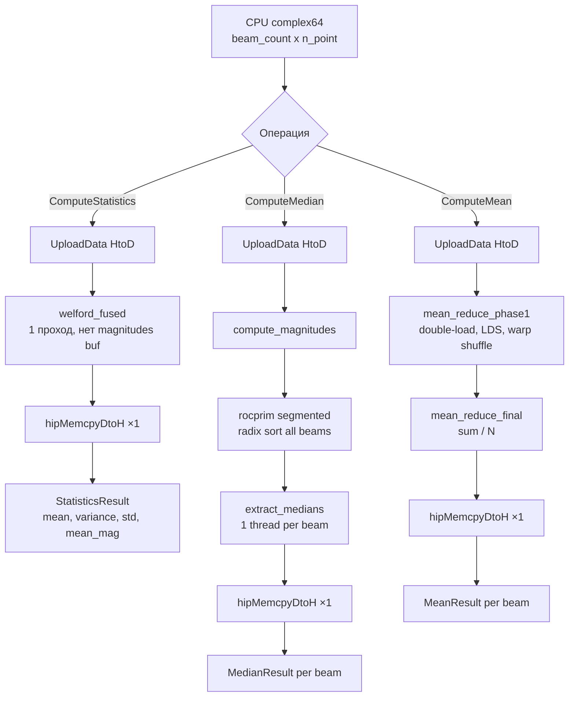

# Statistics — Полная документация

> GPU-статистика комплексных сигналов по лучам: среднее, медиана, дисперсия, СКО (ROCm/HIP)

**Namespace**: `statistics`
**Каталог**: `modules/statistics/`
**Зависимости**: DrvGPU (`IBackend*`, ROCmBackend), rocPRIM, hiprtc, `KernelCacheService`
**Платформа**: ROCm only (AMD GPU, Linux). Недоступно на Windows/NVIDIA.

---

## Содержание

1. [Обзор и назначение](#1-обзор-и-назначение)
2. [Зачем нужен модуль](#2-зачем-нужен-модуль)
3. [Математика алгоритмов](#3-математика-алгоритмов)
4. [Пошаговый pipeline](#4-пошаговый-pipeline)
5. [Kernels](#5-kernels)
6. [API (C++ и Python)](#6-api)
7. [Тесты](#7-тесты)
8. [Ссылки и файловое дерево](#8-ссылки-и-файловое-дерево)
9. [Важные нюансы](#9-важные-нюансы)

---

## 1. Обзор и назначение

`StatisticsProcessor` — модуль ROCm/HIP для вычисления статистических характеристик массивов
комплексных сигналов, разбитых по **лучам (beams)**.

**Что вычисляет**:

| Операция | Метод | Kernel |
|----------|-------|--------|
| Комплексное среднее Re+Im | Иерархическая редукция | `mean_reduce_phase1` + `mean_reduce_final` |
| Медиана модулей `\|z\|` | Radix sort (rocPRIM) + извлечение | `extract_medians` |
| Дисперсия `\|z\|` | Одно-проходный Уэлфорд | `welford_fused` |
| СКО `\|z\|` | sqrt(дисперсии) | `welford_fused` |
| Среднее модулей `mean(\|z\|)` | Одно-проходный Уэлфорд | `welford_fused` |

**Вход**: плоский вектор `complex<float>[beam_count × n_point]` — по одному сегменту на луч.
**Выход**: по одному результату на луч (`MeanResult`, `MedianResult`, `StatisticsResult`).

### Как работает иерархическая редукция (ComputeMean)

Суммировать N=8192 чисел на GPU наивно нельзя — один поток медленно, атомарные операции
в очереди. Решение — **параллельное дерево суммирования** за `log₂(N)` шагов:

```
N=8 элементов, 4 потока:

Данные:   z0   z1   z2   z3   z4   z5   z6   z7

Шаг 1:  (z0+z4) (z1+z5) (z2+z6) (z3+z7)   ← каждый поток берёт пару
Шаг 2:  (z0+z4+z2+z6) (z1+z5+z3+z7)       ← stride вдвое меньше
Шаг 3:  (z0+z1+z2+z3+z4+z5+z6+z7)         ← готово!
```

Если луч длиннее одного блока (N > 512), нужны **два прохода**:

```
Луч N=8192, блок=256 потоков:

mean_reduce_phase1  →  16 блоков параллельно
  Блок 0 : суммирует точки [0..511]    → partial_sum_0
  Блок 1 : суммирует точки [512..1023] → partial_sum_1
  ...
  Блок 15: суммирует [7680..8191]      → partial_sum_15
                    │
                    ▼
mean_reduce_final   →  1 блок
  суммирует 16 partial_sums → делит на N → complex mean
```

**Три оптимизации поверх базового дерева**:

| Оптимизация | Что делает | Эффект |
|-------------|------------|--------|
| **Double-load** | Каждый поток читает 2 элемента и складывает их до входа в дерево | Блок из 256 потоков покрывает 512 точек → вдвое меньше блоков |
| **LDS padding `[257]`** | Shared memory с лишним элементом ломает паттерн bank conflicts | Устраняет сериализацию доступа к общей памяти |
| **Warp shuffle финал** | Последние 32 элемента суммируются без `__syncthreads` через аппаратный shuffle | Нет барьеров внутри warp-а |

```c
// Warp shuffle финал (без __syncthreads):
val += __shfl_down(val, 16);
val += __shfl_down(val, 8);
val += __shfl_down(val, 4);
val += __shfl_down(val, 2);
val += __shfl_down(val, 1);
// tid==0 содержит сумму warp-а
```

**Ключевые особенности**:
- ROCm-only (HIP + rocPRIM). На OpenCL/NVIDIA недоступен.
- Kernels компилируются через **hiprtc** (JIT) при первом вызове.
- Скомпилированный HSACO кешируется на диск через `KernelCacheService`.
- `ComputeStatistics` — единственный проход по данным (fused kernel), без отдельного буфера модулей.
- `ComputeMedian` — GPU segmented radix sort (rocPRIM): все лучи в **одном вызове** параллельно.

---

## 2. Зачем нужен модуль

### Проблема: статистика больших многолучевых массивов

В задачах ЦОС (радары, антенные решётки, связь) обрабатывается одновременно N лучей по M точек.
Для 256 лучей × 1.3M точек CPU-сортировка занимает ~2000 мс. GPU-radix sort (rocPRIM) — ~30 мс (ускорение ~60×).

### Решение: GPU parallel statistics per beam

- **Среднее**: параллельная древовидная редукция (log₂ шагов) + warp shuffle на финальном этапе.
- **Медиана**: `rocprim::segmented_radix_sort_keys` — сортировка всех лучей одним GPU-вызовом,
  затем GPU kernel `extract_medians` читает средний элемент каждого луча.
- **Дисперсия/СКО**: `welford_fused` читает данные один раз, вычисляет `|z|` на лету —
  нет отдельного прохода для буфера модулей.

---

## 3. Математика алгоритмов

### 3.1 Комплексное среднее (ComputeMean)

$$
\bar{z}_b = \frac{1}{N} \sum_{k=0}^{N-1} z_{b,k},\quad z_{b,k} = \text{Re}(z_{b,k}) + j\cdot\text{Im}(z_{b,k})
$$

Иерархическая редукция в два прохода:
1. `mean_reduce_phase1` — блочная сумма с **double-load** (каждый поток читает 2 элемента) →
   `reduce_buf_` (partial sums).
2. `mean_reduce_final` — суммирует partial sums, делит на N → `result_buf_`.

### 3.2 Медиана модулей (ComputeMedian)

$$
\text{median}_b = \text{sorted}\bigl(|z_{b,0}|,\ldots,|z_{b,N-1}|\bigr)\!\left[\frac{N}{2}\right]
$$

Это **не** стандартная медиана (для чётного N — не среднее двух средних), а элемент с индексом
`N/2`. CPU-эталон `CpuMedianMagnitude` использует ту же логику.

### 3.3 Дисперсия и СКО — алгоритм Уэлфорда (ComputeStatistics)

Одно-проходный алгоритм (численно стабильный):

$$
S_{\text{re}} = \sum_{k} \text{Re}(z_k),\quad
S_{\text{im}} = \sum_{k} \text{Im}(z_k),\quad
S_{m} = \sum_{k} |z_k|,\quad
S_{sq} = \sum_{k} |z_k|^2
$$

$$
\bar{z}_b = \frac{S_{\text{re}}}{N} + j\frac{S_{\text{im}}}{N},\qquad
\overline{|z|}_b = \frac{S_m}{N}
$$

$$
\sigma^2_b = \frac{S_{sq}}{N} - \Bigl(\overline{|z|}_b\Bigr)^2,\qquad
\sigma_b = \sqrt{\max(\sigma^2_b,\;0)}
$$

Защита от потери точности float32: `if (variance < 0.0f) variance = 0.0f;`

### 3.4 Оптимизации ядер

| ID | Описание | Эффект |
|----|----------|--------|
| TASK-1 | `welford_fused` — 1 проход, нет magnitudes buffer | −40−50% времени ComputeStatistics |
| TASK-2 | `extract_medians` GPU kernel — 1 DtoH вместо beam_count | устраняет N отдельных DtoH |
| TASK-3 | hiprtc + HSACO disk cache (`KernelCacheService`) | повторный запуск — instant |
| TASK-4 | double-load, warp shuffle, `__launch_bounds__`, blocks_per_beam | меньше divergence |
| TASK-5 | `hipMemcpyAsync` в AllocateBuffers | асинхронная загрузка offsets |
| P1-A | Warp shuffle финал (без `__syncthreads`) | меньше барьеров |
| P1-B | Double-load (2 элемента/поток) | вдвое меньше блоков |
| P1-C | `__launch_bounds__(256)` | компилятор резервирует регистры правильно |
| P2-A | `__fsqrt_rn` — HW intrinsic | быстрее `sqrtf()` на RDNA4 |
| P2-B | LDS padding `[256+1]` | устранение bank conflicts |

---

## 4. Пошаговый pipeline

### 4.1 ComputeStatistics (welford_fused)

```
INPUT: CPU complex<float>[beam_count × n_point]
    │
    ▼
┌───────────────────────────────────────────┐
│ 1. AllocateBuffers (lazy, кеш по размеру) │  hipMalloc 8 буферов (один раз)
└───────────────────────────────────────────┘
    │
    ▼
┌───────────────────────────────────────────┐
│ 2. CompileKernels (lazy, hiprtc JIT)      │  → HSACO → disk cache
└───────────────────────────────────────────┘
    │
    ▼
┌───────────────────────────────────────────┐
│ 3. UploadData (hipMemcpyHtoDAsync)        │  CPU → GPU: input_buffer_
└───────────────────────────────────────────┘
    │
    ▼
┌───────────────────────────────────────────┐
│ 4. welford_fused kernel                   │  grid=(beam_count,1,1), block=(256,1,1)
│    reads: input_buffer_ ТОЛЬКО            │  shared = 4×256×4 = 4096 байт
│    |z| вычисляется inline                 │  нет обращения к magnitudes_buf_
│    writes: result_buf_ (WelfordResult)    │  mean + variance + std per beam
└───────────────────────────────────────────┘
    │
    ▼
┌───────────────────────────────────────────┐
│ 5. hipStreamSynchronize                   │
│    hipMemcpyDtoH (beam_count × 20 байт)  │  1 вызов для всех лучей
└───────────────────────────────────────────┘
    │
    ▼
OUTPUT: vector<StatisticsResult>[beam_count]
  {beam_id, mean (complex), mean_magnitude, variance, std_dev}
```

### 4.2 ComputeMedian (radix sort pipeline)

```
INPUT: CPU complex<float>[beam_count × n_point]
    │
    ▼ AllocateBuffers + CompileKernels (lazy)
    │
    ▼
┌───────────────────────────────────────────┐
│ 1. UploadData → input_buffer_             │
└───────────────────────────────────────────┘
    │
    ▼
┌───────────────────────────────────────────┐
│ 2. compute_magnitudes kernel              │  input_ → magnitudes_buf_ (float)
│    grid=ceil(total/256), block=256        │  |z| = __fsqrt_rn(re²+im²)
└───────────────────────────────────────────┘
    │
    ▼
┌───────────────────────────────────────────┐
│ 3. rocprim::segmented_radix_sort_keys     │  magnitudes_buf_ → sort_buf_
│    (gpu_sort::ExecuteSort)                │  все beam_count лучей параллельно
│    offsets: [0, N, 2N, ..., beams×N]     │  temp storage: sort_temp_buf_
└───────────────────────────────────────────┘
    │
    ▼
┌───────────────────────────────────────────┐
│ 4. extract_medians kernel                 │  sort_buf_[b×N + N/2] → medians_compact_
│    grid=ceil(beams/256), block=256        │  1 поток на луч
└───────────────────────────────────────────┘
    │
    ▼
┌───────────────────────────────────────────┐
│ 5. hipStreamSynchronize                   │
│    hipMemcpyDtoH (beam_count × 4 байт)   │  1 вызов для всех лучей
└───────────────────────────────────────────┘
    │
    ▼
OUTPUT: vector<MedianResult>[beam_count]
  {beam_id, median_magnitude}
```

### 4.3 ComputeMean (иерархическая редукция)

```
INPUT → UploadData → input_buffer_
    │
    ▼
┌───────────────────────────────────────────┐
│ mean_reduce_phase1                        │  grid=(beams × blocks_per_beam)
│ double-load + LDS[257] tree               │  blocks_per_beam = ceil(N / 512)
│ + warp shuffle финал                      │  → reduce_buf_ (partial sums)
└───────────────────────────────────────────┘
    │
    ▼
┌───────────────────────────────────────────┐
│ mean_reduce_final                         │  grid=(beam_count)
│ суммирует partial sums → / N             │  → result_buf_ (float2 per beam)
└───────────────────────────────────────────┘
    │
    ▼ hipStreamSynchronize + hipMemcpyDtoH
    │
    ▼
OUTPUT: vector<MeanResult>[beam_count]
  {beam_id, mean (complex<float>)}
```

### Mermaid



---

## 5. Kernels

Все ядра компилируются через **hiprtc** (JIT при первом вызове).
Исходник — `statistics_kernels_rocm.hpp`, функция `GetStatisticsKernelSource()`.
Флаги компиляции: `-O3 -DWARP_SIZE=32 --offload-arch=<gfx_arch>`.

### Kernel 1: `compute_magnitudes`

Назначение: complex → float magnitude. Используется только в `ComputeMedian`.

| Параметр | Тип | Описание |
|----------|-----|----------|
| `input` | `const float2_t*` | complex<float> входные данные |
| `magnitudes` | `float*` | выходные модули |
| `total_elements` | `unsigned int` | beam_count × n_point |

Grid: `(ceil(total/256), 1, 1)`, Block: `(256, 1, 1)`.

```c
float2_t z = input[gid];
magnitudes[gid] = __fsqrt_rn(z.x * z.x + z.y * z.y);
```

### Kernel 2: `mean_reduce_phase1`

Назначение: блочная редукция комплексной суммы (Phase 1/2).

| Параметр | Тип | Описание |
|----------|-----|----------|
| `input` | `const float2_t*` | входные данные |
| `partial_sums` | `float2_t*` | частичные суммы |
| `beam_count` | `unsigned int` | число лучей |
| `n_point` | `unsigned int` | точек на луч |
| `blocks_per_beam` | `unsigned int` | `ceil(N/512)` |

Grid: `(beam_count × blocks_per_beam, 1, 1)`, Block: `(256, 1, 1)`.
LDS: `float sdata_x[257], sdata_y[257]` — padding +1 устраняет bank conflicts.
Double-load: поток читает элементы `local1` и `local2 = local1 + block_size`.

### Kernel 3: `mean_reduce_final`

Назначение: финальная редукция partial sums → complex mean per beam.
Grid: `(beam_count, 1, 1)`. Суммирует все partial sums луча, делит на N.
Warp shuffle финал без `__syncthreads`.

### Kernel 4: `welford_stats` (legacy)

Назначение: Уэлфорд по input + предвычисленным magnitudes.
Оставлен для совместимости. В `ComputeStatistics` **не используется** (заменён `welford_fused`).

### Kernel 5: `welford_fused` — основной для ComputeStatistics

Назначение: одно-проходный Уэлфорд, читает только `input[]`, вычисляет `|z|` inline.

| Параметр | Тип | Описание |
|----------|-----|----------|
| `input` | `const float2_t*` | complex<float> (только этот буфер!) |
| `results` | `WelfordResult*` | выходные статистики (5 float × beam_count) |
| `beam_count` | `unsigned int` | число лучей |
| `n_point` | `unsigned int` | точек на луч |

Grid: `(beam_count, 1, 1)`, Block: `(256, 1, 1)`.
Shared: `4 × 256 × 4 = 4096 байт` (4 массива: sum_re, sum_im, sum_mag, sum_sq).

```c
// Grid-stride loop — 1 проход по данным
for (unsigned int i = tid; i < n_point; i += block_size) {
    float2_t z  = input[base + i];
    float mag   = __fsqrt_rn(z.x * z.x + z.y * z.y);  // нет отдельного буфера
    sum_re  += z.x;    sum_im  += z.y;
    sum_mag += mag;    sum_sq  += mag * mag;
}
// LDS tree reduction → warp shuffle → tid==0:
float inv_n   = 1.0f / (float)n_point;
r.mean_re     = sum_re  * inv_n;
r.mean_im     = sum_im  * inv_n;
r.mean_mag    = sum_mag * inv_n;
float mean_sq = sum_sq  * inv_n;
r.variance    = mean_sq - r.mean_mag * r.mean_mag;
if (r.variance < 0.0f) r.variance = 0.0f;
r.std_dev     = __fsqrt_rn(r.variance);
```

`WelfordResult` (20 байт на луч):
```c
struct WelfordResult {
    float mean_re, mean_im;   // комплексное среднее
    float mean_mag;           // mean(|z|)
    float variance, std_dev;  // дисперсия и СКО
};
```

### Kernel 6: `extract_medians`

Назначение: GPU kernel — читает средний элемент каждого отсортированного луча.
Заменяет `beam_count` отдельных `hipMemcpyDtoH` одним вызовом.

| Параметр | Тип | Описание |
|----------|-----|----------|
| `sorted` | `const float*` | sort_buf_ после rocPRIM |
| `medians` | `float*` | compact output: beam_count floats |
| `n_point` | `unsigned int` | точек на луч |
| `beam_count` | `unsigned int` | число лучей |

```c
unsigned int b = blockIdx.x * blockDim.x + threadIdx.x;
if (b >= beam_count) return;
medians[b] = sorted[b * n_point + n_point / 2];
```

### GPU файл: `statistics_sort_gpu.hip`

Компилируется HIP-компилятором (clang++). Использует `rocprim::segmented_radix_sort_keys`.

```cpp
// Запрос temp storage size (nullptr → только size query)
rocprim::segmented_radix_sort_keys(
    nullptr, temp_size, keys_in, keys_out,
    total_elements, num_segments,
    d_begin_offsets, d_end_offsets,
    0, 32, stream       // begin_bit=0, end_bit=32 (все биты float)
);
// Сортировка
rocprim::segmented_radix_sort_keys(
    temp_storage, temp_size, keys_in, keys_out,
    total_elements, num_segments,
    d_begin_offsets, d_end_offsets,
    0, 32, stream
);
```

---

## 6. API

### C4-диаграммы

**C1 — System Context**:
```
[Приложение / Pipeline (CPU)]
    │ complex<float>[beams × N]
    ▼
[StatisticsProcessor — statistics module]
    │ hiprtc JIT kernels + rocPRIM sort
    ▼
[AMD GPU — ROCm/HIP, RDNA4/CDNA]
```

**C2 — Containers**:
```
[StatisticsProcessor]
    → [DrvGPU ROCmBackend]        hipStream_t, Allocate, MemcpyH2D
    → [GPU Memory (hipMalloc)]    8 буферов: input, magnitudes, sort,
                                  sort_temp, offsets, reduce, result, medians_compact
    → [rocPRIM]                   segmented_radix_sort_keys (sort_gpu.hip)
    → [KernelCacheService]        disk HSACO cache (manifest.json)
    → [hiprtc]                    JIT компиляция 6 ядер из строки
```

**C3 — Components**:
```
StatisticsProcessor           (statistics_processor.cpp, g++)
  GPU Operations:
    ExecuteMagnitudesKernel   compute_magnitudes (hiprtc)
    ExecuteMeanReduction      phase1 + final (hiprtc)
    ExecuteWelfordFusedKernel welford_fused (hiprtc)
    ExecuteMedianSort         rocprim segmented sort (.hip)
    ExecuteExtractMedians     extract_medians (hiprtc)
  Resource Management:
    CompileKernels()          lazy hiprtc → HSACO → cache
    AllocateBuffers()         lazy, re-use при том же размере
  statistics_sort_gpu.hip     (clang++ / HIP compiler)
```

**C4 — Code**:
```
StatisticsProcessor                        namespace statistics
  + StatisticsProcessor(IBackend*)         throws if not ROCm backend
  + ComputeMean(vector<complex>, params)   → vector<MeanResult>
  + ComputeMean(void* gpu, params)         → vector<MeanResult>
  + ComputeMedian(vector<complex>, params) → vector<MedianResult>
  + ComputeMedian(void* gpu, params)       → vector<MedianResult>
  + ComputeStatistics(vector, params)      → vector<StatisticsResult>
  + ComputeStatistics(void* gpu, params)   → vector<StatisticsResult>
  - CompileKernels()      lazy hiprtc JIT
  - AllocateBuffers()     lazy, size-cache
  - input_buffer_         void* GPU (complex<float>)
  - magnitudes_buf_       void* GPU (float)
  - sort_buf_             void* GPU (rocPRIM output)
  - sort_temp_buf_        void* GPU (rocPRIM temp)
  - offsets_buf_          void* GPU (unsigned int[beams+1])
  - reduce_buf_           void* GPU (float2 partial sums)
  - result_buf_           void* GPU (WelfordResult/MeanResult)
  - medians_compact_buf_  void* GPU (float[beam_count])
  - module_               hipModule_t
  - kernels_compiled_     bool
  - current_beams_        size_t
  - current_n_point_      size_t
```

### 6.1 C++ API

```cpp
#include "statistics_processor.hpp"
#include "statistics_types.hpp"
#include "backends/rocm/rocm_backend.hpp"

// 1. Создать backend (требует ROCm)
drv_gpu_lib::ROCmBackend backend;
backend.Initialize(0);  // device_index=0

// 2. Создать процессор
statistics::StatisticsProcessor stats(&backend);

// 3. Параметры
statistics::StatisticsParams params;
params.beam_count = 4;      // число лучей
params.n_point    = 8192;   // точек на луч

// Данные: плоский вектор beam_count * n_point
std::vector<std::complex<float>> data(params.beam_count * params.n_point);
// ... заполнение data ...

// 4a. ComputeStatistics — полная статистика (одно-проходный Уэлфорд)
auto stat_results = stats.ComputeStatistics(data, params);
for (const auto& r : stat_results) {
    printf("Beam %u: mean=(%.4f, %.4f) mean_mag=%.4f std=%.6f var=%.6f\n",
           r.beam_id, r.mean.real(), r.mean.imag(),
           r.mean_magnitude, r.std_dev, r.variance);
}

// 4b. ComputeMean — только комплексное среднее
auto mean_results = stats.ComputeMean(data, params);
for (const auto& r : mean_results) {
    printf("Beam %u: mean=(%.4f, %.4f)\n",
           r.beam_id, r.mean.real(), r.mean.imag());
}

// 4c. ComputeMedian — медиана модулей (GPU radix sort)
auto median_results = stats.ComputeMedian(data, params);
for (const auto& r : median_results) {
    printf("Beam %u: median_mag=%.4f\n", r.beam_id, r.median_magnitude);
}

// 5. Данные уже на GPU (void* / hipDeviceptr_t)
size_t bytes = data.size() * sizeof(std::complex<float>);
void* gpu_ptr = backend.Allocate(bytes);
backend.MemcpyHostToDevice(gpu_ptr, data.data(), bytes);
auto gpu_stat = stats.ComputeStatistics(gpu_ptr, params);  // без PCIe HtoD
backend.Free(gpu_ptr);
```

**Структуры**:

```cpp
struct StatisticsParams {
    uint32_t beam_count = 1;    // число лучей
    uint32_t n_point    = 0;    // точек на луч
    size_t   memory_limit = 0;  // 0 = авто
};

struct MeanResult {
    uint32_t beam_id;
    std::complex<float> mean;   // Re + j*Im
};

struct MedianResult {
    uint32_t beam_id;
    float median_magnitude;     // median(|z|)
};

struct StatisticsResult {
    uint32_t beam_id;
    std::complex<float> mean;   // комплексное среднее
    float variance;             // дисперсия |z| (population, ddof=0)
    float std_dev;              // СКО = sqrt(variance)
    float mean_magnitude;       // mean(|z|)
};
```

### 6.2 Python API

```python
import sys
sys.path.insert(0, 'build/debian-radeon9070/python')
import gpuworklib
import numpy as np

# 1. Контекст и процессор
ctx   = gpuworklib.ROCmGPUContext(0)
stats = gpuworklib.StatisticsProcessor(ctx)

# 2. Данные: numpy complex64 (плоский вектор beam_count * n_point)
beam_count = 4
n_point    = 8192
data = (np.random.randn(beam_count * n_point) +
        1j * np.random.randn(beam_count * n_point)).astype(np.complex64)

# 3a. Полная статистика
results = stats.compute_statistics(data, beam_count=beam_count)
for r in results:
    print(f"Beam {r['beam_id']}: "
          f"mean=({r['mean_real']:.4f}+{r['mean_imag']:.4f}j) "
          f"mean_mag={r['mean_magnitude']:.4f} "
          f"std={r['std_dev']:.4f} var={r['variance']:.4f}")

# 3b. Только среднее
means = stats.compute_mean(data, beam_count=beam_count)
for r in means:
    print(f"Beam {r['beam_id']}: mean=({r['mean_real']:.6f}+{r['mean_imag']:.6f}j)")

# 3c. Медиана модулей
medians = stats.compute_median(data, beam_count=beam_count)
for r in medians:
    print(f"Beam {r['beam_id']}: median_mag={r['median_magnitude']:.4f}")

# 4. NumPy reference (для сравнения)
beam0 = data[:n_point]
print(f"NumPy mean:     {np.mean(beam0)}")
print(f"NumPy mean_mag: {np.mean(np.abs(beam0)):.6f}")
print(f"NumPy std:      {np.std(np.abs(beam0), ddof=0):.6f}")    # ddof=0 !
print(f"NumPy median:   {np.sort(np.abs(beam0))[n_point // 2]:.6f}")  # НЕ np.median()!
```

Формат результата `compute_statistics`:

```python
{
    'beam_id':        int,    # индекс луча (0-based)
    'mean_real':      float,  # Re(mean(z))
    'mean_imag':      float,  # Im(mean(z))
    'variance':       float,  # var(|z|), population ddof=0
    'std_dev':        float,  # sqrt(variance)
    'mean_magnitude': float,  # mean(|z|)
}
```

Методы Python:

| Метод | Аргументы | Возврат | Описание |
|-------|-----------|---------|----------|
| `compute_mean(data, beam_count=1)` | `np.complex64`, `int` | `list[dict]` | Комплексное среднее |
| `compute_median(data, beam_count=1)` | `np.complex64`, `int` | `list[dict]` | Медиана `|z|` (radix sort) |
| `compute_statistics(data, beam_count=1)` | `np.complex64`, `int` | `list[dict]` | Полная статистика |

Запуск тестов:
```bash
sg render -c "pytest Python_test/statistics/test_statistics_rocm.py -v"
```

---

## 7. Тесты

### 7.1 C++ тесты

**Файл**: `modules/statistics/tests/test_statistics_rocm.hpp`
**Точка входа**: `modules/statistics/tests/all_test.hpp`
**Условие компиляции**: `#if ENABLE_ROCM`

CPU-эталоны в `test_statistics_rocm.hpp`: `CpuMean`, `CpuMeanMagnitude`, `CpuVarianceMagnitude`, `CpuMedianMagnitude`.

---

**Тест 1 — Mean SingleBeam (sinusoid)**

*Параметры*: 1 луч, N=4096, f=100 Гц, fs=1000, amp=1.0. *Порог*: `err_re, err_im < 1e-3`

*Почему синусоид?*
Синусоида `A·e^(j2πft)` — стандартный сигнал ЦОС с известным аналитическим средним.
За достаточно большое число периодов среднее комплексного тона стремится к 0 (Re и Im взаимно
компенсируются). 409.6 периодов при N=4096 достаточно, чтобы `|mean| < 0.01`.

Сравнение не с "0", а с CPU-результатом `CpuMean()` — это проверяет именно **точность GPU
reduction**: потери точности float32 при суммировании 4096 комплексных чисел в параллельном дереве
не должны превышать 1e-3. Если reduction реализована неверно (например, неправильно
аккумулируются partial sums между блоками), ошибка будет выше порога.

---

**Тест 2 — Mean MultiBeam (4 beams)**

*Параметры*: 4 луча, N=2048, f=50 Гц, amp=[1.0, 1.5, 2.0, 2.5]. *Порог*: `max_err < 1e-3`

*Смысл*: Тот же синусоид, но у каждого луча своя амплитуда. Амплитуда не влияет на то, что
среднее ≈ 0. Важно другое: тест проверяет **изоляцию лучей** — данные из буфера `input[b*N ... b*N+N-1]`
каждого луча не должны перемешиваться. Если kernel неверно вычисляет `beam_id` или `base`,
данные лучей "смешаются" и результаты будут неверными.

Разные амплитуды дают разные float-значения в буфере — легче заметить ошибку смешивания.

---

**Тест 3 — Welford Statistics (mean_mag + variance + std)**

*Параметры*: 1 луч, N=4096, f=100 Гц, amp=2.0. *Порог*: все три ошибки `< 1e-2`

*Почему синусоид с amp=2.0?*
У синусоиды `A·e^(jθ)` модуль каждой точки равен ровно `A`: `|z_k| = 2.0` для всех k.
Это даёт **аналитически известные** значения:
- `mean_magnitude = 2.0` (среднее константного набора)
- `variance = 0.0` (нет разброса — все модули одинаковы)
- `std_dev = 0.0`

Тест проверяет два свойства `welford_fused` одновременно:
1. Точность вычисления `|z|` inline через `__fsqrt_rn` (если неверно — mean_mag ≠ 2.0)
2. Устойчивость алгоритма: `variance = E[|z|²] - (E[|z|])²` при одинаковых значениях
   должна дать 0. Ошибки float-арифметики могут дать отрицательную variance — отсюда защита
   `if (variance < 0) variance = 0`.

---

**Тест 4 — Median (linear magnitudes)**

*Параметры*: 1 луч, N=1024, `data[i] = complex(i+1, 0)`. *Порог*: `|err| < 1.0`

*Почему линейные данные?*
`data[i] = (i+1, 0)` → magnitudes = `[1.0, 2.0, ..., 1024.0]`.
Эти данные **уже отсортированы по возрастанию** → CPU и GPU после sort дадут одинаковый порядок.
Медиана = `sorted[1024/2]` = `sorted[512]` = 513.

Трюк: зная точный ответ без дополнительных вычислений, мы проверяем весь pipeline:
`compute_magnitudes → rocprim::segmented_radix_sort_keys → extract_medians`.
Порог 1.0 (не 0.0) потому что float-представление `513.0f` абсолютно точно, но небольшие
отличия возможны из-за float-сортировки вблизи границ.

---

**Тест 5 — GPU Input (void\*)**

*Параметры*: 1 луч, N=2048, f=200 Гц. *Порог*: `err_mean_mag < 1e-2`

*Смысл*: В реальном пайплайне данные уже находятся на GPU (после FFT, гетеродина и т.д.).
Если бы API принимал только CPU-вектор, пришлось бы делать DtoH + HtoD — бессмысленная пересылка.

Тест проверяет перегрузку `ComputeStatistics(void* gpu_data, params)`:
данные загружаются на GPU вручную через `backend.MemcpyHostToDevice()`, затем передаются
указателем. Внутри выполняется `hipMemcpyDtoDAsync` вместо `HtoD`. Результат должен совпасть
с CPU-эталоном — это проверяет, что GPU-путь не ломает вычисления.

---

**Тест 6 — Mean Constant Signal**

*Параметры*: 1 луч, N=4096, `z = (3.14, -2.71)` для всех точек. *Порог*: `err_re, err_im < 1e-4`

*Смысл*: `mean(константа) = константа` — математически тривиально. Зачем тест?

Это **edge case для reduction**: когда все элементы одинаковы, алгоритм суммирования
накапливает N одинаковых float32. При наивной сумме ошибка растёт с N (catastrophic cancellation
не грозит, но float-накопление всё равно имеет погрешность ~N·ε). Порог строже (1e-4 vs 1e-3
в тесте 1) — проверяем, что GPU reduction корректна и для монотонных данных.

Значения (3.14, -2.71) выбраны не кратными степеням 2 — хуже представимы в float32, выше
шанс поймать ошибку округления.

---

**Тест 7 — Benchmark Median GPU vs CPU**

*Параметры*: 4 луча × 500 000 точек, равномерное распределение [0, 1000], seed=42. *Порог*: `speedup > 1.0`

*Смысл*: Единственный тест производительности. CPU выполняет `std::sort` последовательно для каждого
луча. GPU использует `rocprim::segmented_radix_sort_keys` — все лучи сортируются **параллельно**
в одном вызове.

При N=500 000 × 4 лучей CPU занимает ~100-200 мс (N·log(N) ≈ 10M операций × 4).
GPU на RDNA4 — ~5-30 мс.

*Почему warm-up?* Первый вызов `ComputeMedian` запускает hiprtc JIT (~1-3 с) и rocPRIM
temp-storage query. Warm-up делается на маленьком буфере (1024 точек), чтобы не засорять
измерение. Benchmark запускается на "горячем" состоянии.

seed=42 — для воспроизводимости: одни и те же данные на каждом запуске → одинаковые числа.

---

### 7.2 Python тесты

**Файл**: `Python_test/statistics/test_statistics_rocm.py`

NumPy reference тесты (без GPU, всегда проходят):

| # | Функция | Что проверяет | Порог |
|---|---------|---------------|-------|
| 1 | `test_numpy_mean_single_beam` | `|mean(sinusoid)| ≈ 0` | `|Re|, |Im| < 0.01` |
| 2 | `test_numpy_mean_multi_beam` | 4 луча, mean ≈ 0 | `|mean| < 0.01` |
| 3 | `test_numpy_welford_statistics` | `mean_mag ≈ 2.0`, `var < 1e-4` | `|mean_mag - 2.0| < 1e-3` |
| 4 | `test_numpy_median_linear` | `sorted([1..1024])[512] = 513` | `|median - 513| < 1.0` |
| 5 | `test_numpy_mean_constant` | `mean(const) = const` | `|err| < 1e-3` |

GPU тесты (требуют AMD GPU + сборки):

| # | Функция | Что проверяет | Порог |
|---|---------|---------------|-------|
| 6 | `test_gpu_all_pass` | Все 7/7 C++ тестов PASSED | 7/7 |
| 7 | `test_gpu_benchmark_speedup` | GPU sort > CPU | `speedup >= 2.0×` |
| 8 | `test_gpu_vs_numpy_welford` | GPU Welford vs NumPy | `err_mean_mag < 0.01` |
| 9 | `test_gpu_vs_numpy_median` | GPU median vs NumPy `sorted[N//2]` | `|err| < 1.0` |

Визуализация: `Results/Plots/statistics/test_statistics_rocm_reference.png`

---

## 8. Ссылки и файловое дерево

```
modules/statistics/
├── CMakeLists.txt                          # ROCm-only, requires rocprim
├── include/
│   ├── statistics_processor.hpp           # StatisticsProcessor — публичный API
│   ├── statistics_types.hpp               # StatisticsParams, MeanResult,
│   │                                      # MedianResult, StatisticsResult
│   ├── statistics_sort_gpu.hpp            # C++ декларации GPU segmented sort
│   └── kernels/
│       └── statistics_kernels_rocm.hpp    # HIP kernel sources (inline string, hiprtc)
├── src/
│   ├── statistics_processor.cpp           # Реализация (g++ host-side)
│   └── statistics_sort_gpu.hip            # rocPRIM sort (HIP compiler, clang++)
├── kernels/
│   ├── statistics_kernels.cl              # Копия ядер (справочный файл)
│   ├── manifest.json                      # KernelCacheService метаданные
│   └── bin/
│       └── statistics_kernels_rocm.hsaco  # Скомпилированный HSACO (disk cache)
└── tests/
    ├── all_test.hpp                        # Точка входа тестов
    └── test_statistics_rocm.hpp           # 7 тестов + benchmark

python/
└── py_statistics.hpp                      # pybind11 binding (PyStatisticsProcessor)

Python_test/statistics/
└── test_statistics_rocm.py               # Python тесты (NumPy + GPU)
```

Внутренние ссылки:

| Файл | Описание |
|------|----------|
| [Doc/Python/rocm_modules_api.md](../../Python/rocm_modules_api.md) | Python API (StatisticsProcessor + ROCmGPUContext) |
| [Doc_Addition/Info_ROCm_HIP_Optimization_Guide.md](../../../Doc_Addition/Info_ROCm_HIP_Optimization_Guide.md) | Гид по оптимизации HIP ядер |

Внешние ссылки:

| Источник | Описание |
|----------|----------|
| https://github.com/ROCm/rocPRIM | rocPRIM — GPU primitives, radix sort |
| https://rocm.docs.amd.com/projects/HIP/en/latest/how-to/performance_guidelines.html | HIP оптимизации |
| https://en.wikipedia.org/wiki/Algorithms_for_calculating_variance | Алгоритм Уэлфорда |

---

## 9. Важные нюансы

1. **ROCm-only**: защищён `#if ENABLE_ROCM`. Не компилируется без AMD GPU.
   Сборка: `cmake .. -DENABLE_ROCM=ON -DCMAKE_PREFIX_PATH=/opt/rocm`.

2. **Медиана ≠ стандартная**: `ComputeMedian` возвращает `sorted[N/2]` (целочисленное
   деление). Для чётного N это **не** среднее двух средних. При сравнении с NumPy:
   `np.sort(mags)[N//2]`, **не** `np.median(mags)`.

3. **Дисперсия population (ddof=0)**: алгоритм использует $E[X^2] - (E[X])^2$.
   При сравнении с NumPy: `np.std(mags, ddof=0)`, `np.var(mags, ddof=0)`.

4. **Lazy JIT-компиляция**: первый вызов любого метода запускает hiprtc (~1-3 с).
   После компиляции HSACO сохраняется в `modules/statistics/kernels/bin/`.
   При изменении кода ядер — удалить `statistics_kernels_rocm.hsaco`.

5. **Lazy аллокация буферов**: при изменении `beam_count` или `n_point` все 8 GPU-буферов
   пересоздаются (hipFree + hipMalloc). Оптимально: один экземпляр с фиксированными параметрами.

6. **GPU input**: перегрузки `ComputeXxx(void* gpu_data, params)` принимают raw HIP device
   pointer. Выполняется `hipMemcpyDtoDAsync` вместо `HtoD` — нет PCIe overhead.

7. **Два компилятора**: `statistics_processor.cpp` (g++) и `statistics_sort_gpu.hip` (clang++/HIP).
   rocPRIM требует device compiler. В CMakeLists.txt:
   `set_source_files_properties(... PROPERTIES LANGUAGE HIP)`.

8. **WARP_SIZE=32**: флаг `-DWARP_SIZE=32` — для RDNA4 (gfx1201). При иных архитектурах
   проверить размер wavefront.

9. **Namespace**: `statistics::StatisticsProcessor`, **не** `drv_gpu_lib`.
   Python: `gpuworklib.StatisticsProcessor`, регистрируется через `register_statistics(m)`
   в `gpu_worklib_bindings.cpp` под `#if ENABLE_ROCM`.

10. **welford_stats vs welford_fused**: в коде есть legacy kernel `welford_stats`
    (читает input + magnitudes). `ComputeStatistics` использует `welford_fused`.
    `welford_stats` скомпилирован, но `ExecuteWelfordKernel()` не вызывается в публичном API.

---

*Обновлено: 2026-03-02*
