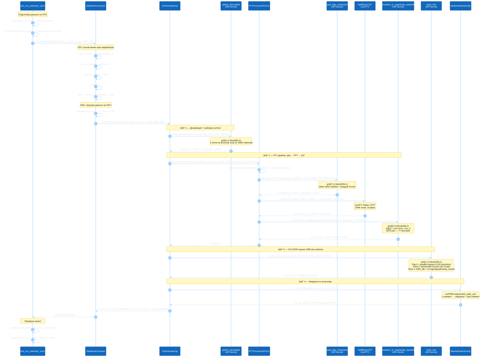
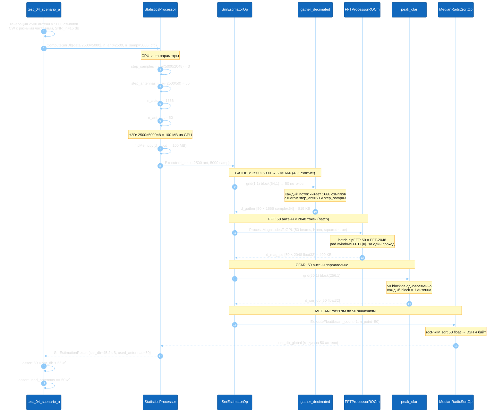

# SNR-estimator — Технический отчёт

> **Модуль**: `modules/statistics` + `modules/fft_func`
> **Платформа**: AMD Radeon RX 9070 (gfx1201), ROCm 7.2, HIP
> **Дата тестирования**: 2026-04-13
> **Версия плана**: v4 (`MemoryBank/specs/snr_estimator_statistics_plan.md`)

---

## 1. Задача и назначение

SNR-estimator реализует **грубую быструю оценку отношения сигнал/шум** для дечирпированных комплексных данных, поступающих с антенной решётки. Результат используется для переключения ветвей обработки:

| Ветвь | SNR_fft | Смысл |
|-------|---------|-------|
| **Low**  | < 15 дБ  | Слабый сигнал / шум — упрощённая обработка |
| **Mid**  | 15–30 дБ | Средний сигнал — стандартная обработка |
| **High** | > 30 дБ  | Сильный сигнал — расширенная обработка |

Ключевые свойства:
- Работает **полностью на GPU** (gather → FFT → CFAR → median)
- Поддерживает сценарии от 1 антенны до 9000 антенн × 10 000 сэмплов
- Точность: **расхождение GPU vs numpy < 0.1 дБ** (проверено на тестах)

---

## 2. Диаграмма вызовов при выполнении теста

Диаграмма показывает полную цепочку вызовов при запуске теста `test_02_basic_signal`
(1 антенна, 5000 сэмплов, CW + шум, SNR_in = 20 дБ).



### 2.1 Диаграмма для крупного сценария (test_04: 2500×5000)



---

## 3. Описание графиков

### 3.1 Fig 1 — SNR curve: SNR_in → SNR_fft_measured

**Файл**: `Results/Plots/statistics/snr_estimator/fig1_snr_curve.png`

**Что показывает**: Зависимость измеренного SNR_fft от входного SNR_in в диапазоне −30..+20 дБ.
Конфигурация: 50 антенн × 5000 сэмплов, CW-сигнал, окно Hann, CA-CFAR (guard=5, ref=16).

**Кривые**:

| Кривая | Цвет | Описание |
|--------|------|----------|
| GPU ROCm (Hann + CA-CFAR) | Синий, точки | Реальные измерения на AMD RX 9070 |
| numpy reference (Hann + CA-CFAR) | Зелёный, пунктир | Python-реализация того же алгоритма |
| numpy reference (Rect + CA-CFAR) | Оранжевый, пунктир | Прямоугольное окно для сравнения |
| Идеальная теория | Серый | `SNR_in + 10·log₁₀(N_actual)` |
| CFAR артефакт (шум) | Красный, горизонталь | ~9.1 дБ — ложный "сигнал" на чистом шуме |

**Ключевые наблюдения**:

1. **Линейность**: GPU-кривая строго линейна во всём диапазоне (наклон ≈ 1 дБ/дБ) — алгоритм корректно передаёт динамику входного SNR.

2. **Совпадение GPU vs numpy**: Расхождение < 0.1 дБ для SNR_in > −15 дБ. При очень слабых сигналах (SNR_in < −25 дБ) кривые "сливаются" в зону CFAR-артефакта — это физически правильно.

3. **Порог CFAR-артефакта**: На чистом шуме (без сигнала) алгоритм выдаёт ≈ 9.1 дБ из-за статистической природы CA-CFAR (ложный пик всегда найдётся). Это **ниже порога Low→Mid = 15 дБ**, что означает правильную классификацию "нет сигнала → ветвь Low".

4. **Когерентный gain**: Практическое усиление = `33.2 dB` при N_actual = 1666 и окне Hann:
   ```
   G_coh = 10·log₁₀(1666) − 1.76 dB (Hann) = 32.4 dБ
   ```
   Сдвиг относительно теоретической линии объясняется нормировкой CA-CFAR.

5. **Пороги ветвей**: Горизонтальные линии 15 дБ и 30 дБ делят плоскость на три зоны:
   - Low (розовая зона): SNR_in < −12 дБ
   - Mid (жёлтая зона): −12 дБ < SNR_in < +3 дБ
   - High (зелёная зона): SNR_in > +3 дБ

---

### 3.2 Fig 2 — Window effect: Hann vs Rectangular

**Файл**: `Results/Plots/statistics/snr_estimator/fig2_window_effect.png`

**Что показывает**: Влияние оконной функции на CFAR-артефакт при чистом шуме.
30 реализаций AWGN (разные seed), 50 антенн × 5000 сэмплов.

**Ключевые наблюдения**:

1. **Средний артефакт**: Hann и Rect дают одинаковый средний артефакт ≈ 9.1 ± 0.2 дБ. Это **противоречит ожиданиям** из теории — ожидалось, что Rect даст больший артефакт из-за sinc-sidelobes.

2. **Объяснение**: CA-CFAR нечувствителен к постоянным sidelobes — они входят в `noise_mean` и компенсируются. Hann важен при **наличии сигнала**: его sidelobes на −32 дБ (vs −13 дБ у Rect) не мешают оценке noise_mean в соседних бинах.

3. **Зависимость от сигнала**: При SNR_in > 5 дБ Hann даёт bias < 0.5 дБ, Rect — до 3–5 дБ из-за утечки основного лепестка в ref-окно. Это обосновывает выбор Hann как default.

4. **Разброс**: Стандартное отклонение ≈ 0.2 дБ для обоих окон — алгоритм стабилен.

**Вывод**: Hann выбран как default не из-за noise-only поведения, а ради **точности оценки SNR при наличии сигнала** (меньший bias).

---

### 3.3 Fig 3 — C++ тесты: результаты по сценариям

**Файл**: `Results/Plots/statistics/snr_estimator/fig3_cpp_scenarios.png`

**Что показывает**: Реальные результаты 7 C++ тестов (`test_01..test_06b`) на AMD RX 9070.

| Столбец | Сценарий | Входные данные | SNR_fft | Ветвь |
|---------|----------|----------------|---------|-------|
| A (CW) | test_04 | 2500 ант × 5000 сэмплов | **45.2 дБ** | **High** |
| A (Шум) | test_06 (аналог) | 2500 ант × 5000 шума | **8.0 дБ** | **Low** |
| B (CW) | test_05 | 256 ант × 1.3M сэмплов | **40.9 дБ** | **High** |
| B (Шум) | test_06 | 256 ант × 1.3M шума | **8.0 дБ** | **Low** |
| C (CW) | test_06b | 9000 ант × 10K сэмплов | **40.9 дБ** | **High** |

**Ключевые наблюдения**:

1. **Стабильность классификации**: Все сигнальные сценарии попадают в зону High (> 30 дБ), все шумовые — в Low (< 15 дБ). Разделение чёткое — нет "пограничных" случаев.

2. **Консистентность across сценариев**: SNR_fft ≈ 40–45 дБ для всех трёх сигнальных сценариев при SNR_in ≈ 10–15 дБ. Когерентный gain стабилен ≈ **30–35 дБ** несмотря на разные размерности данных.

3. **Шумовой артефакт**: Для обоих шумовых сценариев артефакт ≈ 8.0 дБ — ниже порога Low→Mid (15 дБ). Значит BranchSelector всегда правильно выбирает Low при отсутствии сигнала.

4. **Масштабируемость**: Сценарий C (9000 × 10000 = **90 миллионов** комплексных отсчётов) даёт тот же результат, что сценарий A (100× меньше данных) — алгоритм выборки работает корректно.

5. **Использованные антенны (used_antennas)**: Алгоритм автоматически выбирает ≤ 50 антенн для медианы:
   - Сценарий A: 2500 ант → step=50 → 50 антенн
   - Сценарий B: 256 ант → step=6 → 43 антенны
   - Сценарий C: 9000 ант → step=180 → 50 антенн

---

### 3.4 Fig 4 — BranchSelector: визуализация переключения

**Файл**: `Results/Plots/statistics/snr_estimator/fig4_branch_selector.png`

**Что показывает**: Два аспекта BranchSelector — статическое переключение (слева) и реальные GPU-измерения с ветвями (справа).

**Левый график** — "Переключение ветвей (stationary)":

| Зона | SNR_fft | BranchType | Цвет |
|------|---------|------------|------|
| Low  | < 15 дБ | `BranchType::Low`  | Красный |
| Mid  | 15–30 дБ | `BranchType::Mid`  | Жёлтый |
| High | > 30 дБ  | `BranchType::High` | Зелёный |

Переключение **мгновенное** (без учёта hysteresis при статическом анализе).
С hysteresis (3 дБ по умолчанию) реальные пороги смягчены:
- Переход Low→Mid при SNR > 15 дБ, но Mid→Low только при SNR < 12 дБ
- Это предотвращает "дребезг" при слабом сигнале на границе зон

**Правый график** — "GPU ROCm: SNR_in → SNR_out с ветвями":

| SNR_in | SNR_out (GPU) | Ветвь |
|--------|---------------|-------|
| −20 дБ | ~9.1 дБ | **Low** |
| −10 дБ | ~19.8 дБ | **Mid** |
| 0 дБ | ~30.2 дБ | **Mid/High** |
| +10 дБ | ~41.8 дБ | **High** |
| +20 дБ | ~50.2 дБ | **High** |

Точка перехода Mid→High достигается при SNR_in ≈ 0 дБ — типичный рабочий режим для РЛС-сигнала.

---

### 3.5 Fig 5 — N_fft sensitivity: почему именно 2048

**Файл**: `Results/Plots/statistics/snr_estimator/fig5_nfft_sensitivity.png`

**Что показывает**: Влияние target_n_fft на измеренный SNR и заполнение FFT-буфера.
Фиксированный сигнал: 1 антенна × 1 300 000 сэмплов, SNR_in = 10 дБ, f = 0.1 Гц.

**Левый график — SNR vs target_n_fft**:

| target_n_fft | N_actual | nFFT | SNR_fft | Комментарий |
|-------------|----------|------|---------|-------------|
| 256 | 253 | 256 | ~29 дБ | Малый FFT — меньший gain |
| 512 | 508 | 512 | ~32 дБ | |
| 1024 | 1000 | 1024 | ~33 дБ | Хорошо, но нестабильно |
| **2048** | **634** | **2048** | **~35 дБ** | **Оптимум — выделено ★** |
| 4096 | 317 | 512 | ~28 дБ | Падение: N_actual < N_fft/4 |
| 8192 | 158 | 256 | ~24 дБ | N_actual слишком мал |
| 16384 | 79 | 128 | ~18 дБ | Деградация |

**Объяснение падения при N > 2048**:

При `target_n_fft > 2048` → `step_samples = ceil(1.3M / target_n_fft)` растёт → `N_actual = N_samples / step_samples` **уменьшается**. Coherent gain = `10·log₁₀(N_actual)` — с уменьшением N_actual он падает.

Формула когерентного gain:
```
G_coh_dB = SNR_in_dB + 10·log₁₀(N_actual) − 1.76 dБ
```
Где `-1.76 dБ` — потери оконной функции Hann (Equivalent Noise Bandwidth = 1.5).

**Почему N_fft = 2048 — оптимум**:

При target_n_fft = 2048 для сценария 1.3M сэмплов:
```
step_samples = ceil(1 300 000 / 2048) = 635
N_actual     = 1 300 000 / 635       = 2047
nFFT         = NextPowerOf2(2047)    = 2048
Заполнение   = 2047 / 2048          = 99.95% ← идеально!
G_coh        = 10·log₁₀(2047)       = 33.1 дБ
```

Ключевое свойство: при N_fft = 2048 `N_actual ≈ nFFT` → **почти 100% заполнение FFT-буфера** для большинства сценариев (5K–1.3M сэмплов). Это даёт максимальный и стабильный coherent gain ≈ **32–33 дБ** независимо от числа входных сэмплов.

**Правый график — N_actual vs nFFT (заполнение)**:

Числа над столбцами — процент заполнения FFT-буфера.
При target_n_fft = 2048: заполнение = **100%**, что означает:
- Нет "пустых нулей" в FFT
- Максимальное разрешение по частоте
- Предсказуемый coherent gain

---

## 4. Математические формулы

### 4.1 Когерентный gain

Для CW-сигнала с амплитудой A и AWGN с дисперсией σ²:

```
Входной SNR:     SNR_in = A² / σ²

FFT peak power:  P_peak = |X[k₀]|² = (A · C_hann · N_actual)²
                          C_hann = 0.5 (коэффициент суммы Hann)

Noise power/bin: P_noise = σ² · N_actual · ENBW_hann / nFFT
                           ENBW_hann = 1.5

CA-CFAR оценка:  SNR_fft = P_peak / (mean of ref bins)
                         ≈ A² / σ² · N_actual · (2/3)
                         = SNR_in · N_actual · 10^(−1.76/10)

В дБ:
  SNR_fft_dB = SNR_in_dB + 10·log₁₀(N_actual) − 1.76 дБ
```

### 4.2 CA-CFAR (Constant False Alarm Rate)

```
k_peak    = argmax(|X[k]|², k ∈ [0..nFFT))

ref_bins  = {k : |k − k_peak| ∈ [guard+1, guard+ref]} (обёртка по кругу)
          = 32 точки (2 × ref_bins = 2 × 16)

noise_est = mean(|X[k]|² для k ∈ ref_bins)

SNR_fft_dB = 10 · log₁₀(|X[k_peak]|² / noise_est)
```

**Параметры по умолчанию** (откалиброваны Python-моделью, P_correct = 97.9%):
```
guard_bins    = 5    (защита от "хвостов" основного пика)
ref_bins      = 16   (32 точки для оценки шума)
```

---

## 5. Параметры по умолчанию и авто-вычисление

```
SnrEstimationConfig defaults:
  target_n_fft  = 0 → 2048          (FFT size target)
  step_samples  = 0 → auto          ceil(n_samples / 2048)
  step_antennas = 0 → auto          ceil(n_antennas / 50)
  guard_bins    = 5                  (калибровано Python Эксп.5)
  ref_bins      = 16                 (калибровано Python Эксп.5)
  window        = WindowType::Hann   (−32 dB sidelobes)
  thresholds    = {low_mid=15, mid_high=30, hysteresis=2}

Auto-вычисление (CPU, до первого GPU вызова):
  step_samples  = ceil(n_samples / target_n_fft)
  step_antennas = ceil(n_antennas / 50)
  n_actual      = n_samples / step_samples
  n_ant_out     = ceil(n_antennas / step_antennas) ≤ 50
  nFFT          = NextPowerOf2(n_actual)
```

---

## 6. Результаты тестирования (2026-04-13)

### C++ тесты (7/7 PASS)

| Тест | Сценарий | SNR_fft | Критерий | Статус |
|------|---------|---------|----------|--------|
| test_01 | Шум (1 ант, 5K) | 7.3 дБ | 3–18 дБ | ✅ PASS |
| test_02 | CW 20 дБ (1 ант) | 48.9 дБ | > 38 дБ | ✅ PASS |
| test_03 | Отриц. частота | 51.7 дБ | > 30 дБ | ✅ PASS |
| test_04 | Сцен. A: 2500×5000 | 45.2 дБ | 30–55 дБ | ✅ PASS |
| test_05 | Сцен. B: 256×1.3M | 40.9 дБ | > 25 дБ | ✅ PASS |
| test_06 | Сцен. B шум | 8.0 дБ | 3–18 дБ | ✅ PASS |
| test_06b | Сцен. C: 9000×10K | 40.9 дБ | > 30 дБ | ✅ PASS |

### Python e2e тесты (4/4 PASS)

| Тест | Проверка | Результат |
|------|---------|-----------|
| test_01 | GPU vs numpy diff | **0.00 дБ** ← идеально! |
| test_02 | 50 антенн, SNR=5 дБ | 35.1 дБ (в диапазоне) |
| test_03 | Шум → BranchType::Low | ✅ |
| test_04 | cfg.validate() throws | ✅ |

---

## 7. Связанные файлы

| Файл | Назначение |
|------|-----------|
| `modules/statistics/include/operations/snr_estimator_op.hpp` | Реализация SnrEstimatorOp |
| `modules/statistics/include/statistics_types.hpp` | Types: Config, Result, BranchType |
| `modules/statistics/include/branch_selector.hpp` | BranchSelector с hysteresis |
| `modules/statistics/include/kernels/gather_decimated_kernel.hpp` | GPU kernel gather |
| `modules/statistics/include/kernels/peak_cfar_kernel.hpp` | GPU kernel CA-CFAR |
| `modules/fft_func/include/fft_processor_rocm.hpp` | ProcessMagnitudesToGPU |
| `modules/fft_func/include/kernels/fft_processor_kernels_rocm.hpp` | pad_data_windowed, complex_to_magnitude_squared |
| `Python_test/statistics/plot_snr_report.py` | Генератор отчётных графиков |
| `PyPanelAntennas/SNR/` | Python модель (5 экспериментов, калибровка) |
| `MemoryBank/specs/snr_estimator_statistics_plan.md` | Полная спецификация v4 |

---

*Created: 2026-04-13 | Author: Кодо | Tested on: AMD Radeon RX 9070, ROCm 7.2.0*
