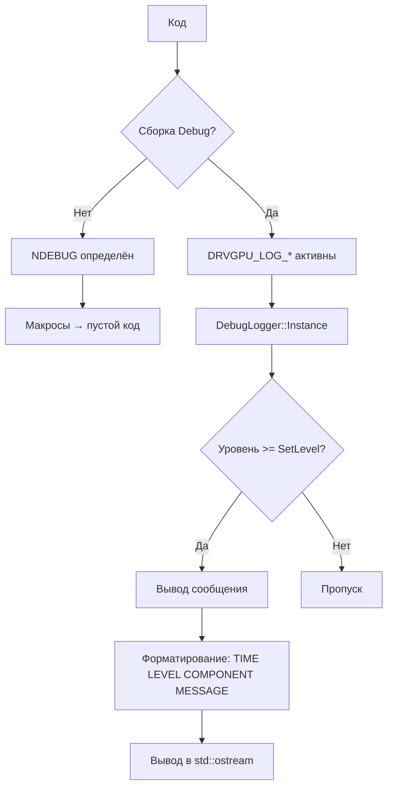

# План: Создание класса DebugLogger для DrvGPU

## 1. Анализ проблемы

### Найденные отладочные сообщения

В проекте `include/DrvGPU/` обнаружены **более 40 отладочных сообщений**, использующих `std::cout` и `std::cerr` напрямую:

| Файл | stdout | stderr | Всего |
|------|--------|--------|-------|
| [`drv_gpu.cpp`](drv_gpu.cpp) | 10 | 0 | 10 |
| [`gpu_manager.hpp`](gpu_manager.hpp) | 12 | 0 | 12 |
| [`module_registry.cpp`](module_registry.cpp) | 5 | 0 | 5 |
| [`opencl_backend.cpp`](opencl_backend.cpp) | 2 | 3 | 5 |
| [`opencl_core.cpp`](opencl_core.cpp) | 3 | 1 | 4 |
| [`command_queue_pool.cpp`](command_queue_pool.cpp) | 0 | 1 | 1 |
| [`opencl_backend_external.cpp`](opencl_backend_external.cpp) | 14 | 1 | 15 |
| **Итого** | **46** | **6** | **52** |

### Примеры проблемных паттернов

```cpp
// Проблема 1: Разные форматы вывода
std::cout << "[WARNING] DrvGPU already initialized\n";
std::cout << "[OK] DrvGPU initialized successfully\n";
std::cout << "\n" << std::string(50, separator) << "\n";

// Проблема 2: Смешивание stdout и stderr
std::cerr << "[OpenCLBackend] MemcpyHostToDevice error: " << err << "\n";
std::cout << "[OpenCLBackend] Initialized for device index: " << device_index << "\n";

// Проблема 3: Нет отключения в релизе - сообщения всегда выводятся
// При сборке Release: NDEBUG определён, но cout всё равно вызывается
```

---

## 2. Решение: Класс DebugLogger

### 2.1. Требования

1. **Условная компиляция**: Сообщения должны полностью исключаться из бинарного файла в Release режиме
2. **Уровни логирования**: DEBUG, INFO, WARNING, ERROR
3. **Единый формат**: `[Класс] Сообщение`
4. **Простота использования**: Макросы для быстрого внедрения
5. **Thread-safety**: Безопасность в многопоточной среде

### 2.2. Структура файла `logger.hpp`

```
include/DrvGPU/
├── common/
│   └── logger.hpp          # NEW: Класс DebugLogger
```

### 2.3. API DebugLogger

```cpp
namespace drv_gpu_lib {

class DebugLogger {
public:
    // Уровни логирования
    enum class Level {
        DEBUG,   // Подробная отладка
        INFO,    // Информационные сообщения
        WARNING, // Предупреждения
        ERROR    // Ошибки
    };

    // Статический доступ
    static DebugLogger& Instance();

    // Методы логирования
    void Log(Level level, const std::string& component, const std::string& message);
    void Debug(const std::string& component, const std::string& message);
    void Info(const std::string& component, const std::string& message);
    void Warning(const std::string& component, const std::string& message);
    void Error(const std::string& component, const std::string& message);

    // Проверка уровня
    bool IsEnabled(Level level) const;

    // Настройки
    void SetLevel(Level level);
    void SetOutput(std::ostream& output);
};

} // namespace drv_gpu_lib
```

### 2.4. Макросы для удобства

```cpp
// DRVGPU_LOG_DEBUG(component, message)   - Только Debug сборка
// DRVGPU_LOG_INFO(component, message)    - Debug + Release (можно отключить)
// DRVGPU_LOG_WARNING(component, message)  - Всегда активен
// DRVGPU_LOG_ERROR(component, message)    - Всегда активен

// Примеры использования:
DRVGPU_LOG_INFO("DrvGPU", "Initialized successfully");
DRVGPU_LOG_WARNING("GPUManager", "Already initialized");
DRVGPU_LOG_ERROR("OpenCL", "Failed to create buffer: " + std::to_string(err));
```

---

## 3. Детали реализации

### 3.1. Условная компиляция

```cpp
#ifdef NDEBUG
    // Release: логирование отключено (сообщения не компилируются)
    #define DRVGPU_LOG_DEBUG(component, msg)    ((void)0)
    #define DRVGPU_LOG_INFO(component, msg)     ((void)0)
#else
    // Debug: полное логирование
    #define DRVGPU_LOG_DEBUG(component, msg) \
        drv_gpu_lib::DebugLogger::Instance().Debug(component, msg)
#endif

// WARNING и ERROR всегда активны
#define DRVGPU_LOG_WARNING(component, msg) \
    drv_gpu_lib::DebugLogger::Instance().Warning(component, msg)
#define DRVGPU_LOG_ERROR(component, msg) \
    drv_gpu_lib::DebugLogger::Instance().Error(component, msg)
```

### 3.2. Формат вывода

```
[DRVGPU] [INFO]    [DrvGPU]     Initialized successfully
[TIME]  [LEVEL]    [COMPONENT]  Message
```

---

## 4. План интеграции

### Фаза 1: Создание logger.hpp
- [ ] Создать `include/DrvGPU/common/logger.hpp`
- [ ] Реализовать класс DebugLogger с условной компиляцией
- [ ] Добавить макросы DRVGPU_LOG_*

### Фаза 2: Обновление файлов

#### drv_gpu.cpp
| Было | Станет |
|------|--------|
| `std::cout << "[OK] DrvGPU initialized successfully\n";` | `DRVGPU_LOG_INFO("DrvGPU", "Initialized successfully");` |
| `std::cout << "[WARNING] DrvGPU already initialized\n";` | `DRVGPU_LOG_WARNING("DrvGPU", "Already initialized");` |
| `std::cout << "Device Info:\n";` | `DRVGPU_LOG_DEBUG("DrvGPU", "Printing device info");` |

#### gpu_manager.hpp
| Было | Станет |
|------|--------|
| `std::cout << "[GPUManager] Initialized " << gpus_.size() << " GPU(s)\n";` | `DRVGPU_LOG_INFO("GPUManager", "Initialized " + std::to_string(gpus_.size()) + " GPU(s)");` |

#### opencl_backend.cpp
| Было | Станет |
|------|--------|
| `std::cerr << "[OpenCLBackend] MemcpyHostToDevice error: " << err << "\n";` | `DRVGPU_LOG_ERROR("OpenCLBackend", "MemcpyHostToDevice error: " + std::to_string(err));` |
| `std::cout << "[OpenCLBackend] Initialized for device index: " << device_index << "\n";` | `DRVGPU_LOG_INFO("OpenCLBackend", "Initialized for device index: " + std::to_string(device_index));` |

#### opencl_backend_external.cpp
| Было | Станет |
|------|--------|
| `std::cout << "[OpenCLBackendExternal] Created with external OpenCL context\n";` | `DRVGPU_LOG_INFO("OpenCLBackendExternal", "Created with external OpenCL context");` |

### Фаза 3: Обновление CMakeLists.txt
- [ ] Добавить `logger.hpp` в список common headers
- [ ] Убедиться, что `iostream` включается только в .cpp файлах

---

## 5. Преимущества решения

| До | После |
|----|-------|
| 52 вызова `std::cout`/`std::cerr` в коде | 0 прямых вызовов |
| Сообщения всегда выводятся | Отключаются в Release через NDEBUG |
| Разные форматы сообщений | Единый формат `[LEVEL] [COMPONENT] Message` |
| Нет контроля уровней | 4 уровня: DEBUG, INFO, WARNING, ERROR |
| Сложно отключить | Один макрос для всех сообщений |

---

## 6. Диаграмма использования


