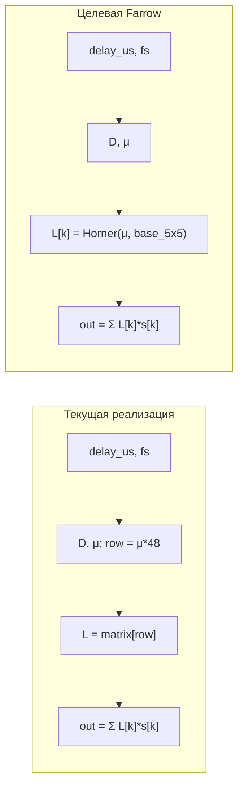

# План: Семантика задержки, описание kernel и переход на Farrow

> Сохранено для чтения и дополнения. Дополни — сохрани обратно или отредактируй в репо.

---

## 1. Семантика задержки (зафиксировать в документе)

- **Целая задержка 5:** выход[0..4] = 0; с выход[5] идёт задержанный сигнал; форма повторяет входной сигнал.
- **Дробная задержка 5.23:** «начало» задержки в позиции 5.23; до этого — нули; **первое значение после пересчёта** — в точке **[6]** (т.е. выход[0..5] = 0, с выход[6] — интерполяция).

Текущая реализация в `modules/signal_generators/src/delayed_form_signal_generator.cpp` уже даёт это поведение: `if ((float)sample_id < delay_samples) { output[gid] = 0; return; }`. Имеет смысл явно описать эту семантику в спецификации (например в `MemoryBank/specs/Form_signals.md` или в отдельном подразделе DelayedFormSignal) и в комментарии в kernel.

---

## 2. Подробное описание kernel (документ)

Создать или расширить документ (например `MemoryBank/specs/DelayedFormSignal_Kernel.md` или раздел в `Plan_FractionalDelay_Farrow.md`) с разделами:

- **Назначение:** применение дробной задержки (per-antenna) к комплексному сигналу + опциональный шум.
- **Входы:** `input` (float2, чистый сигнал), `lagrange_matrix` (48×5 или базисная матрица Farrow), `delay_us`, `antennas`, `points`, `sample_rate`, `noise_amplitude`, `norm_val`, `noise_seed`.
- **Выход:** `output` (float2), задержанный сигнал + шум.
- **Формула задержки:**
  - `delay_samples = delay_us * 1e-6 * sample_rate`
  - `D = floor(delay_samples)`, `μ = delay_samples - D` ∈ [0, 1).
  - Для **текущей** реализации: `row = (uint)(μ * 48) % 48`, выходной отсчёт = Σ L[row][k] * input[center - 1 + k] при center = sample_id - D, с нулём при sample_id < delay_samples и при чтении за границами.
- **Границы:** при чтении индексов за [0, points) подставлять 0; при `sample_id < delay_samples` выход = 0.
- **Отличие от настоящего Farrow:** сейчас используется выборка строки матрицы 48×5 по дискретному μ; по ТЗ нужна **структура Farrow** — вычисление коэффициентов как полинома по μ (схема Горнера) в ядре.

Указать в описании ссылки на источники: CCRMA Farrow Structure, `Farrow_GPU_OpenCL_Algorithm.md` (вариант со свёрткой FFT — альтернатива), план `Plan_FractionalDelay_Farrow.md`.

---

## 3. Исследование для перехода на Farrow

- **Context7:** по запросу "farrow fractional delay" подходящей библиотеки не найдено; оставить в плане использование статей и референсов по URL.
- **Статьи по URL (уже подтянуты):**
  - CCRMA: [Farrow Structure](https://ccrma.stanford.edu/~jos/pasp/Farrow_Structure.html) — H_Δ(z) = Σ C_m(z) Δ^m, схема Горнера.
  - CCRMA: [Farrow Structure for Variable Delay](https://ccrma.stanford.edu/~jos/pasp05/Farrow_Structure_Variable_Delay.html) — Lagrange через Farrow, finite difference filters.
- **Локальные материалы:** `Farrow_GPU_OpenCL_Algorithm.md` описывает вариант через **свёртку FFT** (h[48] на CPU из Farrow_coeff .* pw, затем FFT-based свёртка). Текущий код использует **time-domain 5-point** интерполяцию; целевой вариант — time-domain Farrow в ядре: 5 коэффициентов L[k] как полином от μ, схема Горнера.
- **GitHub:** при рабочей авторизации — поиск кода (например "Farrow fractional delay", "Lagrange Horner μ") для референса коэффициентов и формул.
- **Sequential-thinking:** при необходимости разобрать варианты (time-domain Farrow в ядре vs FFT-свёртка; вывод базисной матрицы из 48×5) через MCP sequential-thinking.

---

## 4. Коэффициенты: использование старых

- Текущая матрица `lagrange_matrix_48x5.json` и встроенная `kBuiltinLagrangeMatrix` — 48 строк по 5 коэффициентов Лагранжа для μ = 0/48 … 47/48.
- Для **настоящего Farrow** в ядре нужна матрица **базисных** коэффициентов: каждый из 5 коэффициентов интерполяции — полином 4-й степени по μ:
  - `L[k](μ) = c0[k] + c1[k]*μ + c2[k]*μ² + c3[k]*μ³ + c4[k]*μ⁴`.
  - Тогда матрица размером 5×5 (по одному столбцу на степень μ) задаёт базис; в ядре: для каждого k вычислить L[k] по схеме Горнера по μ, затем выход = Σ L[k]*s[k].
- **Связь со старыми коэффициентами:** строки 48×5 — это выборки L[k](μ) при μ = row/48. По ним можно восстановить коэффициенты полинома (например МНК по 48 точкам или решение по 5 точкам для каждого k). Если полученная базисная матрица даёт при подстановке μ = row/48 те же значения, что в lagrange_matrix_48x5 — старые коэффициенты «подходят» и их можно оставить в виде производной базисной матрицы 5×5 (или 5×5 хранить, 48×5 использовать только для эталона/тестов).
- В плане явно указать: **эталон и тесты** продолжать использовать текущую матрицу 48×5 (или её строки при μ = row/48) для сравнения; после перехода на Farrow в ядре — либо эталон перевести на ту же формулу Горнера с базисной матрицей, либо оставить эталон 48×5 и сравнивать с допустимой погрешностью.

---

## 5. Шаги реализации (без изменений кода в этой сессии)

1. **Документ семантики и kernel:** обновить/создать спецификацию с п. 1 и п. 2 (семантика задержки + подробное описание kernel с формулами и границами).
2. **Исследование Farrow:** оформить краткую выжимку из CCRMA и из Farrow_GPU_OpenCL_Algorithm.md (различие time-domain 5-point vs FFT, формула Farrow через C_m(z) и Горнер) в MemoryBank (например `MemoryBank/research/Farrow_kernel_sources.md` или раздел в DiscussionPlan).
3. **Базисная матрица из 48×5:** при переходе на Farrow — скрипт или небольшая утилита (Python/C++): по lagrange_matrix_48x5 вычислить матрицу 5×5 базисных коэффициентов (полином по μ для каждого из 5 taps); проверить, что при μ = i/48, i=0..47 восстанавливаются исходные строки (или погрешность в пределах допуска).
4. **Переделка kernel:** заменить в ядре выборку строки `row = (uint)(μ*48)%48` на вычисление 5 коэффициентов по полиному от μ (схема Горнера), используя базисную матрицу 5×5 в `__constant`; логику границ и `sample_id < delay_samples` не менять.
5. **Тесты и эталон:** оставить CPU/NumPy эталон с 48×5 для сравнения; при необходимости добавить эталон с формулой Горнера и той же базисной матрицей; зафиксировать допуск по норме ошибки.

---

## 6. Диаграмма (текущая vs целевая)

---

## Итог

- Семантика задержки явно документируется; текущее поведение (нули до delay_samples, первое значение в ceil(delay_samples)) сохраняется.
- Kernel получает подробное текстовое описание (входы, выходы, формулы, границы, отличия от Farrow).
- Переход на Farrow: исследование по CCRMA и локальным материалам, вывод базисной матрицы из 48×5, замена в ядре на расчёт по Горнеру; старые коэффициенты используются через производную базисную матрицу; эталон при необходимости оставить 48×5 с допуском.
- При рабочей авторизации GitHub — поиск референсного кода; при сложных решениях — sequential-thinking.

---

## Место для дополнений

<!-- Дополни план ниже или в отдельных разделах -->
