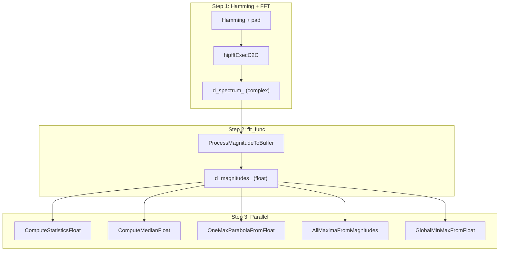

# Strategies Pipeline: интеграция fft_func

> **Цель**: после Hamming+FFT вызывать fft_func для получения магнитуд (без фазы), затем параллельно запускать статистику, медиану и три post-FFT сценария. API — vector<float> (как в Statistics).
>
> **Проверка**: другая AI выполняет, Кодо проверяет.

---

## 1. Текущее состояние

```
[antenna_processor_v1.cpp] do_window_fft():
  1. Hamming + pad → d_fft_input_
  2. hipfftExecC2C → d_spectrum_ (complex)
  3. magnitudes_kernel_ (собственный) → d_magnitudes_ (float)
```

Post-FFT: ONE_MAX_PARABOLA, ALL_MAXIMA, GLOBAL_MINMAX — последовательно на stream_debug3_.

---

## 2. Целевое состояние

```
do_window_fft():
  1. Hamming + pad → d_fft_input_
  2. hipfftExecC2C → d_spectrum_ (complex)
  3. ComplexToMagPhase.ProcessMagnitudeToBuffer(d_spectrum_, d_magnitudes_, params)  ← fft_func
  4. d_spectrum_ можно обнулить для новых данных

do_run_post_fft_scenarios():
  Параллельно: Statistics, Median, OneMaxParabola, AllMaxima, GlobalMinMax
  Вход: d_magnitudes_ (GPU) или vector<float> (CPU wrappers)
```

---

## 3. Принятые решения

| Вопрос | Решение |
|--------|---------|
| ProcessMagnitudeToBuffer | Добавляем в fft_func — функции нет в коде |
| hipMallocManaged | Доработать DrvGPU/backends/rocm/ — CPU читает без D2H |
| OneMaxParabola (парабола) | **fft_func** |
| OneMax, GlobalMinMax, AllMaxima | **statistics** |
| Stream'ы | Бенчмарк: 1 stream vs 3 streams → выбрать по времени |

---

## 4. Схема потока данных



---

## 5. Ссылки

- Task: [MemoryBank/tasks/Task_13_StrategiesPipelineFftFunc.md](../tasks/Task_13_StrategiesPipelineFftFunc.md)
- Инструкция для проверяющего: [MemoryBank/INSTRUCTION_StrategiesPipeline.md](../INSTRUCTION_StrategiesPipeline.md)
- Исходный план: `.cursor/plans/strategies_pipeline_fft_func_0fcecca4.plan.md`
