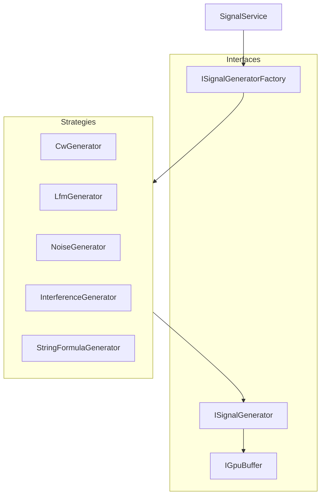

# План работы GPUWorkLib по приоритетам

## Задача 0: Анализ antenna_fft_release.cpp и antenna_fft_core.cpp

**Результат анализа:** Файлы **активно используются** и являются ядром модуля `fft_maxima`.


| Файл                                                                      | Роль                                                                  | Зависимости                                                          |
| ------------------------------------------------------------------------- | --------------------------------------------------------------------- | -------------------------------------------------------------------- |
| [antenna_fft_core.cpp](modules/fft_maxima/src/antenna_fft_core.cpp)       | Базовый класс `AntennaFFTCore` — контекст OpenCL, clFFT, batch config | `antenna_fft_release`, `spectrum_maxima_finder`, `fft_batch_adapter` |
| [antenna_fft_release.cpp](modules/fft_maxima/src/antenna_fft_release.cpp) | Реализация `AntennaFFTProcMax` — FFT с callbacks                      | Наследует `AntennaFFTCore`                                           |


**Использование:**

- `test_external_context_fft.hpp`, `test_fft_maxima.hpp`, `test_fft_svm.hpp` — тесты
- `spectrum_maxima_finder.cpp` — использует `AntennaFFTProcMax` через `AntennaFFTParams`
- `fft_batch_adapter.hpp`, `fft_plan_cache.hpp` — инфраструктура

**Вывод:** Файлы **не удалять**. Они — core pipeline FFT. Документировать в `MemoryBank/specs/` краткий граф зависимостей.

---

## Задача 1 (Высокий): Модуль генераторов сигналов

### 1.1 Архитектура (по [Pлан GENERATOR.md](MemoryBank/DiscussionPlan/Synthesizer/Pлан GENERATOR.md))




**Базовые сущности:**

- `SystemSampling{fs, length}` — параметры дискретизации
- `SignalRequest{kind, system, params}` — запрос на генерацию
- `ISignalGenerator::generateToCpu()`, `generateToGpu()` — контракт

### 1.2 Набор генераторов


| Тип                   | Источник                                                                                   | Параметры                           |
| --------------------- | ------------------------------------------------------------------------------------------ | ----------------------------------- |
| **sin/cos**           | Новый                                                                                      | f0, phase, amplitude, fs            |
| **sin+cos (IQ)**      | Новый                                                                                      | Вариации квадратурного              |
| **LFM (ЛЧМ)**         | [generator_gpu_new.cpp](e:\C++\LCH-Farrow01\src\GPU\generator_gpu_new.cpp)                 | f_start, f_end, duration, complexIQ |
| **Шумы**              | Новый                                                                                      | white, pink, gaussian; seed         |
| **Помехи**            | Новый                                                                                      | CW jammer, chirp jammer, импульсные |
| **Строковая формула** | [Вариант формирования.txt](MemoryBank/DiscussionPlan/Synthesizer/Вариант формирования.txt) | [Defs] + [Signal], ID, T            |


**Строковое представление** (из Вариант формирования.txt):

- Секции `[Params]`, `[Defs]`, `[Signal]`
- Переменные: `ID` (антенна), `T` (время)
- Генерация OpenCL kernel из конфига → `StringFormulaGenerator`

### 1.3 Интеграция с LCH-Farrow01

Перенести/адаптировать из `E:\C++\LCH-Farrow01\src\GPU`:

- `generator_gpu_new.cpp` — LFM, sinusoids, delay, combined
- Заменить `OpenCLComputeEngine::GetInstance()` на DI через `IBackend*` (без синглтона)

### 1.4 Структура модуля

```
modules/signal_generators/
├── include/
│   ├── i_signal_generator.hpp
│   ├── signal_service.hpp
│   ├── generators/
│   │   ├── cw_generator.hpp
│   │   ├── lfm_generator.hpp
│   │   ├── noise_generator.hpp
│   │   ├── interference_generator.hpp
│   │   └── string_formula_generator.hpp
│   └── params/
│       └── signal_request.hpp
├── src/
├── kernels/
│   └── generators.cl
└── tests/
```

### 1.5 Тесты

- Unit: каждый генератор (CPU reference vs GPU)
- Integration: генератор → FFT → проверка частоты

---

## Задача 2 (Высокий): Расширение fft_maxima — FFT 1/n лучей с вариантами вывода

### 2.1 Текущее состояние

- [SpectrumMaximaFinder](modules/fft_maxima/include/spectrum_maxima_finder.h) — поиск максимума с параболической интерполяцией
- [MaxValue](modules/fft_maxima/include/interface/spectrum_maxima_types.h) — уже содержит `magnitude`, `phase`, `refined_frequency`
- `AntennaFFTProcMax` — FFT с callbacks, batch по лучам

### 2.2 Требуемые расширения


| Режим       | Описание                 | Вывод                                                           |
| ----------- | ------------------------ | --------------------------------------------------------------- |
| **1 луч**   | FFT одного луча          | complex ИЛИ magnitude+phase+freq                                |
| **n лучей** | Параллельный FFT n лучей | массив результатов                                              |
| **Вывод**   | Варианты                 | `complex` / `magnitude_phase` (с пересчётом freq = bin*fs/nFFT) |


### 2.3 API (новый класс или расширение)

```cpp
// Вариант: новый класс FFTProcessor или расширение AntennaFFTProcMax
enum class FFTOutputMode { COMPLEX, MAGNITUDE_PHASE_FREQ };

struct FFTProcessorParams {
    size_t beam_count;      // 1 или n
    size_t n_point;
    float sample_rate;      // fs для пересчёта freq
    FFTOutputMode output_mode;
};

// Результат для magnitude_phase: freq_hz = bin * fs / nFFT
```

### 2.4 Реализация

- Переиспользовать `AntennaFFTCore` / `AntennaFFTProcMax`
- Добавить post-processing: при `MAGNITUDE_PHASE_FREQ` — конвертация bin → freq
- `refined_frequency` уже вычисляется в `SpectrumMaximaFinder`; для «просто FFT» — линейный пересчёт

### 2.5 Тесты

- 1 луч: сравнение с CPU FFT (FFTW или эталон)
- n лучей: батч vs по одному
- Проверка freq при известном тоне

---

## Задача 3 (Высокий): Python-обертка (pybind11)

### 3.1 Референс

[С++and Python.md](MemoryBank/DiscussionPlan/CallFromPython/С++ and Python.md) — архитектура:

- `SignalProcessor` (или аналог) с `compute()` → `py::array_t<float>`
- Zero-copy: `queue.enqueueReadBuffer(..., ptr)` в буфер NumPy
- `pybind11_add_module(gpu_signal, ...)`

### 3.2 Обёртываемые компоненты


| Компонент      | Метод Python                    | Возврат                                      |
| -------------- | ------------------------------- | -------------------------------------------- |
| Генераторы     | `generate_signal(kind, params)` | `numpy.ndarray` (float/complex)              |
| FFT            | `fft(signal, fs)`               | `numpy.ndarray` (complex или mag+phase+freq) |
| SpectrumMaxima | `find_maxima(signal, params)`   | список `{freq, magnitude, phase}`            |


### 3.3 Структура

```
python/
├── CMakeLists.txt          # pybind11_add_module
├── gpu_worklib_bindings.cpp
└── setup.py                # опционально, для pip
```

### 3.4 Зависимости

- `find_package(pybind11)`
- `find_package(Python3 COMPONENTS Interpreter Development)`
- Линковка: DrvGPU, fft_maxima, signal_generators, OpenCL, clFFT

### 3.5 Тесты

- `pytest`: вызов из Python, проверка shape/dtype
- Сравнение с NumPy FFT для эталона

---

## Задача 4 (Низкий): Анализ и реализация Analiz_DROB_pause

### 4.1 Содержимое

[delay_methods_report.md](MemoryBank/DiscussionPlan/Analiz_DROB_pause/Анализ дробной задержки/delay_methods_report.md):

- 6 методов оценки дробной задержки ЛЧМ
- Рекомендуемый: **МНК фазового наклона (beat-сигнал)** — O(N), достигает КРБ
- Оптимальный: **FFT (малый ZP) + параболическая интерполяция**

### 4.2 Этапы

1. **Анализ** — детализация алгоритмов, границы применимости
2. **Прототип CPU** — МНК beat (phase unwrap + linear regression)
3. **GPU kernel** — OpenCL: beat = rx * conj(ref), unwrap, regression
4. **Интеграция** — модуль `FractionalDelay` или в `signal_generators`

### 4.3 Связь с LCH-Farrow01

[fractional_delay_processor.cpp](e:\C++\LCH-Farrow01\src\GPU\fractional_delay_processor.cpp) — проверить наличие реализации

---

## Порядок выполнения


| #   | Задача               | Зависимости | Оценка |
| --- | -------------------- | ----------- | ------ |
| 0   | Анализ antenna_fft   | —           | 0.5 дн |
| 1   | Модуль генераторов   | DrvGPU      | 5–7 дн |
| 2   | FFT 1/n лучей, вывод | antenna_fft | 2–3 дн |
| 3   | Python-обертка       | 1, 2        | 3–4 дн |
| 4   | Analiz_DROB_pause    | 1 (LFM)     | 3–5 дн |


**Рекомендуемая последовательность:** 0 → 1 → 2 → 3 (параллельно с 4 при наличии ресурсов).

---

## Файлы для создания/изменения

- `MemoryBank/specs/antenna_fft_dependencies.md` — граф зависимостей (задача 0)
- `modules/signal_generators/` — новый модуль (задача 1)
- `modules/fft_maxima/` — расширение API (задача 2)
- `python/` — pybind11 bindings (задача 3)
- `MemoryBank/specs/fractional_delay_module.md` — спецификация (задача 4)

