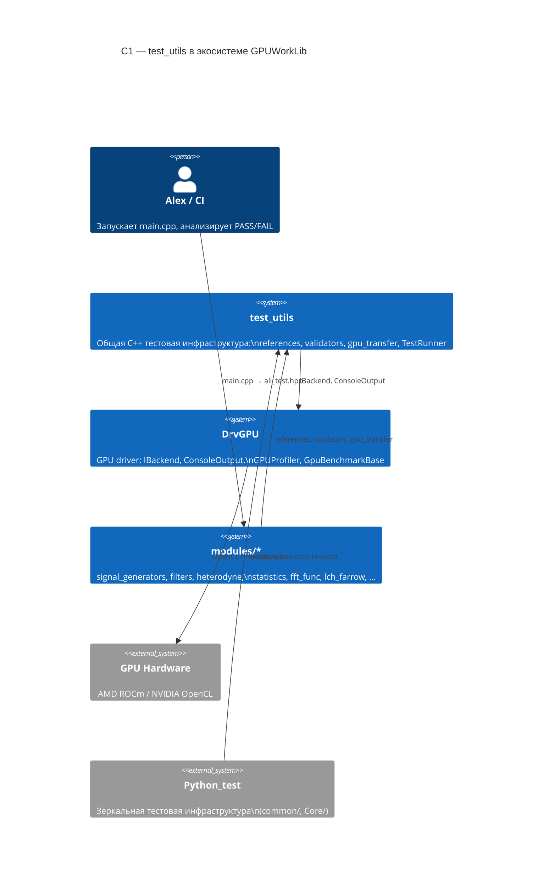
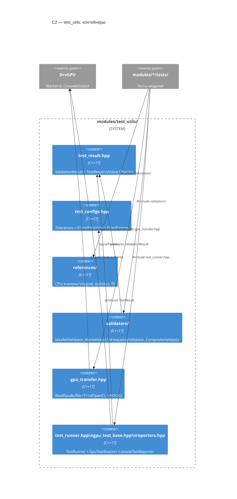
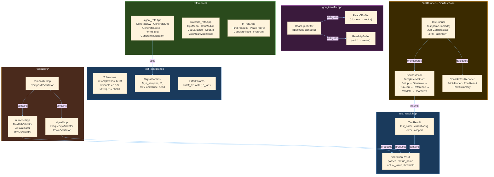
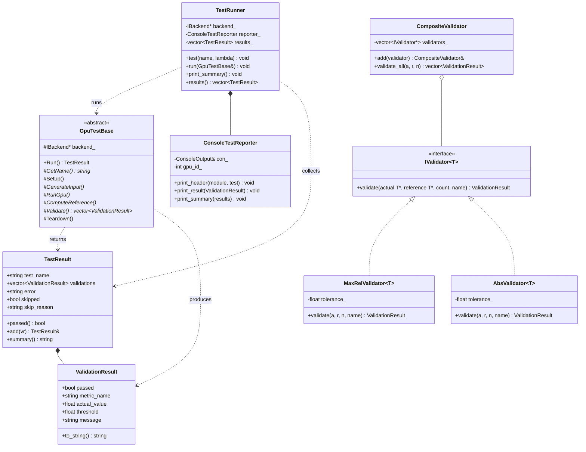
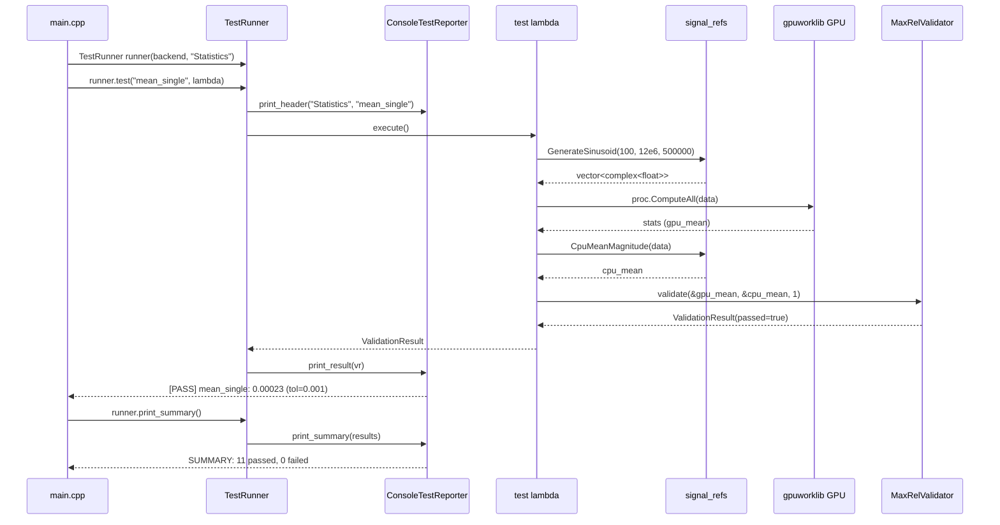

# 🏗️ C++ test_utils — Полный план (C1-C4 + миграция)

> **Дата**: 2026-03-21
> **Автор**: Кодо
> **Статус**: ✅ APPROVED by Alex (2026-03-21)
> **Размещение**: `modules/test_utils/` (НЕ include/test_utils!)
> **Источники**: Context7 (GoogleTest, HIP/ROCm, Catch2), sequential-thinking, анализ 83 тестовых файлов

---

## 📋 TL;DR

| Метрика | Значение |
|---------|----------|
| Новых файлов | **13** (header-only, composite → test_result) |
| LOC utilities | **~650** |
| Дублирования устраняется | **~1000 LOC** |
| Тестов мигрируется | **80+** |
| GPU transfer упрощений | **40+ мест** (5 строк → 1) |
| Validation упрощений | **80+ мест** (4 строки → 1) |

---

## 📐 C1 — System Context

> Где test_utils живёт относительно всей экосистемы GPUWorkLib



---

## 📐 C2 — Container Diagram

> 6 контейнеров внутри test_utils + связи с DrvGPU



---

## 📐 C3 — Component Diagram

> Все классы и зависимости



---

## 📐 C4 — Code Diagram (ключевые классы)



---

## 📐 Sequence: типичный тест (функциональный стиль)



---

## 📁 Целевая структура файлов

```
modules/test_utils/
├── test_utils.hpp               ← 1.  Master include
├── test_result.hpp              ← 2.  ValidationResult + TestResult + add_all (composite)
├── test_configs.hpp             ← 3.  Tolerances + SignalParams + FilterParams
├── test_runner.hpp              ← 4.  TestRunner + timing + JSON export
├── gpu_test_base.hpp            ← 5.  GpuTestBase (Template Method)
├── reporters.hpp                ← 6.  ConsoleTestReporter + ANSI цвета
├── gpu_transfer.hpp             ← 7.  ReadGpuBuffer + PeekGpuBuffer (offset)
├── references/
│   ├── signal_refs.hpp          ← 8.  GenerateCw, GenerateLfm, FormSignal, Noise
│   ├── statistics_refs.hpp      ← 9.  CpuMean, CpuMedian, CpuVariance
│   └── fft_refs.hpp             ← 10. FindPeakBin, PeakFreqHz
└── validators/
    ├── numeric.hpp              ← 11. MaxRelError, AbsError, RmseError + value_to_string
    └── signal.hpp               ← 12. CheckPeakFreq, CheckPower
```

(13 файлов: composite объединён с test_result.hpp по итогам ревью)

---

## 🔑 Два стиля API

### Стиль 1: Функциональный (90% тестов — быстрая миграция)

```cpp
#include "test_utils/test_utils.hpp"
using namespace gpu_test_utils;

namespace test_statistics_rocm {

inline void run(IBackend* backend) {
    TestRunner runner(backend, "Statistics");

    auto proc = StatisticsProcessorROCm(backend);

    runner.test("mean_single_beam", [&]() {
        auto data = refs::GenerateSinusoid(100.f, 12e6f, 500000);
        auto stats = proc.ComputeAll(data.data(), data.size());
        float cpu_mean = refs::CpuMeanMagnitude(data.data(), data.size());
        return MaxRelError(&stats.mean, &cpu_mean, 1, 1e-3f, "mean");
    });

    runner.test("median_multi_beam", [&]() {
        auto data = refs::GenerateMultiBeam(4, 500000, 12e6f, 100.f, 1.0f, 0.5f);
        // ... GPU computation ...
        auto cpu_medians = refs::CpuMedianMagnitude(data, 4, 500000);
        return MaxRelError(gpu_medians.data(), cpu_medians.data(), 4, 1e-3f, "median");
    });

    runner.print_summary();
}

} // namespace test_statistics_rocm
```

### Стиль 2: Классовый (10% — сложные pipeline-тесты)

```cpp
class TestDechirpPipeline : public GpuTestBase {
    HeterodyneDechirp* het_;
    std::vector<std::complex<float>> input_, gpu_out_, cpu_ref_;
    float fs_ = 12e6f, f_start_ = 0.f, f_end_ = 2e6f;

protected:
    std::string GetName() override { return "dechirp_pipeline"; }

    void Setup() override {
        het_ = new HeterodyneDechirp(backend_, fs_, f_start_, f_end_, 8000, 5);
    }
    void GenerateInput() override {
        input_ = refs::GenerateDelayedLfm(fs_, 8000, f_start_, f_end_,
                                           {100e-6f, 200e-6f, 300e-6f, 400e-6f, 500e-6f});
    }
    void RunGpu() override {
        auto gpu_buf = het_->DechirpToGpu(input_.data());
        gpu_out_ = ReadGpuBuffer<std::complex<float>>(backend_, gpu_buf, 5 * 8000);
    }
    void ComputeReference() override {
        auto s_ref = refs::GenerateLfm(fs_, 8000, f_start_, f_end_);
        cpu_ref_.resize(5 * 8000);
        for (int a = 0; a < 5; ++a)
            for (int i = 0; i < 8000; ++i)
                cpu_ref_[a*8000+i] = input_[a*8000+i] * std::conj(s_ref[i]);
    }
    std::vector<ValidationResult> Validate() override {
        return { MaxRelError(gpu_out_.data(), cpu_ref_.data(), 5*8000, 1e-3f, "dechirp") };
    }
    void Teardown() override { delete het_; }
};
```

---

## 🔄 Маппинг: C++ ↔ Python (зеркальная архитектура)

```
C++ modules/test_utils/         Python_test/common/
═══════════════════════         ═══════════════════
test_result.hpp                 result.py
  ValidationResult                ValidationResult
  TestResult                      TestResult

test_configs.hpp                configs.py
  Tolerances                      (tolerance в DataValidator)
  SignalParams                    SignalConfig
  FilterParams                    FilterConfig

references/                     references/
  signal_refs.hpp                 signal_refs.py (SignalReferences)
  statistics_refs.hpp             statistics_refs.py (StatisticsReferences)
  fft_refs.hpp                    fft_refs.py (FftReferences)

validators/                     validators/
  numeric.hpp                     numeric.py (Relative/Absolute/Rmse)
  signal.hpp                      signal.py (Frequency/Power)
  composite.hpp                   composite.py (CompositeValidator)

gpu_transfer.hpp                (нет — pybind11 автоматически)

test_runner.hpp                 runner.py (TestRunner + SkipTest)
gpu_test_base.hpp               test_base.py (TestBase)
reporters.hpp                   reporters.py (Console/JSON)
```

---

## 📊 Конкретные замены в каждом модуле

### statistics/tests/ (11 тестов)

| Было | Станет | LOC экономия |
|------|--------|-------------|
| `CpuMean()` inline (8 LOC) | `refs::CpuMean()` | -8 |
| `CpuMedianMagnitude()` (12 LOC) | `refs::CpuMedianMagnitude()` | -12 |
| `CpuVarianceMagnitude()` (10 LOC) | `refs::CpuVarianceMagnitude()` | -10 |
| `GenerateSinusoid()` (8 LOC) | `refs::GenerateSinusoid()` | -8 |
| `GenerateConstant()` (5 LOC) | `refs::GenerateConstant()` | -5 |
| `GenerateMultiBeam()` (12 LOC) | `refs::GenerateMultiBeam()` | -12 |
| 11× MaxError + bool + Print (44 LOC) | 11× `MaxRelError()` (11 LOC) | -33 |
| **Итого** | | **~88 LOC** |

### signal_generators/tests/ (6+6 тестов)

| Было | Станет | LOC экономия |
|------|--------|-------------|
| `MaxError()` (8 LOC) | `validators::MaxRelError()` | -8 |
| `FindPeakBin()` (8 LOC) | `refs::FindPeakBin()` | -8 |
| `GetXReference()` (20 LOC) | `refs::FormSignal()` | -20 |
| 12× validation + Print (48 LOC) | 12× `MaxRelError()` (12 LOC) | -36 |
| 6× GPU readback (30 LOC) | 6× `ReadGpuBuffer<>()` (6 LOC) | -24 |
| **Итого** | | **~96 LOC** |

### filters/tests/ (4 теста + 2 benchmark)

| Было | Станет | LOC экономия |
|------|--------|-------------|
| `MaxError()` (8 LOC) | уже в test_utils | -8 |
| `GenerateTestSignal()` (15 LOC) | `refs::GenerateComposite()` | -15 |
| 4× GPU readback (20 LOC) | 4× `ReadGpuBuffer<>()` (4 LOC) | -16 |
| **Итого** | | **~39 LOC** |

### heterodyne/tests/ (7 тестов)

| Было | Станет | LOC экономия |
|------|--------|-------------|
| `GenerateRxFlat()` (20 LOC) | `refs::GenerateDelayedLfm()` | -20 |
| `delayedLFM()` вариации | `refs::GenerateLfm()` + delay | -15 |
| 7× GPU readback (35 LOC) | 7× `ReadGpuBuffer<>()` (7 LOC) | -28 |
| 7× validation (28 LOC) | 7× `MaxRelError()` (7 LOC) | -21 |
| **Итого** | | **~84 LOC** |

### fft_func/tests/ (5 тестов)

| Было | Станет | LOC экономия |
|------|--------|-------------|
| GPU readback × 5 (25 LOC) | `ReadGpuBuffer<>()` × 5 (5 LOC) | -20 |
| validation × 5 (20 LOC) | `MaxRelError()` × 5 (5 LOC) | -15 |
| **Итого** | | **~35 LOC** |

### Остальные модули (lch_farrow, vector_algebra, capon, strategies, fm_correlator, range_angle)

| Модуль | Тестов | Примерная экономия |
|--------|--------|-------------------|
| lch_farrow | 3 | ~25 LOC |
| vector_algebra | 4 | ~30 LOC |
| capon | 2 | ~15 LOC |
| strategies | 6 | ~40 LOC (уже есть StrategyTestBase) |
| fm_correlator | 4 | ~30 LOC |
| range_angle | 2 | ~15 LOC |

### ИТОГО ВСЯ МИГРАЦИЯ

| | Было | Станет | Экономия |
|---|------|--------|----------|
| Дублированный код | ~1500 LOC | 0 | -1500 |
| test_utils код | 0 | ~600 LOC | +600 |
| **Чистый эффект** | | | **-900 LOC** |
| Файлов затронуто | 83 | 83 + 14 | +14 новых |

---

## 📋 TASK'и (13 штук)

### Фаза 0 — Инфраструктура

| # | Файл | Что | Приоритет | Зависимости |
|---|------|-----|-----------|-------------|
| CppTest-01 | test_result.hpp + test_configs.hpp | Value Objects + Tolerances | 🔴 | — |
| CppTest-02 | validators/ (3 файла) | MaxRel, Abs, Rmse, Freq, Power, Composite | 🔴 | 01 |
| CppTest-03 | references/ (3 файла) | CPU-эталоны сигналов, статистики, FFT | 🔴 | 01 |
| CppTest-04 | gpu_transfer.hpp | ReadGpuBuffer (OpenCL + ROCm) | 🔴 | — |
| CppTest-05 | reporters + test_runner + gpu_test_base + test_utils | Runner + Template Method + master include | 🔴 | 01, 02, 04 |

### Фаза 1 — Эталонная миграция

| # | Модуль | Что | Приоритет | Зависимости |
|---|--------|-----|-----------|-------------|
| CppTest-06 | statistics | Перевести test_statistics_rocm.hpp на test_utils | 🟠 | Фаза 0 |

### Фаза 2 — Массовая миграция

| # | Модуль | Файлов | Приоритет | Зависимости |
|---|--------|--------|-----------|-------------|
| CppTest-07 | signal_generators | 6 | 🟠 | 06 |
| CppTest-08 | filters | 4 | 🟡 | 06 |
| CppTest-09 | heterodyne | 3 | 🟡 | 06 |
| CppTest-10 | fft_func | 5 | 🟡 | 06 |
| CppTest-11 | lch_farrow + vector_algebra + capon + range_angle + fm_correlator | 15 | 🟡 | 06 |

### Фаза 3 — Полировка

| # | Что | Приоритет |
|---|-----|-----------|
| CppTest-12 | Унификация benchmark runners (уже GpuBenchmarkBase — мало работы) | 🔵 |
| CppTest-13 | Обновить все README.md в tests/ | 🔵 |

---

## ⚠️ Критические правила

1. **Header-only** — все файлы `.hpp`, inline functions, без `.cpp`
2. **Namespace**: `gpu_test_utils` (как `common` в Python)
3. **Зависимость**: test_utils → DrvGPU ТОЛЬКО (IBackend, ConsoleOutput). НЕ от modules.
4. **C++17** — structured bindings, `if constexpr`, `std::optional`
5. **Template** — validators шаблонные (`MaxRelValidator<float>`, `<complex<float>>`)
6. **Backward compat**: на время миграции старые inline-функции можно оставить (они просто станут вызовами test_utils). Потом удалить.
7. **Tolerance**: все значения в `test_configs.hpp`, не хардкод
8. **ConsoleOutput**: всё через ConsoleTestReporter, не напрямую

---

---

## 📋 Правки по итогам ревью (2026-03-21)

> Ревью: `MemoryBank/research/cpp_test_utils_review_2026_03_21.md`

| # | Правка | Файл |
|---|--------|------|
| R1 | `hipMemcpyAsync` + `hipStreamSynchronize` вместо `hipMemcpy` | TASK_CppTest_04 |
| R2 | `ValidationResult.actual_value/threshold` → `double` | TASK_CppTest_01 |
| R3 | `detail::value_to_string()` для complex | TASK_CppTest_02 |
| R4 | `composite.hpp` → объединён с `test_result.hpp` (add_all, first_failed) | TASK_CppTest_01 |
| R5 | `DechirpParams.c_light` → `double`, `kSpeedOfLight = 299792458.0` | TASK_CppTest_01 |
| R6 | Timing (`elapsed_ms`) в TestRunner | TASK_CppTest_05 |
| R7 | ANSI цвета в ConsoleTestReporter | TASK_CppTest_05 |
| R8 | JSON export (`export_json()`) в TestRunner | TASK_CppTest_05 |
| R9 | `PeekGpuBuffer` с offset (читать часть буфера) | TASK_CppTest_04 |
| R10 | **13 файлов** вместо 14 (composite объединён) | full_plan + INDEX |
| R11 | При миграции abs→rel: пересмотреть tolerance каждого теста | все миграционные TASK |

*План: Кодо | 2026-03-21 | 13 файлов, 13 TASK'ов, 3 фазы | обновлён по ревью*
