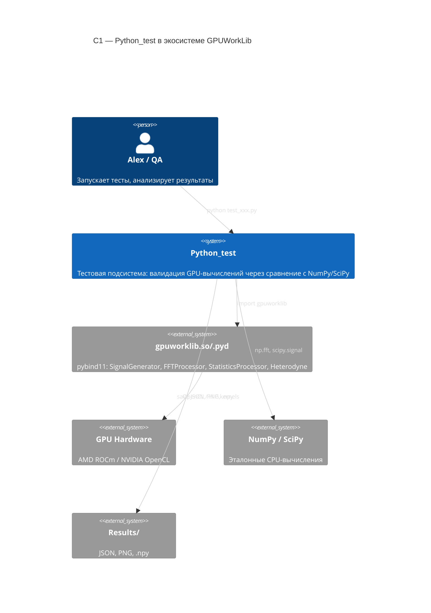
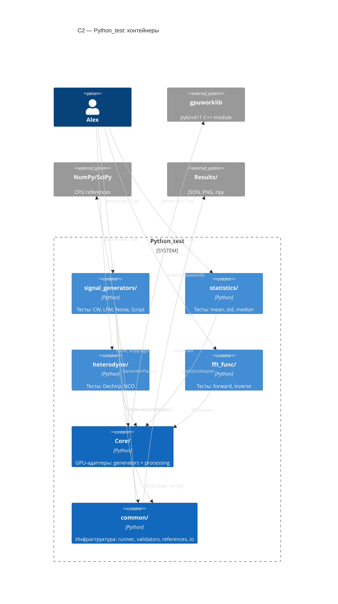
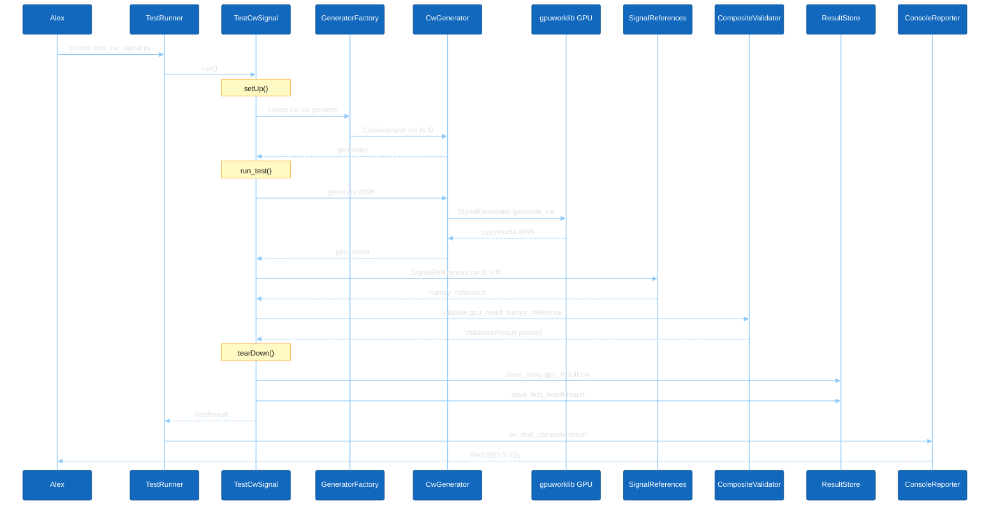
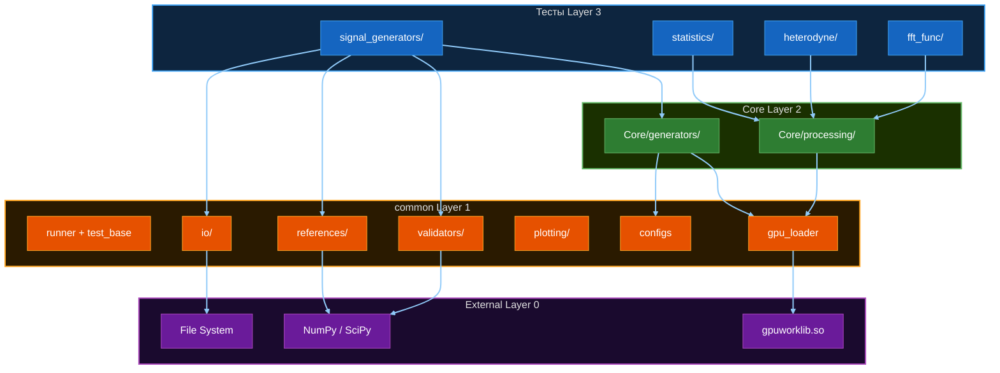

# 🏗️ Python_test — План рефакторинга (ООП + SOLID + GRASP + GoF)

> **Дата**: 2026-03-21
> **Автор**: Кодо
> **Статус**: PLAN (на согласование с Alex)

---

## 📋 TL;DR — Что делаем

| # | Компонент | Действие | Паттерны |
|---|-----------|----------|---------|
| 1 | `Core/generators/` | СОЗДАТЬ — GPU-генераторы как Adapter+Factory | Adapter, Factory, ISP |
| 2 | `Core/processing/` | СОЗДАТЬ — GPU-процессоры (Statistics, Heterodyne, FFT) | Adapter, Factory |
| 3 | `common/references/` | СОЗДАТЬ — NumPy-эталоны (устранить дублирование) | Information Expert, DRY |
| 4 | `common/validators/` | РЕФАКТОРИНГ — иерархия из DataValidator | Strategy, Composite, OCP |
| 5 | `common/io/` | СОЗДАТЬ — I/O: ResultStore | Repository, Strategy |
| 6 | `common/plotting/factory.py` | ДОБАВИТЬ — PlotterFactory | Factory Method |
| ✅ | `common/gpu_loader.py` | НЕ ТРОГАТЬ — уже отлично | Singleton |
| ✅ | `common/gpu_context.py` | НЕ ТРОГАТЬ — уже отлично | Singleton |
| ✅ | `common/runner.py` | НЕ ТРОГАТЬ — работает | Coordinator |
| ✅ | `common/test_base.py` | НЕ ТРОГАТЬ — Template Method правильный | Template Method |
| ✅ | `common/reporters.py` | НЕ ТРОГАТЬ — Observer хороший | Observer |

---

## 🗺️ Целевая архитектура

### 📐 C1 — System Context (Системный контекст)

> Где Python_test живёт относительно всей экосистемы GPUWorkLib



---

### 📐 C2 — Container Diagram (Контейнеры)

> Три слоя: инфраструктура (`common/`), GPU-адаптеры (`Core/`), тесты модулей



---

### 📐 C3 — Component Diagram (Компоненты)

> Детальная структура `common/` и `Core/` — все паттерны и зависимости

```mermaid
%%{init: {'theme': 'base', 'themeVariables': {'lineColor': '#90caf9', 'textColor': '#e0e0e0'}}}%%
flowchart TB
    subgraph COMMON["📦 common/"]
        direction TB
        GPU_L["🔌 GPULoader\n<i>Singleton</i>"]
        GPU_CTX["🖥️ GPUContextManager\n<i>Singleton</i>"]
        CFG["⚙️ SignalConfig / FilterConfig\n<i>Value Object</i>"]
        RUN["▶️ TestRunner + SkipTest\n<i>Controller</i>"]
        TB_["📋 TestBase\n<i>Template Method</i>"]
        REP["📊 IReporter → Console, JSON\n<i>Observer</i>"]
        VAL["✅ validators/\n<i>Strategy + Composite</i>\nRelative · Absolute · RMSE\nFrequency · Phase · Composite"]
        VF["🏭 ValidatorFactory\n<i>Factory + Creator</i>"]
        REF["📐 references/\n<i>Information Expert</i>\nSignalRefs · FilterRefs\nStatisticsRefs · FftRefs"]
        IO_["💾 io/\n<i>Repository + Strategy</i>\nNumpyStore · JsonStore\nResultStore"]
        PLT["📈 plotting/\n<i>Strategy + Factory</i>\nSpectrumPlotter · TimePlotter"]
    end

    subgraph CORE["🔧 Core/"]
        direction TB
        subgraph GEN["generators/"]
            GI["«interface» ISignalGenerator\ngenerate · set_params"]
            GCW["CwGenerator\n<i>Adapter</i>"]
            GLFM["LfmGenerator\n<i>Adapter</i>"]
            GN["NoiseGenerator\n<i>Adapter</i>"]
            GF["GeneratorFactory\n<i>Registry Factory (OCP)</i>"]
        end
        subgraph PROC["processing/"]
            PI["«interface» IProcessor\nprocess · name"]
            PS["StatisticsAdapter"]
            PH["HeterodyneAdapter"]
            PF["FftAdapter"]
        end
    end

    EXT["🔗 gpuworklib\n<i>pybind11 C++ module</i>"]

    GCW -.->|implements| GI
    GLFM -.->|implements| GI
    GN -.->|implements| GI
    GF -->|creates| GI

    PS -.->|implements| PI
    PH -.->|implements| PI
    PF -.->|implements| PI

    GCW -->|GPULoader.get| GPU_L
    GF -->|SignalConfig| CFG
    PS -->|GPULoader.get| GPU_L

    GCW -->|SignalGenerator| EXT
    PS -->|StatisticsProcessor| EXT
    PH -->|HeterodyneDechirp| EXT
    PF -->|FFTProcessor| EXT

    VF -->|creates| VAL
    TB_ -->|validate| VAL
    TB_ -->|get reference| REF
    TB_ -->|runs in| RUN
    RUN -->|notify| REP

    linkStyle default stroke:#90caf9,stroke-width:2px

    style COMMON fill:#1a3a5c,stroke:#4a90d9,stroke-width:2px,color:#ffffff
    style CORE fill:#3a2a1a,stroke:#d4a043,stroke-width:2px,color:#ffffff
    style GEN fill:#4a3520,stroke:#e0b050,color:#ffffff
    style PROC fill:#4a3520,stroke:#e0b050,color:#ffffff

    style GPU_L fill:#1168bd,stroke:#0b4884,color:#ffffff
    style GPU_CTX fill:#1168bd,stroke:#0b4884,color:#ffffff
    style CFG fill:#1168bd,stroke:#0b4884,color:#ffffff
    style RUN fill:#1168bd,stroke:#0b4884,color:#ffffff
    style TB_ fill:#1168bd,stroke:#0b4884,color:#ffffff
    style REP fill:#1168bd,stroke:#0b4884,color:#ffffff
    style VAL fill:#438dd5,stroke:#2e6295,color:#ffffff
    style VF fill:#438dd5,stroke:#2e6295,color:#ffffff
    style REF fill:#438dd5,stroke:#2e6295,color:#ffffff
    style IO_ fill:#438dd5,stroke:#2e6295,color:#ffffff
    style PLT fill:#438dd5,stroke:#2e6295,color:#ffffff

    style GI fill:#08427b,stroke:#073b6f,color:#ffffff
    style GCW fill:#85bbf0,stroke:#5d99c6,color:#000000
    style GLFM fill:#85bbf0,stroke:#5d99c6,color:#000000
    style GN fill:#85bbf0,stroke:#5d99c6,color:#000000
    style GF fill:#d4a843,stroke:#a07830,color:#000000
    style PI fill:#08427b,stroke:#073b6f,color:#ffffff
    style PS fill:#85bbf0,stroke:#5d99c6,color:#000000
    style PH fill:#85bbf0,stroke:#5d99c6,color:#000000
    style PF fill:#85bbf0,stroke:#5d99c6,color:#000000
    style EXT fill:#999999,stroke:#6b6b6b,color:#ffffff
```



---

### 📐 C4 — Code Diagram (Уровень классов)

> UML-классы ключевых иерархий: Generators, Validators, I/O

```mermaid
%%{init: {'theme': 'base', 'themeVariables': {'primaryColor': '#fffde7', 'primaryTextColor': '#1a1a1a', 'primaryBorderColor': '#f9a825', 'lineColor': '#90caf9', 'secondaryColor': '#e3f2fd', 'tertiaryColor': '#fff8e1', 'textColor': '#e0e0e0', 'classText': '#1a1a1a'}}}%%
classDiagram
    direction TB

    class ISignalGenerator {
        &lt;&lt;ABC&gt;&gt;
        +generate(n_samples int) ndarray
        +set_params(kwargs)
        +sample_rate float
    }

    class CwGenerator {
        -_gen SignalGenerator
        -_fs float
        -_f0 float
        +generate(n_samples) ndarray
        +set_params(f0, amplitude)
        +sample_rate float
    }

    class LfmGenerator {
        -_gen SignalGenerator
        -_fs float
        -_f_start float
        -_f_end float
        +generate(n_samples) ndarray
        +set_params(f_start, f_end)
    }

    class NoiseGenerator {
        -_gen SignalGenerator
        -_fs float
        -_seed int
        +generate(n_samples) ndarray
        +set_params(seed, amplitude)
    }

    class GeneratorFactory {
        -_registry dict
        +register(name, cls)
        +create(name, ctx, params) ISignalGenerator
        +available() list
    }

    ISignalGenerator <|.. CwGenerator
    ISignalGenerator <|.. LfmGenerator
    ISignalGenerator <|.. NoiseGenerator
    GeneratorFactory ..> ISignalGenerator : creates

    class IValidator {
        &lt;&lt;ABC&gt;&gt;
        +validate(actual, reference, name) ValidationResult
    }

    class RelativeValidator {
        -_tol float
        +validate(actual, reference, name) ValidationResult
    }

    class AbsoluteValidator {
        -_tol float
        +validate(actual, reference, name) ValidationResult
    }

    class RmseValidator {
        -_tol float
        +validate(actual, reference, name) ValidationResult
    }

    class FrequencyValidator {
        -_expected_hz float
        -_tolerance_hz float
        -_fs float
        +validate(actual, reference, name) ValidationResult
    }

    class CompositeValidator {
        -_validators list
        +add(validator) CompositeValidator
        +validate(actual, reference, name) ValidationResult
    }

    class ValidatorFactory {
        +create(metric, tolerance, name) IValidator
        +create_for_signal(hz, fs) CompositeValidator
        +create_for_filter(rel_tol) CompositeValidator
    }

    IValidator <|.. RelativeValidator
    IValidator <|.. AbsoluteValidator
    IValidator <|.. RmseValidator
    IValidator <|.. FrequencyValidator
    IValidator <|.. CompositeValidator
    CompositeValidator o-- IValidator : contains
    ValidatorFactory ..> IValidator : creates

    class IDataStore {
        &lt;&lt;ABC&gt;&gt;
        +save(data, name, subdir) Path
        +load(name, subdir)
        +exists(name, subdir) bool
    }

    class NumpyStore {
        -_base Path
        +save(data, name, subdir) Path
        +save_compressed(arrays, name) Path
        +load(name, subdir) ndarray
    }

    class JsonStore {
        -_base Path
        +save(data, name, subdir) Path
        +load(name, subdir) dict
    }

    class ResultStore {
        -_numpy NumpyStore
        -_json JsonStore
        +save_array(data, name, module) Path
        +load_array(name, module) ndarray
        +save_test_result(result, module) Path
        +save_benchmark(data, name, module) Path
    }

    IDataStore <|.. NumpyStore
    IDataStore <|.. JsonStore
    ResultStore *-- NumpyStore
    ResultStore *-- JsonStore
```



---

### 📐 C4+ — Sequence: типичный тест-сценарий

> Поток выполнения `test_cw_signal.py` — от запуска до результата



---

### 📐 Зависимости слоёв (Dependency Rule)



> **Правило**: стрелки идут ТОЛЬКО вниз → Layer 3 → 2 → 1 → 0. Никогда вверх!

---

### Файловое дерево целевой архитектуры

```
Python_test/
├── common/                          ← ИНФРАСТРУКТУРА
│   ├── __init__.py                  ← публичный API всего пакета
│   ├── gpu_loader.py                ✅ Singleton: загрузка gpuworklib
│   ├── gpu_context.py               ✅ Singleton: GPU контексты
│   ├── configs.py                   ✅ DataClasses: SignalConfig, FilterConfig
│   ├── result.py                    ✅ Value Objects: TestResult, ValidationResult
│   ├── test_base.py                 ✅ Template Method: TestBase
│   ├── runner.py                    ✅ Coordinator: TestRunner, SkipTest
│   ├── reporters.py                 ✅ Observer: IReporter, ConsoleReporter, JSONReporter
│   │
│   ├── validators/                  🔄 РЕФАКТОРИНГ (Strategy + Composite)
│   │   ├── __init__.py              ← export: IValidator, DataValidator (compat), ValidatorFactory
│   │   ├── base.py                  ← IValidator (ABC)
│   │   ├── numeric.py               ← RelativeValidator, AbsoluteValidator, RmseValidator
│   │   ├── signal.py                ← FrequencyValidator, PhaseValidator, PowerValidator
│   │   ├── composite.py             ← CompositeValidator (AND логика)
│   │   └── factory.py               ← ValidatorFactory: create(metric, tol) → IValidator
│   │
│   ├── references/                  🆕 НОВОЕ (DRY NumPy эталоны)
│   │   ├── __init__.py
│   │   ├── signal_refs.py           ← SignalReferences: cw(), lfm(), noise()
│   │   ├── filter_refs.py           ← FilterReferences: fir_filter(), iir_filter()
│   │   ├── statistics_refs.py       ← StatisticsReferences: mean(), std(), median()
│   │   └── fft_refs.py              ← FftReferences: fft(), magnitude()
│   │
│   ├── io/                          🆕 НОВОЕ (Repository I/O)
│   │   ├── __init__.py
│   │   ├── base.py                  ← IDataStore (ABC)
│   │   ├── numpy_store.py           ← NumpyStore: save/load np.ndarray (.npy, .npz)
│   │   ├── json_store.py            ← JsonStore: save/load dict/TestResult (.json)
│   │   └── result_store.py          ← ResultStore: координирует, знает пути Results/
│   │
│   └── plotting/                    🔄 РАСШИРИТЬ
│       ├── __init__.py
│       ├── plotter_base.py          ✅ IPlotter, PlotConfig [ЕСТЬ]
│       ├── spectrum_plotter.py      🆕 SpectrumPlotter
│       ├── time_plotter.py          🆕 TimePlotter
│       └── factory.py               🆕 PlotterFactory(module_name)
│
├── Core/                            🆕 НОВОЕ — готовые GPU-объекты
│   ├── __init__.py
│   ├── generators/                  ← GPU-генераторы (Adapter + Registry Factory)
│   │   ├── __init__.py              ← export + регистрация в Factory
│   │   ├── base.py                  ← ISignalGenerator (ABC)
│   │   ├── cw.py                    ← CwGenerator(ctx, fs, f0, amplitude)
│   │   ├── lfm.py                   ← LfmGenerator(ctx, fs, f_start, f_end)
│   │   ├── noise.py                 ← NoiseGenerator(ctx, fs, amplitude, seed)
│   │   └── factory.py               ← GeneratorFactory.create(type, ctx, params)
│   │
│   ├── processing/                  ← GPU-процессоры
│   │   ├── __init__.py
│   │   ├── base.py                  ← IProcessor (ABC): process(data) → data
│   │   ├── statistics.py            ← StatisticsAdapter(ctx)
│   │   ├── heterodyne.py            ← HeterodyneAdapter(ctx, params)
│   │   └── fft.py                   ← FftAdapter(ctx)
│   │
│   └── filters/                     ⏳ ПЛАНИРУЕТСЯ (когда Filters-модуль будет готов)
│
├── signal_generators/               ← тесты используют Core.generators + references
├── statistics/                      ← тесты используют Core.processing + references
├── heterodyne/                      ← тесты используют Core.processing + references
├── fft_func/                        ← тесты используют Core.processing + references
├── conftest.py                      ✅ Глобальные helpers (добавить Core helpers)
└── README.md                        ← обновить
```

---

## 1️⃣ Core/ — Репозиторий готовых GPU-объектов

### Концепция
> **Правило**: Если GPU-объект протестирован и стабилен → он переезжает в `Core/`
> Другие тесты делают `from Core.generators import GeneratorFactory` вместо создания вручную

**Паттерны**: Adapter (GoF), Factory Method (GoF), Creator (GRASP), ISP (SOLID)

---

### Core/generators/base.py — ISignalGenerator

```python
from abc import ABC, abstractmethod
import numpy as np

class ISignalGenerator(ABC):
    """Интерфейс GPU-генератора сигнала. ISP: только генерация."""

    @abstractmethod
    def generate(self, n_samples: int) -> np.ndarray:
        """Генерирует сигнал. Возвращает complex64 numpy array."""

    @abstractmethod
    def set_params(self, **kwargs) -> None:
        """Устанавливает параметры без пересоздания объекта."""

    @property
    @abstractmethod
    def sample_rate(self) -> float:
        """Частота дискретизации (Гц)."""
```

---

### Core/generators/cw.py — CwGenerator (Adapter)

```python
from .base import ISignalGenerator
from common import GPULoader
import numpy as np

class CwGenerator(ISignalGenerator):
    """
    GPU CW-генератор. Adapter над gpuworklib.SignalGenerator.

    GoF Adapter: оборачивает несовместимый API gpuworklib
    в единый интерфейс ISignalGenerator.
    """

    def __init__(self, ctx, fs: float, f0: float, amplitude: float = 1.0,
                 phase: float = 0.0):
        gw = GPULoader.get()
        self._gen = gw.SignalGenerator(ctx)
        self._fs = fs
        self._f0 = f0
        self._amplitude = amplitude
        self._phase = phase

    def generate(self, n_samples: int) -> np.ndarray:
        return self._gen.generate_cw(
            freq=self._f0, fs=self._fs,
            length=n_samples, amplitude=self._amplitude
        )

    def set_params(self, f0=None, amplitude=None, phase=None):
        if f0 is not None: self._f0 = f0
        if amplitude is not None: self._amplitude = amplitude
        if phase is not None: self._phase = phase

    @property
    def sample_rate(self) -> float:
        return self._fs
```

Аналогично: `LfmGenerator(ctx, fs, f_start, f_end)`, `NoiseGenerator(ctx, fs, amplitude, seed)`

---

### Core/generators/factory.py — GeneratorFactory (Registry Factory)

```python
from typing import Type
from common import SignalConfig
from .base import ISignalGenerator

class GeneratorFactory:
    """
    Создаёт GPU-генераторы по типу.

    GoF Factory Method + Registry: OCP — добавить новый тип = register(),
    не менять этот класс.
    GRASP Creator: знает как создать ISignalGenerator.
    """

    _registry: dict[str, Type[ISignalGenerator]] = {}

    @classmethod
    def register(cls, type_name: str, cls_: Type[ISignalGenerator]) -> None:
        """Регистрирует новый тип генератора."""
        cls._registry[type_name] = cls_

    @classmethod
    def create(cls, type_name: str, ctx, params: SignalConfig) -> ISignalGenerator:
        """
        Создаёт генератор по имени типа.

        Args:
            type_name: "cw" | "lfm" | "noise"
            ctx: GPU контекст
            params: SignalConfig с параметрами

        Returns:
            ISignalGenerator готовый к generate()
        """
        if type_name not in cls._registry:
            raise ValueError(
                f"Unknown generator: '{type_name}'. "
                f"Available: {sorted(cls._registry)}"
            )
        return cls._registry[type_name](ctx, params)

    @classmethod
    def available(cls) -> list[str]:
        return sorted(cls._registry)
```

**Core/generators/\_\_init\_\_.py**:
```python
from .base import ISignalGenerator
from .cw import CwGenerator
from .lfm import LfmGenerator
from .noise import NoiseGenerator
from .factory import GeneratorFactory

# Регистрация при импорте (OCP — без изменения Factory)
GeneratorFactory.register("cw", CwGenerator)
GeneratorFactory.register("lfm", LfmGenerator)
GeneratorFactory.register("noise", NoiseGenerator)
```

**Использование в тестах**:
```python
from Core.generators import GeneratorFactory
from common import SignalConfig

params = SignalConfig(fs=12e6, f0_hz=2e6, n_samples=4096)
gen = GeneratorFactory.create("cw", ctx, params)
signal = gen.generate(params.n_samples)  # np.ndarray complex64
```

---

### Core/processing/base.py — IProcessor

```python
class IProcessor(ABC):
    """Интерфейс GPU-процессора. ISP: только обработка данных."""

    @abstractmethod
    def process(self, data: np.ndarray) -> np.ndarray:
        """Обрабатывает данные на GPU."""

    @property
    @abstractmethod
    def name(self) -> str:
        """Имя процессора для логирования."""
```

**StatisticsAdapter**, **HeterodyneAdapter**, **FftAdapter** — аналогично CwGenerator.

---

## 2️⃣ common/references/ — NumPy эталоны (DRY)

### Проблема
Функции `cw_numpy()`, `lfm_numpy()` копируются в каждом `conftest.py`.
Если формула меняется — нужно исправлять в 5 местах.

### Решение — SignalReferences (Information Expert GRASP)

```python
# common/references/signal_refs.py

import numpy as np
from math import pi

class SignalReferences:
    """
    NumPy-эталоны для сигналов. Единая точка истины (DRY).
    GRASP Information Expert: знает формулы всех сигналов.
    """

    @staticmethod
    def cw(fs: float, n_samples: int, f0: float,
           amplitude: float = 1.0, phase: float = 0.0) -> np.ndarray:
        """CW-сигнал (непрерывная синусоида)."""
        t = np.arange(n_samples) / fs
        return (amplitude * np.exp(1j * (2*pi*f0*t + phase))).astype(np.complex64)

    @staticmethod
    def lfm(fs: float, n_samples: int, f_start: float, f_end: float,
            amplitude: float = 1.0, phase: float = 0.0) -> np.ndarray:
        """ЛЧМ-сигнал (линейная частотная модуляция)."""
        t = np.arange(n_samples) / fs
        duration = n_samples / fs
        rate = (f_end - f_start) / duration
        phi = 2*pi * (f_start*t + 0.5*rate*t**2) + phase
        return (amplitude * np.exp(1j * phi)).astype(np.complex64)

    @staticmethod
    def lfm_with_delay(fs: float, n_samples: int, f_start: float, f_end: float,
                       delay_s: float, amplitude: float = 1.0) -> np.ndarray:
        """ЛЧМ с задержкой (для тестов гетеродина)."""
        t = np.arange(n_samples) / fs
        duration = n_samples / fs
        rate = (f_end - f_start) / duration
        mask = t >= delay_s
        result = np.zeros(n_samples, dtype=np.complex64)
        t_local = t[mask] - delay_s
        phi = 2*pi * (f_start*t_local + 0.5*rate*t_local**2)
        result[mask] = (amplitude * np.exp(1j * phi)).astype(np.complex64)
        return result

    @staticmethod
    def noise(n_samples: int, seed: int = 42, amplitude: float = 1.0) -> np.ndarray:
        """Гауссов шум (воспроизводимый через seed)."""
        rng = np.random.default_rng(seed)
        sig = rng.standard_normal(n_samples) + 1j * rng.standard_normal(n_samples)
        return (sig * amplitude / 2**0.5).astype(np.complex64)
```

Аналогично: `FilterReferences`, `StatisticsReferences`, `FftReferences`.

**Использование**:
```python
from common.references import SignalReferences

ref = SignalReferences.cw(fs=12e6, n_samples=4096, f0=2e6)
# Вместо: cw_numpy(fs=12e6, length=4096, f0=2e6)  ← было в conftest.py
```

---

## 3️⃣ common/validators/ — Иерархия валидаторов

### Проблема
`DataValidator` делает 3 вещи (нарушение SRP). Нет специализации под тип сигнала.

### Решение — Strategy + Composite + Factory

```python
# common/validators/base.py

class IValidator(ABC):
    """Strategy: валидатор с единым интерфейсом."""

    @abstractmethod
    def validate(self, actual: np.ndarray, reference: np.ndarray,
                 name: str = "") -> ValidationResult:
        ...
```

```python
# common/validators/numeric.py

class RelativeValidator(IValidator):
    """max|actual - ref| / max|ref| < tolerance. SRP: только эта метрика."""
    def __init__(self, tolerance: float, name: str = "relative_error"):
        self._tol = tolerance
        self._name = name

    def validate(self, actual, reference, name="") -> ValidationResult:
        err = np.max(np.abs(actual - reference))
        ref_scale = np.max(np.abs(reference))
        metric = err / ref_scale if ref_scale > 1e-10 else err
        return ValidationResult(
            passed=metric <= self._tol,
            metric_name=name or self._name,
            actual_value=float(metric),
            threshold=self._tol
        )

class AbsoluteValidator(IValidator): ...  # max|actual - ref| < tolerance
class RmseValidator(IValidator): ...      # rms(|actual - ref|) / rms(|ref|) < tolerance
```

```python
# common/validators/signal.py

class FrequencyValidator(IValidator):
    """Проверяет пик спектра в указанном диапазоне ±tolerance_hz."""
    def __init__(self, expected_hz: float, tolerance_hz: float, fs: float):
        ...

    def validate(self, actual: np.ndarray, reference=None, name="peak_freq") -> ValidationResult:
        # FFT → argmax → Hz
        ...

class PhaseValidator(IValidator):
    """Проверяет линейность фазы (наклон = expected_delay_s)."""
    ...
```

```python
# common/validators/composite.py

class CompositeValidator(IValidator):
    """
    GoF Composite: AND-логика. Все вложенные должны пройти.
    Позволяет строить сложные проверки без повторения кода.
    """
    def __init__(self, *validators: IValidator):
        self._validators = list(validators)

    def add(self, validator: IValidator) -> "CompositeValidator":
        """Fluent API."""
        self._validators.append(validator)
        return self

    def validate(self, actual, reference, name="") -> ValidationResult:
        results = [v.validate(actual, reference, name) for v in self._validators]
        passed = all(r.passed for r in results)
        return ValidationResult(
            passed=passed,
            metric_name=name or "composite",
            actual_value=max(r.actual_value for r in results),
            threshold=min(r.threshold for r in results),
            message=" | ".join(str(r) for r in results)
        )
```

```python
# common/validators/factory.py

class ValidatorFactory:
    """GRASP Creator: создаёт нужный тип валидатора."""

    @staticmethod
    def create(metric: str = "max_rel", tolerance: float = 0.01,
               name: str = "") -> IValidator:
        """Универсальный factory метод."""
        mapping = {
            "max_rel": RelativeValidator,
            "abs": AbsoluteValidator,
            "rmse": RmseValidator,
        }
        if metric not in mapping:
            raise ValueError(f"Unknown metric: {metric}. Use: {list(mapping)}")
        return mapping[metric](tolerance, name)

    @staticmethod
    def create_for_signal(expected_hz: float, fs: float,
                          tolerance_hz: float = 1e3,
                          rel_tolerance: float = 0.01) -> CompositeValidator:
        """Комплексная проверка сигнала: корреляция + частота пика."""
        return CompositeValidator(
            RelativeValidator(rel_tolerance, "amplitude"),
            FrequencyValidator(expected_hz, tolerance_hz, fs)
        )

    @staticmethod
    def create_for_filter(rel_tolerance: float = 0.01) -> CompositeValidator:
        """Комплексная проверка фильтра: RMSE + фазовая линейность."""
        return CompositeValidator(
            RmseValidator(rel_tolerance, "rmse"),
        )
```

**Backward compatibility** (не ломаем существующие тесты):
```python
# common/validators/__init__.py
from .factory import ValidatorFactory

# Старый DataValidator остаётся как alias — существующие тесты не ломаются
def DataValidator(tolerance, metric="max_rel", name=""):
    return ValidatorFactory.create(metric, tolerance, name)

# Экспортируем новый API
from .base import IValidator
from .numeric import RelativeValidator, AbsoluteValidator, RmseValidator
from .signal import FrequencyValidator, PhaseValidator
from .composite import CompositeValidator
```

---

## 4️⃣ common/io/ — I/O система (Repository)

### Концепция
Единое место для всего I/O. Тесты не знают куда и как сохраняется — знает `ResultStore`.

### IDataStore (ABC)

```python
# common/io/base.py

class IDataStore(ABC):
    """Strategy для хранения данных."""

    @abstractmethod
    def save(self, data, name: str, subdir: str = "") -> Path:
        """Сохраняет данные. Возвращает путь к файлу."""

    @abstractmethod
    def load(self, name: str, subdir: str = ""):
        """Загружает данные по имени."""

    @abstractmethod
    def exists(self, name: str, subdir: str = "") -> bool:
        ...
```

### NumpyStore

```python
# common/io/numpy_store.py

class NumpyStore(IDataStore):
    """Хранение np.ndarray в .npy / .npz файлах."""

    def __init__(self, base_dir: str | Path = "Results/Arrays"):
        self._base = Path(base_dir)

    def save(self, data: np.ndarray, name: str, subdir: str = "") -> Path:
        path = self._base / subdir / f"{name}.npy"
        path.parent.mkdir(parents=True, exist_ok=True)
        np.save(path, data)
        return path

    def save_compressed(self, arrays: dict[str, np.ndarray], name: str,
                        subdir: str = "") -> Path:
        """Сохраняет несколько массивов в .npz."""
        path = self._base / subdir / f"{name}.npz"
        path.parent.mkdir(parents=True, exist_ok=True)
        np.savez_compressed(path, **arrays)
        return path

    def load(self, name: str, subdir: str = "") -> np.ndarray:
        path = self._base / subdir / f"{name}.npy"
        if not path.exists():
            raise FileNotFoundError(f"Array not found: {path}")
        return np.load(path)
```

### ResultStore (Repository — координатор I/O)

```python
# common/io/result_store.py

class ResultStore:
    """
    GoF Repository: единая точка доступа к результатам тестов.
    GRASP Information Expert: знает правила именования и расположения файлов.

    Структура Results/:
        Results/
        ├── Arrays/{module}/{name}.npy      ← numpy данные
        ├── JSON/{module}/{test_name}.json  ← результаты тестов
        ├── Plots/{module}/*.png            ← графики
        └── Profiler/                       ← профилировщик (через GPUProfiler)
    """

    def __init__(self, base_dir: str | Path = "Results"):
        base = Path(base_dir)
        self._numpy = NumpyStore(base / "Arrays")
        self._json = JsonStore(base / "JSON")

    def save_array(self, data: np.ndarray, name: str, module: str) -> Path:
        """Сохраняет numpy array: Results/Arrays/{module}/{name}.npy"""
        return self._numpy.save(data, name, subdir=module)

    def load_array(self, name: str, module: str) -> np.ndarray:
        """Загружает: Results/Arrays/{module}/{name}.npy"""
        return self._numpy.load(name, subdir=module)

    def save_test_result(self, result: TestResult, module: str) -> Path:
        """Сохраняет TestResult: Results/JSON/{module}/{test_name}.json"""
        return self._json.save(result.to_dict(), result.test_name, subdir=module)

    def save_benchmark(self, data: dict, name: str, module: str) -> Path:
        """Сохраняет benchmark: Results/JSON/{module}/bench_{name}.json"""
        return self._json.save(data, f"bench_{name}", subdir=module)
```

**Использование в тестах**:
```python
from common.io import ResultStore

store = ResultStore()
store.save_array(gpu_output, name="cw_output", module="signal_generators")
store.save_test_result(result, module="signal_generators")

# Позже: загрузить для отладки
prev_output = store.load_array("cw_output", module="signal_generators")
```

---

## 5️⃣ Применение паттернов — Сводная таблица

| Паттерн | GoF/GRASP/SOLID | Где применяем |
|---------|-----------------|---------------|
| **Singleton** | GoF | GPULoader, GPUContextManager ✅ |
| **Adapter** | GoF | CwGenerator, LfmGenerator, StatisticsAdapter |
| **Factory Method** | GoF | GeneratorFactory, ValidatorFactory, PlotterFactory |
| **Template Method** | GoF | TestBase, SignalTestBase ✅ |
| **Strategy** | GoF | IValidator, IPlotter, IDataStore |
| **Composite** | GoF | CompositeValidator |
| **Observer** | GoF | IReporter, ConsoleReporter, JSONReporter ✅ |
| **Repository** | GoF | ResultStore |
| **Value Object** | GoF | TestResult, ValidationResult ✅ |
| **Information Expert** | GRASP | SignalReferences, SignalConfig, ResultStore |
| **Creator** | GRASP | ValidatorFactory, GeneratorFactory |
| **Controller** | GRASP | TestRunner ✅ |
| **Low Coupling** | GRASP | Core/ → common/ (односторонняя зависимость) |
| **High Cohesion** | GRASP | validators/ только про валидацию, references/ только эталоны |
| **SRP** | SOLID | RelativeValidator = одна метрика, NumpyStore = один формат |
| **OCP** | SOLID | GeneratorFactory.register(), новый класс ≠ изменение Factory |
| **LSP** | SOLID | CwGenerator/LfmGenerator взаимозаменяемы через ISignalGenerator |
| **ISP** | SOLID | ISignalGenerator отдельно от IProcessor отдельно от IDataStore |
| **DIP** | SOLID | TestBase зависит от IValidator, не от DataValidator |

---

## 📅 План реализации — 3 фазы

### Фаза 1 — Быстрый результат (приоритет HIGH)
> Устраняем дублирование, создаём Core

1. **Создать `common/references/`**
   - `signal_refs.py` — CW, LFM, Noise, LFM_with_delay
   - `filter_refs.py` — FIR через scipy
   - `statistics_refs.py` — mean, std, median через numpy
   - `fft_refs.py` — fft, magnitude
   - Обновить `conftest.py` в signal_generators/, heterodyne/ — использовать References

2. **Создать `Core/generators/`**
   - `base.py` — ISignalGenerator
   - `cw.py`, `lfm.py`, `noise.py` — Adapters
   - `factory.py` — GeneratorFactory с регистрацией

### Фаза 2 — Улучшение архитектуры (приоритет MEDIUM)

3. **Рефакторинг `common/validators/` → иерархия**
   - Сохранить `DataValidator` как backward-compat функцию
   - Добавить FrequencyValidator, PhaseValidator
   - Добавить CompositeValidator
   - ValidatorFactory

4. **Создать `common/io/`**
   - `base.py` — IDataStore
   - `numpy_store.py` — NumpyStore
   - `json_store.py` — JsonStore
   - `result_store.py` — ResultStore (координатор)

5. **Создать `Core/processing/`**
   - `base.py` — IProcessor
   - `statistics.py` — StatisticsAdapter
   - `heterodyne.py` — HeterodyneAdapter
   - `fft.py` — FftAdapter

### Фаза 3 — Полировка (приоритет LOW)

6. **Расширить `common/plotting/`**
   - SpectrumPlotter, TimePlotter
   - PlotterFactory(module_name)

7. **Обновить тесты** (по мере удобства)
   - signal_generators/ → использовать Core.generators
   - statistics/ → использовать Core.processing
   - heterodyne/ → использовать Core.processing

8. **Core/filters/** — когда Filters-модуль будет готов

---

## ⚠️ Правила при реализации

1. **Не ломать существующие тесты** — DataValidator остаётся, conftest.py остаётся
2. **Не плодить сущностей** — только то что реально нужно сейчас
3. **Тесты обновляются добровольно** — не переписывать все тесты сразу
4. **pytest ЗАПРЕЩЁН** — TestRunner + SkipTest + `if __name__ == "__main__"`
5. **Файлы только в основной репозиторий** — не в worktree!
6. **Core/ зависит от common/** — но не наоборот (Low Coupling)

---

## 📁 Новые файлы (полный список)

```
common/validators/__init__.py      ← DataValidator backward compat + новый API
common/validators/base.py          ← IValidator (ABC)
common/validators/numeric.py       ← RelativeValidator, AbsoluteValidator, RmseValidator
common/validators/signal.py        ← FrequencyValidator, PhaseValidator
common/validators/composite.py    ← CompositeValidator
common/validators/factory.py       ← ValidatorFactory

common/references/__init__.py
common/references/signal_refs.py   ← SignalReferences
common/references/filter_refs.py   ← FilterReferences
common/references/statistics_refs.py ← StatisticsReferences
common/references/fft_refs.py      ← FftReferences

common/io/__init__.py
common/io/base.py                  ← IDataStore
common/io/numpy_store.py           ← NumpyStore
common/io/json_store.py            ← JsonStore
common/io/result_store.py          ← ResultStore

common/plotting/spectrum_plotter.py ← SpectrumPlotter
common/plotting/time_plotter.py    ← TimePlotter
common/plotting/factory.py         ← PlotterFactory

Core/__init__.py
Core/generators/__init__.py
Core/generators/base.py            ← ISignalGenerator
Core/generators/cw.py              ← CwGenerator
Core/generators/lfm.py             ← LfmGenerator
Core/generators/noise.py           ← NoiseGenerator
Core/generators/factory.py         ← GeneratorFactory

Core/processing/__init__.py
Core/processing/base.py            ← IProcessor
Core/processing/statistics.py      ← StatisticsAdapter
Core/processing/heterodyne.py      ← HeterodyneAdapter
Core/processing/fft.py             ← FftAdapter
```

**Итого**: ~28 новых файлов, ~10 обновляемых файлов.

---

*Создано: 2026-03-21 | Кодо | Для согласования с Alex*
