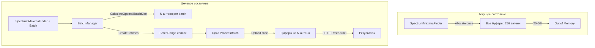

# Анализ Batch Processing для больших данных (256 × 1 300 000)

> **Источник**: sequential-thinking анализ, 2026-02-11
> **Связь**: [batch_large_data.md](batch_large_data.md), [batch_large_data_doplnenie_refined.md](batch_large_data_doplnenie_refined.md)

---

## 1. Выводы sequential-thinking

### 1.1 Два разных модуля

| Модуль                   | Файл                                                                 | API              | Batch   | Статус                                         |
| ------------------------ | -------------------------------------------------------------------- | ---------------- | ------- | ---------------------------------------------- |
| **SpectrumMaximaFinder** | [spectrum_maxima_finder.cpp](../../modules/fft_maxima/src/spectrum_maxima_finder.cpp) | SpectrumParams   | **Нет** | Работает для малых размеров (5 × 100000)       |
| **AntennaFFTCore**       | [antenna_fft_core.cpp](../../modules/fft_maxima/src/antenna_fft_core.cpp)           | AntennaFFTParams | **Да**  | Собственная логика, не использует BatchManager |

SpectrumMaximaFinder и AntennaFFTCore — это **разные модули** с разными параметрами и контрактами. Тест [test_spectrum_maxima.hpp](../../modules/fft_maxima/tests/test_spectrum_maxima.hpp) использует **только SpectrumMaximaFinder**.

### 1.2 Проблема SpectrumMaximaFinder

Для 256 × 1 300 000 (repeat_count=4):

- nFFT ≈ 8 388 608 (8M)
- Память ~20 GB — не помещается на типичную GPU

Код [spectrum_maxima_finder.cpp](../../modules/fft_maxima/src/spectrum_maxima_finder.cpp) выделяет **все буферы сразу** (строки 259–324):

- `pre_callback_userdata_`: header + ВСЕ данные
- `fft_input_` / `fft_output_`: antenna_count × nFFT
- `maxima_output_`: antenna_count × (4 или 8) × 32

Батчирования нет.

### 1.3 AntennaFFTCore vs алгоритм из дополнения

Алгоритм из дополнения (строки 221–228 batch_large_data.md):

1. Считаем требуемый размер данных
2. Проверяем сколько свободно
3. Используем 70% от свободной (параметр)
4. Если не проходим — пачками по N антенн
5. Байт на антенну × N = batch
6. [1..3] антенны добавляем в последний batch (merge tail)

**AntennaFFTCore** (строки 310–323 [antenna_fft_core.cpp](../../modules/fft_maxima/src/antenna_fft_core.cpp)):

- `memory_usage_limit = 0.65` (жёстко)
- При нехватке памяти: `batch_beams = beam_count * 0.22` — **долю от количества**, а не от памяти
- Нет использования [BatchManager](../../DrvGPU/services/batch_manager.hpp)

**BatchManager** реализует алгоритм из дополнения:

- `CalculateOptimalBatchSize(backend, total_items, item_memory_bytes, memory_limit=0.7)`
- `CreateBatches(..., min_tail=3, merge_small_tail=true)` — слияние хвоста [1..3]

### 1.4 FFTBatchAdapter

[fft_batch_adapter.hpp](../../modules/fft_maxima/include/fft_batch_adapter.hpp) — адаптер **AntennaFFTParams** к BatchManager. Не используется SpectrumMaximaFinder (другой API: SpectrumParams).

---

## 2. Рекомендации по дополнению batch_large_data.md

В секции «Дополнение» (строки 219–228) стоит:

1. **Уточнить формулировку** — «добавляем в последний batch» = **слияние хвоста** (merge tail), а не отдельный маленький batch.
2. **Добавить ссылку** на BatchManager: реализация уже есть в `DrvGPU/services/batch_manager.hpp`.
3. **Параметр 70%** — задаётся через `memory_limit` в `BatchManager::CalculateOptimalBatchSize` и `CreateBatches`.

См. уточнённую формулировку в [batch_large_data_doplnenie_refined.md](batch_large_data_doplnenie_refined.md).

---

## 3. План действий

### Вариант A: Batch в SpectrumMaximaFinder (рекомендуется)

Для больших данных (256 × 1 300 000):

1. **Формула памяти на антенну** (аналогично AllocateBuffers):
   - pre_callback: 32 + n_point × 8
   - fft_input + fft_output: 2 × nFFT × 8
   - maxima: (4 или 8) × 32
2. **Интеграция BatchManager**:
   - Вызов `BatchManager::CalculateOptimalBatchSize(backend, antenna_count, per_antenna_bytes, memory_limit)`
   - `BatchManager::CreateBatches(antenna_count, batch_size, 3, true)`
3. **Цикл обработки**:
   - Для каждого `BatchRange`: перевыделить буферы под `batch.count` антенн; считать срез входных данных; FFT → post-kernel → read; добавлять результаты в общий вектор.
4. **Параметр memory_limit** (70%): добавить в `SpectrumParams` или в конструктор/конфиг.

### Вариант B: Рефакторинг AntennaFFTCore

- Заменить `CalculateBatchConfig` на вызов BatchManager.
- `memory_usage_limit` — сделать конфигурируемым (по умолчанию 0.7).
- Убрать `batch_size_ratio` в пользу расчёта по памяти.

### Вариант C: test_large_batch.hpp

После добавления batch в SpectrumMaximaFinder — создать тест по образцу [test_spectrum_maxima.hpp](../../modules/fft_maxima/tests/test_spectrum_maxima.hpp) с 256 × 1 300 000.

---

## 4. Диаграмма потока данных

---

## 5. Соответствие дополнению

| Шаг дополнения        | BatchManager                      | AntennaFFTCore                     |
| --------------------- | --------------------------------- | ---------------------------------- |
| 1. Требуемый размер   | `item_memory_bytes × total_items` | `EstimateRequiredMemory`           |
| 2. Свободная память   | `GetAvailableMemory(backend)`     | `CL_DEVICE_GLOBAL_MEM_SIZE`        |
| 3. 70% (параметр)     | `memory_limit` в API              | `memory_usage_limit=0.65` (жёстко) |
| 4. Пачками по N       | `CalculateOptimalBatchSize`       | `beams_per_batch` через ratio      |
| 5. Байт × N = batch   | Да                                | Нет (используется ratio)           |
| 6. [1..3] в последний | `CreateBatches(..., min_tail=3)`  | Нет                                |

**Вывод:** BatchManager полностью соответствует дополнению; AntennaFFTCore — частично (нет параметра 70%, нет слияния хвоста).

---

*Создано: 2026-02-11*
